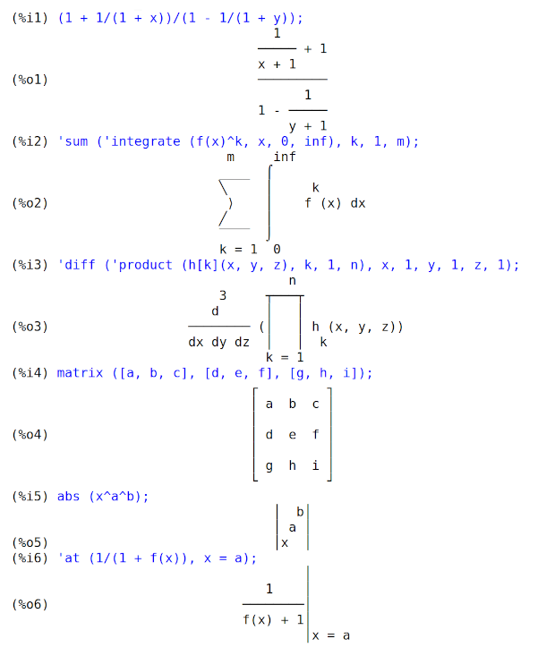
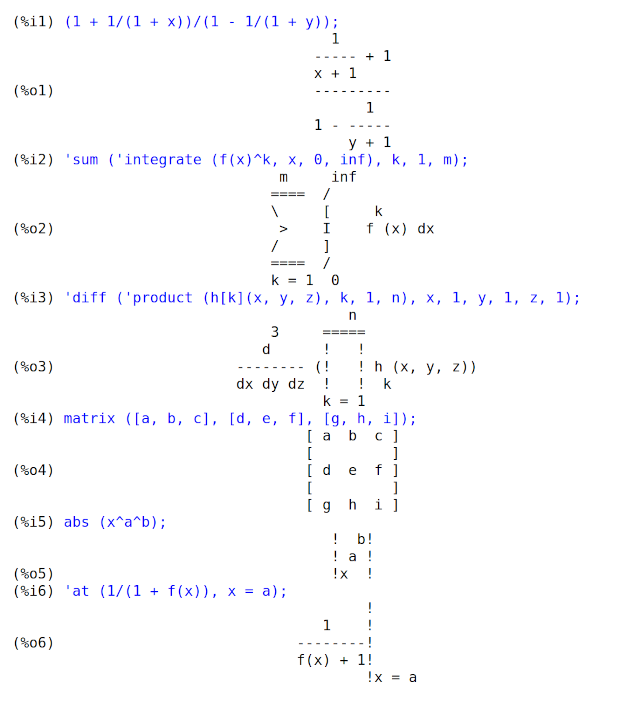

## Command Line

### Variable: %edispflag

Default value: `false`


When `%edispflag` is `true`, Maxima displays `%e` to a negative
exponent as a quotient.  For example, `%e^-x` is displayed as
`1/%e^x`.  See also `exptdispflag`.


Example:


```maxima
maxima

(%i1) %e^-10;
                               - 10
(%o1)                        %e

(%i2) %edispflag:true$

(%i3) %e^-10;
                               1
(%o3)                         ----
                                10
                              %e
```

See also: `exptdispflag`.

### Variable: absboxchar

Default value: `!`


`absboxchar` is the character used to draw absolute value
signs around expressions which are more than one line tall.


`absboxchar` is only used when `display2d_unicode` is `false`.


Example:


```maxima
maxima
(%i1) display2d_unicode: false $

(%i2) abs((x^3+1));
                            | 3    |
(%o2)                       |x  + 1|
```

### Function: declare_index_properties (declare_index_properties, a, p_1, p_2, p_3, ..., declare_index_properties, a, b, c, ..., p_1, p_2, p_3, ...)

Declares the properties of indices applied to the symbol *a*
or each of the of symbols *a*, *b*, *c*, ....
If multiple symbols are given,
the whole list of properties applies to each symbol.


Given a symbol with indices, `a[i_1, i_2, i_3, ...]`,
the `k`-th property *p_k* applies to the `k`-th index *i_k*.
There may be any number of index properties, in any order. 


Each property *p_k* must one of these four recognized properties:
`postsubscript`, `postsuperscript`, `presuperscript`, or `presubscript`,
to denote indices which are displayed, respectively,
to the right and below, to the right and above, to the left and above, or to the left and below.


Index properties apply only to the 2-dimensional display of indexed variables
(i.e., when `display2d` is `true`)
and TeX output via `tex`.
Otherwise, index properties are ignored.
Index properties do not change the input of indexed variables,
do not change the algebraic properties of indexed variables,
and do not change the 1-dimensional display of indexed variables.


`declare_index_properties` quotes (does not evaluate) its arguments.


`remove_index_properties` removes index properties.
`kill` also removes index properties (and all other properties).


`get_index_properties` retrieves index properties.


Examples:


Given a symbol with indices, `a[i_1, i_2, i_3, ...]`,
the `k`-th property *p_k* applies to the `k`-th index *i_k*.
There may be any number of index properties, in any order. 


```maxima
maxima

(%i1) declare_index_properties (A, [presubscript, postsubscript]);
(%o1)                         done


(%i2) declare_index_properties (B, [postsuperscript, postsuperscript,
 presuperscript]);
(%o2)                         done


(%i3) declare_index_properties (C, [postsuperscript, presubscript,
 presubscript, presuperscript]);
(%o3)                         done


(%i4) A[w, x];
(%o4)                           A
                               w x


(%i5) B[w, x, y];
                             y w, x
(%o5)                         B


(%i6) C[w, x, y, z];
                                z w
(%o6)                            C
                             x, y
```


Index properties apply only to the 2-dimensional display of indexed variables and TeX output.
Otherwise, index properties are ignored.


```maxima
maxima

(%i1) declare_index_properties (A, [presubscript, postsubscript]);
(%o1)                         done


(%i2) A[w, x];
(%o2)                           A
                               w x


(%i3) tex (A[w, x]);
$${}_{w}A_{x}$$
(%o3)                         false

(%i4) display2d: false $

(%i5) A[w, x];
(%o5) A[w,x]

(%i6) display2d: true $

(%i7) grind (A[w, x]);
A[w,x]$
(%o7)                         done

(%i8) stringdisp: true $

(%i9) string (A[w, x]);
(%o9)                       "A[w,x]"
```

See also: `display2d`.

### Function: disp (expr_1, expr_2, ...)

is like `display` but only the value of the arguments are displayed rather
than equations.  This is useful for complicated arguments which don’t have names 
or where only the value of the argument is of interest and not the name.


See also `ldisp` and `print`.


Example:


```maxima
maxima
(%i1) b[1,2]:x-x^2$
(%i2) x:123$

(%i3) disp(x, b[1,2], sin(1.0));
                               123

                                  2
                             x - x

                       0.8414709848078965

(%o3)                         done
```

See also: `display`, `ldisp`, `print`.

### Function: display (expr_1, expr_2, ...)

Displays equations whose left side is *expr_i* unevaluated, and whose right
side is the value of the expression centered on the line.  This function is 
useful in blocks and `for` statements in order to have intermediate results
displayed.  The arguments to `display` are usually atoms, subscripted 
variables, or function calls.


See also `ldisplay`, `disp`, and `ldisp`.


Example:


```maxima
maxima
(%i1) b[1,2]:x-x^2$
(%i2) x:123$

(%i3) display(x, b[1,2], sin(1.0));
                             x = 123

                                      2
                         b     = x - x
                          1, 2

                  sin(1.0) = 0.8414709848078965

(%o3)                         done
```

See also: `for`, `ldisplay`, `disp`, `ldisp`.

### Variable: display2d

Default value: `true`


When `display2d` is `true`,
the console display is an attempt to present mathematical expressions
as they might appear in books and articles,
using only letters, numbers, and some punctuation characters.
This display is sometimes called the "pretty printer" display.


When `display2d` is `true`,
Maxima attempts to honor the global variable for line length, `linel`.
When an atom (symbol, number, or string) would otherwise cause a line to exceed `linel`,
the atom may be printed in pieces on successive lines,
with a continuation character (backslash, `\`) at the end of the leading piece;
however, in some cases, such atoms are printed without a line break,
and the length of the line is greater than `linel`.


When `display2d` is `false`,
the console display is a 1-dimensional or linear form
which is the same as the output produced by `grind`.


When `display2d` is `false`,
the value of `stringdisp` is ignored,
and strings are always displayed with quote marks.


When `display2d` is `false`,
Maxima attempts to honor `linel`,
but atoms are not broken across lines,
and the actual length of an output line may exceed `linel`.


See also `leftjust` to switch between a left justified and a centered
display of equations.


Example:


```maxima
maxima

(%i1) x/(x^2+1);
                               x
(%o1)                        ------
                              2
                             x  + 1

(%i2) display2d:false$

(%i3) x/(x^2+1);
(%o3) x/(x^2+1)
```

See also: `stringdisp`, `leftjust`.

### Variable: display2d_unicode

Default value: `true`


When `display2d_unicode` is `true`,
the 2-d pretty printer (enabled by the global flag `display2d`) uses Unicode drawing characters [1] to display
integrals, summations, products, matrices, ratios, derivatives,
`box` expressions, `at` expressions, and absolute value expressions.


Otherwise, the pretty printer uses only ASCII characters to display every kind of expression.


In addition to displaying expressions in console interaction (as `%o` labeled expressions),
the 2-d pretty printer is invoked to display expressions for `print`,
and `printf` with the `~m` format specifier.


Examples:


Expressions displayed by 2-d pretty printer using Unicode drawing characters
(`display2d_unicode` equal to `true`),
shown as an image:





Same expressions, displayed using only ASCII characters
(`display2d_unicode` equal to `false`),
shown as an image:





Footnotes:


[1] [https://en.wikipedia.org/wiki/Box-drawing_character]()

### Variable: display_format_internal

Default value: `false`


When `display_format_internal` is `true`, expressions are displayed
without being transformed in ways that hide the internal mathematical
representation.  The display then corresponds to what `inpart` returns
rather than `part`.


Examples:


```maxima
User     part       inpart
a-b;      a - b     a + (- 1) b

           a            - 1
a/b;       -         a b
           b
                       1/2
sqrt(x);   sqrt(x)    x

          4 X        4
X*4/3;    ---        - X
           3         3
```

See also: `inpart`, `part`.

### Variable: display_index_separator

When a symbol *A* has index display properties declared via `declare_index_properties`,
the value of the property `display_index_separator`
is the string or other expression which is displayed between indices.


The value of `display_index_separator`
is assigned by `put(A, S, display_index_separator)`,
where *S* is a string or other expression.
The assigned value is retrieved by `get(A, display_index_separator)`.


The display index separator *S* can be a string, including an empty string,
or `false`, indicating the default separator, or any expression.
If not a string and not `false`, the property value is coerced to a string via `string`.


If no display index separator is assigned, the default separator is used.
The default separator is a comma.
There is no way to change the default separator.


Each symbol has its own value of `display_index_separator`.


See also `put`, `get`, and `declare_005findex_005fproperties`.


Examples:

    

When a symbol *A* has index display properties,
the value of the property `display_index_separator`
is the string or other expression which is displayed between indices.
The value is assigned by `put(A, S, display_index_separator)`,


```maxima
maxima

(%i1) declare_index_properties (A, [postsuperscript, postsuperscript,
 presubscript, presubscript]);
(%o1)                         done


(%i2) put (A, ";", display_index_separator);
(%o2)                           ;


(%i3) A[w, x, y, z];
                                 w;x
(%o3)                           A
                             y;z
```


The assigned value is retrieved by `get(A, display_index_separator)`.


```maxima
maxima

(%i1) declare_index_properties (A, [postsuperscript, postsuperscript,
 presubscript, presubscript]);
(%o1)                         done


(%i2) put (A, ";", display_index_separator);
(%o2)                           ;


(%i3) get (A, display_index_separator);
(%o3)                           ;
```


The display index separator *S* can be a string, including an empty string,
or `false`, indicating the default separator, or any expression.


```maxima
maxima

(%i1) declare_index_properties (A, [postsuperscript, postsuperscript,
 presubscript, presubscript]);
(%o1)                         done


(%i2) A[w, x, y, z];
                                 w, x
(%o2)                           A
                            y, z


(%i3) put (A, "-", display_index_separator);
(%o3)                           -


(%i4) A[w, x, y, z];
                                 w-x
(%o4)                           A
                             y-z


(%i5) put (A, " ", display_index_separator);
(%o5)                            


(%i6) A[w, x, y, z];
                                 w x
(%o6)                           A
                             y z


(%i7) put (A, "", display_index_separator);
(%o7) 


(%i8) A[w, x, y, z];
                                 wx
(%o8)                           A
                              yz


(%i9) put (A, false, display_index_separator);
(%o9)                         false


(%i10) A[w, x, y, z];
                                 w, x
(%o10)                          A
                            y, z


(%i11) put (A, 'foo, display_index_separator);
(%o11)                         foo


(%i12) A[w, x, y, z];
                                 wfoox
(%o12)                          A
                           yfooz
```


If no display index separator is assigned, the default separator is used.
The default separator is a comma.


```maxima
maxima

(%i1) declare_index_properties (A, [postsuperscript, postsuperscript,
 presubscript, presubscript]);
(%o1)                         done


(%i2) A[w, x, y, z];
                                 w, x
(%o2)                           A
                            y, z
```


Each symbol has its own value of `display_index_separator`.


```maxima
maxima

(%i1) declare_index_properties (A, [postsuperscript, postsuperscript,
 presubscript, presubscript]);
(%o1)                         done


(%i2) put (A, " ", display_index_separator);
(%o2)                            


(%i3) declare_index_properties (B, [presuperscript, presuperscript,
 postsubscript, postsubscript]);
(%o3)                         done


(%i4) put (B, ";", display_index_separator);
(%o4)                           ;


(%i5) A[w, x, y, z] + B[w, x, y, z];
                        w;x           w x
(%o5)                      B    +    A
                            y;z   y z
```

See also: `put`, `get`, `declare_index_properties`.

### Function: dispterms (expr)

Displays *expr* in parts one below the other.  That is, first the operator
of *expr* is displayed, then each term in a sum, or factor in a product, or
part of a more general expression is displayed separately.  This is useful if
*expr* is too large to be otherwise displayed.  For example if `P1`,
`P2`, ...  are very large expressions then the display program may run
out of storage space in trying to display `P1 + P2 + ...`  all at once.
However, `dispterms (P1 + P2 + ...)` displays `P1`, then below it
`P2`, etc.  When not using `dispterms`, if an exponential expression
is too wide to be displayed as `A^B` it appears as `expt (A, B)` (or
as `ncexpt (A, B)` in the case of `A^^B`).


Example:


```maxima
maxima

(%i1) dispterms(2*a*sin(x)+%e^x);
+

2 a sin(x)


  x
%e


(%o1)                         done
```

### Function: expt (a, b)

If an exponential expression is too wide to be displayed as
`a^b` it appears as `expt (a, b)` (or as
`ncexpt (a, b)` in the case of `a^^b`).


`expt` and `ncexpt` are not recognized in input.

### Variable: exptdispflag

Default value: `true`


When `exptdispflag` is `true`, Maxima displays expressions
with negative exponents using quotients.  See also `_0025edispflag`.


Example:


```maxima
maxima

(%i1) exptdispflag:true;
(%o1)                         true


(%i2) 10^-x;
                                1
(%o2)                          ---
                                 x
                               10


(%i3) exptdispflag:false;
(%o3)                         false


(%i4) 10^-x;
                                - x
(%o4)                         10
```

See also: `%edispflag`.

### Function: get_index_properties (a)

Returns the properties for *a* established by `declare_index_properties`.


See also `remove_005findex_005fproperties`.

See also: `remove_index_properties`.

### Function: grind (expr)

The function `grind` prints *expr* to the console in a form suitable
for input to Maxima.  `grind` always returns `done`.


When *expr* is the name of a function or macro, `grind` prints the
function or macro definition instead of just the name.


See also `string`, which returns a string instead of printing its
output.  `grind` attempts to print the expression in a manner which makes
it slightly easier to read than the output of `string`.


`grind` evaluates its argument.


Examples:


```maxima
maxima

(%i1) aa + 1729;
(%o1)                       aa + 1729


(%i2) grind (%);
aa+1729$
(%o2)                         done


(%i3) [aa, 1729, aa + 1729];
(%o3)                 [aa, 1729, aa + 1729]


(%i4) grind (%);
[aa,1729,aa+1729]$
(%o4)                         done


(%i5) matrix ([aa, 17], [29, bb]);
                           [ aa  17 ]
(%o5)                      [        ]
                           [ 29  bb ]


(%i6) grind (%);
matrix([aa,17],[29,bb])$
(%o6)                         done


(%i7) set (aa, 17, 29, bb);
(%o7)                   {17, 29, aa, bb}


(%i8) grind (%);
{17,29,aa,bb}$
(%o8)                         done


(%i9) exp (aa / (bb + 17)^29);
                                aa
                            -----------
                                     29
                            (bb + 17)
(%o9)                     %e


(%i10) grind (%);
%e^(aa/(bb+17)^29)$
(%o10)                        done


(%i11) expr: expand ((aa + bb)^10);
         10           9        2   8         3   7         4   6
(%o11) bb   + 10 aa bb  + 45 aa  bb  + 120 aa  bb  + 210 aa  bb
         5   5         6   4         7   3        8   2
 + 252 aa  bb  + 210 aa  bb  + 120 aa  bb  + 45 aa  bb
        9        10
 + 10 aa  bb + aa


(%i12) grind (expr);
bb^10+10*aa*bb^9+45*aa^2*bb^8+120*aa^3*bb^7+210*aa^4*bb^6
     +252*aa^5*bb^5+210*aa^6*bb^4+120*aa^7*bb^3+45*aa^8*bb^2
     +10*aa^9*bb+aa^10$
(%o12)                        done


(%i13) string (expr);
(%o13) bb^10+10*aa*bb^9+45*aa^2*bb^8+120*aa^3*bb^7+210*aa^4*bb^6\
+252*aa^5*bb^5+210*aa^6*bb^4+120*aa^7*bb^3+45*aa^8*bb^2+10*aa^9*\
bb+aa^10


(%i14) cholesky (A):= block ([n : length (A), L : copymatrix (A),
  p : makelist (0, i, 1, length (A))],
  for i thru n do for j : i thru n do
  (x : L[i, j], x : x - sum (L[j, k] * L[i, k], k, 1, i - 1),
  if i = j then p[i] : 1 / sqrt(x) else L[j, i] : x * p[i]),
  for i thru n do L[i, i] : 1 / p[i],
  for i thru n do for j : i + 1 thru n do L[i, j] : 0, L)$
define: warning: redefining the built-in operator cholesky


(%i15) grind (cholesky);
cholesky(A):=block(
         [n:length(A),L:copymatrix(A),
          p:makelist(0,i,1,length(A))],
         for i thru n do
             (for j from i thru n do
                  (x:L[i,j],x:x-sum(L[j,k]*L[i,k],k,1,i-1),
                   if i = j then p[i]:1/sqrt(x)
                       else L[j,i]:x*p[i])),
         for i thru n do L[i,i]:1/p[i],
         for i thru n do (for j from i+1 thru n do L[i,j]:0),L)$
(%o15)                        done


(%i16) string (fundef (cholesky));
(%o16) cholesky(A):=block([n:length(A),L:copymatrix(A),p:makelis\
t(0,i,1,length(A))],for i thru n do (for j from i thru n do (x:L\
[i,j],x:x-sum(L[j,k]*L[i,k],k,1,i-1),if i = j then p[i]:1/sqrt(x\
) else L[j,i]:x*p[i])),for i thru n do L[i,i]:1/p[i],for i thru \
n do (for j from i+1 thru n do L[i,j]:0),L)
```

See also: `string`.

### Variable: ibase

Default value: `10`


`ibase` is the base for integers read by Maxima.


`ibase` may be assigned any integer between 2 and 36 (decimal), inclusive.
When `ibase` is greater than 10,
the numerals comprise the decimal numerals 0 through 9
plus letters of the alphabet `A`, `B`, `C`, ...,
as needed to make `ibase` digits in all.
Letters are interpreted as digits only if the first digit is 0 through 9.


Uppercase and lowercase letters are not distinguished.
The numerals for base 36, the largest acceptable base,
comprise 0 through 9 and `A` through `Z`.


Whatever the value of `ibase`,
when an integer is terminated by a decimal point,
it is interpreted in base 10.


See also `obase`.


Examples:


`ibase` less than 10 (for example binary numbers).


```maxima
maxima
(%i1) ibase : 2 $

(%i2) obase;
(%o2)                          10


(%i3) 1111111111111111;
(%o3)                         65535
```


`ibase` greater than 10.
Letters are interpreted as digits only if the first digit is 0
through 9 which means that hexadecimal numbers might need to
be prepended by a 0.


```maxima
maxima
(%i1) ibase : 16 $

(%i2) obase;
(%o2)                          10


(%i3) 1000;
(%o3)                         4096


(%i4) abcd;
(%o4)                         abcd


(%i5) symbolp (abcd);
(%o5)                         true


(%i6) 0abcd;
(%o6)                         43981


(%i7) symbolp (0abcd);
(%o7)                         false
```


When an integer is terminated by a decimal point,
it is interpreted in base 10.


```maxima
maxima
(%i1) ibase : 36 $

(%i2) obase;
(%o2)                          10


(%i3) 1234;
(%o3)                         49360


(%i4) 1234.;
(%o4)                         1234
```

See also: `obase`.

### Function: ldisp (expr_1, ..., expr_n)

Displays expressions *expr_1*, ..., *expr_n* to the console as
printed output.  `ldisp` assigns an intermediate expression label to each
argument and returns the list of labels.


See also `disp`, `display`, and `ldisplay`.


Examples:


```maxima
maxima

(%i1) e: (a+b)^3;
                                   3
(%o1)                       (b + a)


(%i2) f: expand (e);
                     3        2      2      3
(%o2)               b  + 3 a b  + 3 a  b + a


(%i3) ldisp (e, f);
                                   3
(%t3)                       (b + a)

                     3        2      2      3
(%t4)               b  + 3 a b  + 3 a  b + a

(%o4)                      [%t3, %t4]


(%i5) %t3;
                                   3
(%o5)                       (b + a)


(%i6) %t4;
                     3        2      2      3
(%o6)               b  + 3 a b  + 3 a  b + a
```

See also: `disp`, `display`, `ldisplay`.

### Function: ldisplay (expr_1, ..., expr_n)

Displays expressions *expr_1*, ..., *expr_n* to the console as
printed output.  Each expression is printed as an equation of the form
`lhs = rhs` in which `lhs` is one of the arguments of `ldisplay`
and `rhs` is its value.  Typically each argument is a variable.
`ldisp` assigns an intermediate expression label to each equation and
returns the list of labels.


See also `display`, `disp`, and `ldisp`.


Examples:


```maxima
maxima

(%i1) e: (a+b)^3;
                                   3
(%o1)                       (b + a)


(%i2) f: expand (e);
                     3        2      2      3
(%o2)               b  + 3 a b  + 3 a  b + a


(%i3) ldisplay (e, f);
                                     3
(%t3)                     e = (b + a)

                       3        2      2      3
(%t4)             f = b  + 3 a b  + 3 a  b + a

(%o4)                      [%t3, %t4]


(%i5) %t3;
                                     3
(%o5)                     e = (b + a)


(%i6) %t4;
                       3        2      2      3
(%o6)             f = b  + 3 a b  + 3 a  b + a
```

See also: `ldisp`, `display`, `disp`.

### Variable: leftjust

Default value: `false`


When `leftjust` is `true`, equations in 2D-display are drawn left
justified rather than centered.


See also `display2d` to switch between 1D- and 2D-display.


Example:


```maxima
maxima

(%i1) expand((x+1)^3);
                        3      2
(%o1)                  x  + 3 x  + 3 x + 1

(%i2) leftjust:true$

(%i3) expand((x+1)^3);
       3      2
(%o3) x  + 3 x  + 3 x + 1
```

See also: `display2d`.

### Variable: linel

Default value: `79`


`linel` is the assumed width (in characters) of the console display for the
purpose of displaying expressions.  `linel` may be assigned any value by
the user, although very small or very large values may be impractical.  Text
printed by built-in Maxima functions, such as error messages and the output of
`describe`, is not affected by `linel`.

See also: `describe`.

### Variable: lispdisp

Default value: `false`


When `lispdisp` is `true`, Lisp symbols are displayed with a leading
question mark `?`.  Otherwise, Lisp symbols are displayed with no leading
mark. This has the same effect for 1-d and 2-d display.


Examples:


```maxima
maxima
(%i1) lispdisp: false$

(%i2) ?foo + ?bar;
(%o2)                       foo + bar

(%i3) lispdisp: true$

(%i4) ?foo + ?bar;
(%o4)                      ?foo + ?bar
```

### Variable: negsumdispflag

Default value: `true`


When `negsumdispflag` is `true`, `x - y` displays as `x - y`
instead of as `- y + x`.  Setting it to `false` causes the special
check in display for the difference of two expressions to not be done.  One
application is that thus `a + %i*b` and `a - %i*b` may both be
displayed the same way.

### Variable: obase

Default value: `10`


`obase` is the base for integers displayed by Maxima.


`obase` may be assigned any integer between 2 and 36 (decimal), inclusive.
When `obase` is greater than 10,
the numerals comprise the decimal numerals 0 through 9
plus capital letters of the alphabet A, B, C, ..., as needed.
A leading 0 digit is displayed if the leading digit is otherwise a letter.
The numerals for base 36, the largest acceptable base,
comprise 0 through 9, and A through Z.


See also `ibase`.


Examples:


```maxima
maxima

(%i1) obase : 2;
(%o1)                          10


(%i2) 2^8 - 1;
(%o2)                       11111111


(%i3) obase : 8;
(%o3)                          10


(%i4) 8^8 - 1;
(%o4)                       77777777


(%i5) obase : 16;
(%o5)                          10


(%i6) 16^8 - 1;
(%o6)                       0FFFFFFFF


(%i7) obase : 36;
(%o7)                          10


(%i8) 36^8 - 1;
(%o8)                       0ZZZZZZZZ
```

See also: `ibase`.

### Variable: pfeformat

Default value: `false`


When `pfeformat` is `true`, a ratio of integers is displayed with the
solidus (forward slash) character, and an integer denominator `n` is
displayed as a leading multiplicative term `1/n`.


Examples:


```maxima
maxima
(%i1) pfeformat: false$

(%i2) 2^16/7^3;
                              65536
(%o2)                         -----
                               343


(%i3) (a+b)/8;
                              b + a
(%o3)                         -----
                                8

(%i4) pfeformat: true$

(%i5) 2^16/7^3;
(%o5)                       65536/343


(%i6) (a+b)/8;
(%o6)                     (1/8) (b + a)
```

### Variable: powerdisp

Default value: `false`


When `powerdisp` is `true`,
a sum is displayed with its terms in order of increasing power.
Thus a polynomial is displayed as a truncated power series,
with the constant term first and the highest power last.


By default, terms of a sum are displayed in order of decreasing power.


Example:


```maxima
maxima

(%i1) powerdisp:true;
(%o1)                         true


(%i2) x^2+x^3+x^4;
                           2    3    4
(%o2)                     x  + x  + x


(%i3) powerdisp:false;
(%o3)                         false


(%i4) x^2+x^3+x^4;
                           4    3    2
(%o4)                     x  + x  + x
```

### Function: print (expr_1, ..., expr_n)

Evaluates and displays *expr_1*, ..., *expr_n* one after another,
from left to right, starting at the left edge of the console display.


The value returned by `print` is the value of its last argument.
`print` does not generate intermediate expression labels.


See also `display`, `disp`, `ldisplay`, and
`ldisp`.  Those functions display one expression per line, while
`print` attempts to display two or more expressions per line.


To display the contents of a file, see `printfile`.


Examples:


```maxima
maxima

(%i1) r: print ("(a+b)^3 is", expand ((a+b)^3), "log (a^10/b) is", radcan (log (a^10/b)))$
            3        2      2      3
(a+b)^3 is b  + 3 a b  + 3 a  b + a  log (a^10/b) is 
                                              10 log(a) - log(b) 


(%i2) r;
(%o2)                  10 log(a) - log(b)


(%i3) disp ("(a+b)^3 is", expand ((a+b)^3), "log (a^10/b) is", radcan (log (a^10/b)))$
                           (a+b)^3 is

                     3        2      2      3
                    b  + 3 a b  + 3 a  b + a

                         log (a^10/b) is

                       10 log(a) - log(b)
```

See also: `display`, `disp`, `ldisplay`, `ldisp`, `printfile`.

### Function: remove_index_properties (a, b, c, ...)

Removes the properties established by `declare_index_properties`.
All index properties are removed from each symbol *a*, *b*, *c*, ....


`remove_index_properties` quotes (does not evaluate) its arguments.

### Variable: sqrtdispflag

Default value: `true`


When `sqrtdispflag` is `false`, causes `sqrt` to display with
exponent 1/2.

### Variable: stardisp

Default value: `false`


When `stardisp` is `true`, multiplication is
displayed with an asterisk `*` between operands.

### Variable: ttyoff

Default value: `false`


When `ttyoff` is `true`, output expressions are not displayed.
Output expressions are still computed and assigned labels.  See `labels`.


Text printed by built-in Maxima functions, such as error messages and the output
of `describe`, is not affected by `ttyoff`.

See also: `labels`, `describe`.

### Function: with_default_2d_display (expr)

While maxima by default realizes 2d Output using ASCII-Art some frontend
change that to TeX, MathML or a specific XML dialect that better suits
the needs for this specific frontend. `with_default_2d_display`
temporarily switches maxima to the default 2D ASCII Art formatter for
outputting the result of `expr`.


See also `set_alt_display` and `display2d`.

See also: `set_alt_display`, `display2d`.

