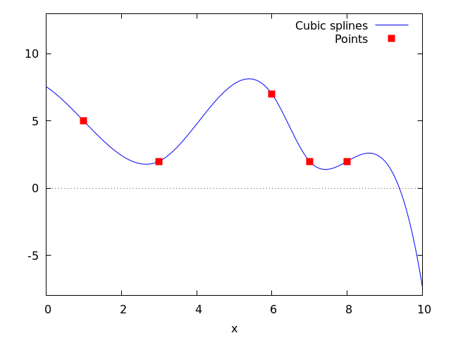
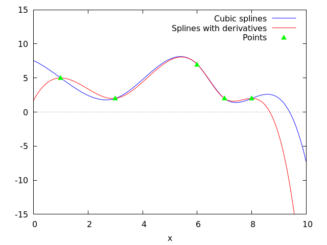
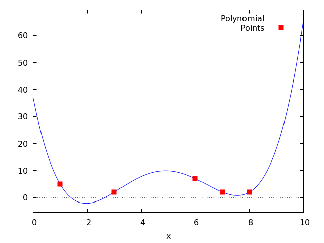
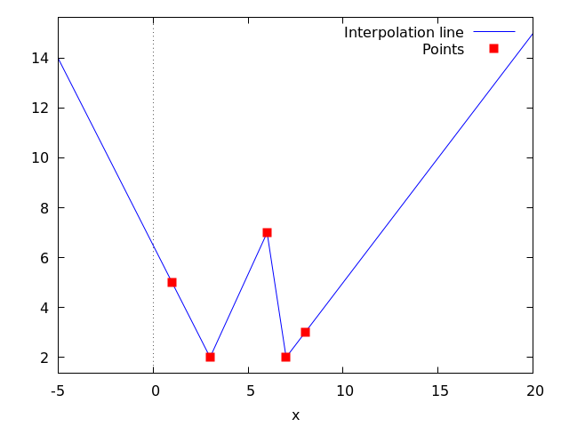
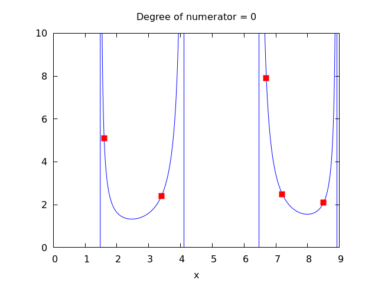
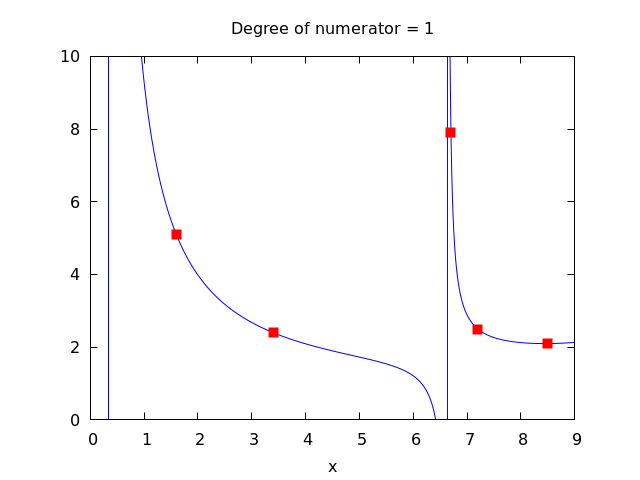
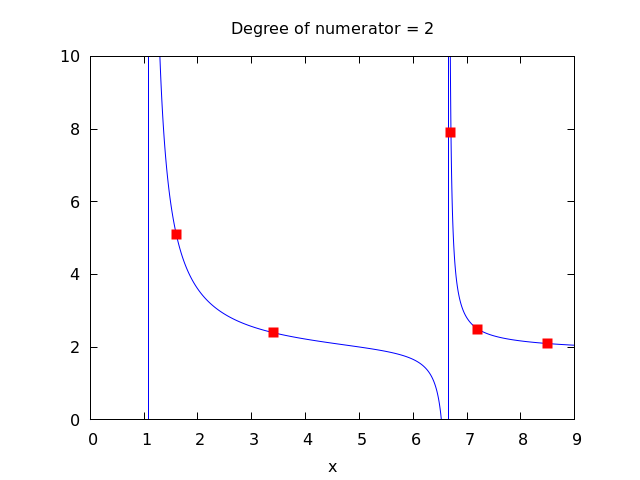
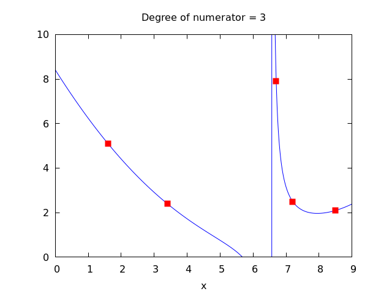
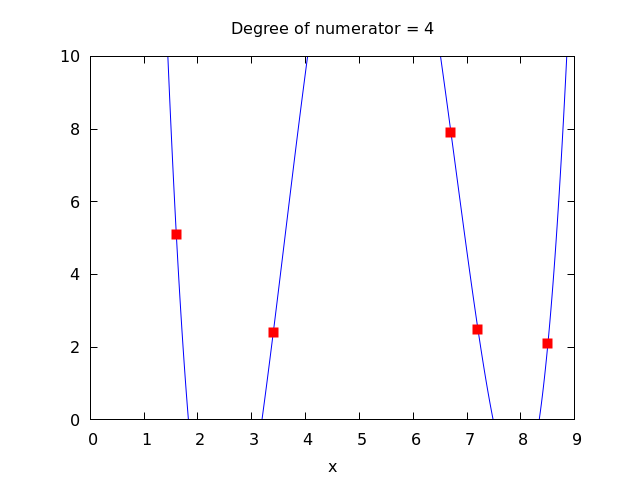

## interpol

<!-- category: Numerical -->
<!-- keywords: charfun2 -->
<!-- signatures: charfun2(x, a, b) -->
### Function: charfun2 (x, a, b)

The characteristic or indicator function on the half-open interval $[a, b)$,
that is, including *a* and excluding *b*.


Package `interpol` loads this function.


See also `charfun`.


Examples:


When $x >= a$ and $x < b$ evaluates to `true` or `false`,
`charfun2` returns 1 or 0, respectively.


```maxima
maxima
(%i1) load ("interpol") $

(%i2) charfun2 (5, 0, 100);
(%o2)                           1


(%i3) charfun2 (-5, 0, 100);
(%o3)                           0
```


Otherwise, `charfun2` returns a partially-evaluated result in terms of `charfun`.


```maxima
maxima
(%i1) load ("interpol") $

(%i2) charfun2 (t, 0, 100);
(%o2)            charfun((0 <= t) and (t < 100))


(%i3) charfun2 (5, u, v);
(%o3)             charfun((u <= 5) and (5 < v))


(%i4) assume (v > u, u > 5);
(%o4)                    [v > u, u > 5]


(%i5) charfun2 (5, u, v);
(%o5)                           0
```

See also: `charfun`.

<!-- category: Numerical -->
<!-- keywords: cspline -->
<!-- signatures: cspline(points), cspline(points, option1, option2, ...) -->
### Function: cspline (points)

Computes the polynomial interpolation by the cubic splines method. Argument *points* must be either:


- *
a two column matrix, `p:matrix([2,4],[5,6],[9,3])`,
- *
a list of pairs, `p: [[2,4],[5,6],[9,3]]`,
- *
a list of numbers, `p: [4,6,3]`, in which case the abscissas will be assigned automatically to 1, 2, 3, etc.


In the first two cases the pairs are ordered with respect to the first coordinate before making computations.


There are three options to fit specific needs:


- *
`'d1`, default `'unknown`, is the first derivative at $x_1$; if it is `'unknown`, the second derivative at $x_1$ is made equal to 0 (natural cubic spline); if it is equal to a number, the second derivative is calculated based on this number.
- *
`'dn`, default `'unknown`, is the first derivative at $x_n$; if it is `'unknown`, the second derivative at $x_n$ is made equal to 0 (natural cubic spline); if it is equal to a number, the second derivative is calculated based on this number.
- *
`'varname`, default `'x`, is the name of the independent variable.


See also `lagrange`,  `linearinterpol`,  and `ratinterpol`.


Examples:


```maxima
maxima
(%i1) load("interpol")$
(%i2) p:[[7,2],[8,2],[1,5],[3,2],[6,7]]$

(%i3) cspline(p);
             3         2
       1159 x    1159 x    6091 x   8283
(%o3) (------- - ------- - ------ + ----) charfun(x < 3)
        3288      1096      3288    1096
 + charfun((6 <= x) and (x < 7))
        3          2
  4715 x    15209 x    579277 x   199575
 (------- - -------- + -------- - ------)
   1644       274        1644      274
 + charfun((3 <= x) and (x < 6))
          3         2
    3287 x    2223 x    48275 x   9609
 (- ------- + ------- - ------- + ----)
     4932       274      1644     274
                            3         2
                      2587 x    5174 x    494117 x   108928
 + charfun(7 <= x) (- ------- + ------- - -------- + ------)
                       1644       137       1644      137

(%i4) define (f(x),%)$

(%i5) float (map (f, [2.3,5/7,%pi]));
(%o5) [1.9914607664233568, 5.823200187269903, 2.2274053124295072]


(%i6) plot2d ([f,[discrete,p]], [x,0,10], [y,-8,13], [style,lines,points],
    [legend,"Cubic splines","Points"])$


(%i7) cspline(p,d1=0,dn=0);
             3          2
       1949 x    11437 x    17027 x   1247
(%o7) (------- - -------- + ------- + ----) charfun(x < 3)
        2256       2256      2256     752
 + charfun((6 <= x) and (x < 7))
       3          2
  607 x    35147 x    55706 x   38420
 (------ - -------- + ------- - -----)
   188       564        141      47
 + charfun((3 <= x) and (x < 6))
          3         2
    3895 x    1807 x    5146 x   2148
 (- ------- + ------- - ------ + ----)
     5076       188      141      47
                            3          2
                      1547 x    35581 x    68068 x   173546
 + charfun(7 <= x) (- ------- + -------- - ------- + ------)
                        564       564        141      141

(%i8) define (g(x),%)$

(%i9) plot2d ([f,g,[discrete,p]], [x,0,10], [y,-15,15], [style,lines,lines,points],
       [legend,"Cubic splines","Splines with derivatives","Points"])$
```







See also: `lagrange`, `linearinterpol`, `ratinterpol`.

<!-- category: Numerical -->
<!-- keywords: lagrange -->
<!-- signatures: lagrange(points), lagrange(points, option) -->
### Function: lagrange (points)

Computes the polynomial interpolation by the Lagrangian method. Argument *points* must be either:


- *
a two column matrix, `p:matrix([2,4],[5,6],[9,3])`,
- *
a list of pairs, `p: [[2,4],[5,6],[9,3]]`,
- *
a list of numbers, `p: [4,6,3]`, in which case the abscissas will be assigned automatically to 1, 2, 3, etc.


In the first two cases the pairs are ordered with respect to the first coordinate before making computations.


With the *option* argument it is possible to select the name for the independent variable, which is `'x` by default; to define another one, write something like `varname='z`. 


Note that when working with high degree polynomials, floating point evaluations are unstable.


See also `linearinterpol`,  `cspline`,  and `ratinterpol`.


Examples:


```maxima
maxima
(%i1) load("interpol")$
(%i2) p:[[7,2],[8,2],[1,5],[3,2],[6,7]]$

(%i3) lagrange(p);
      (x - 7) (x - 6) (x - 3) (x - 1)
(%o3) -------------------------------
                    35
   (x - 8) (x - 6) (x - 3) (x - 1)
 - -------------------------------
                 12
   7 (x - 8) (x - 7) (x - 3) (x - 1)
 + ---------------------------------
                  30
   (x - 8) (x - 7) (x - 6) (x - 1)
 - -------------------------------
                 60
   (x - 8) (x - 7) (x - 6) (x - 3)
 + -------------------------------
                 84

(%i4) define(f(x),%)$

(%i5) expand(map(f,[2.3,5/7,%pi]));
                                 4          3           2
                   919062  73 %pi    701 %pi    8957 %pi
(%o5) [- 1.567535, ------, ------- - -------- + ---------
                   84035     420       210         420
                                                  5288 %pi   186
                                                - -------- + ---]
                                                    105       5


(%i6) plot2d ([f,[discrete,p]], [x,0,10], [style,lines,points],
       [legend,"Polynomial","Points"])$


(%i7) lagrange(p, varname=w);
      (w - 7) (w - 6) (w - 3) (w - 1)
(%o7) -------------------------------
                    35
   (w - 8) (w - 6) (w - 3) (w - 1)
 - -------------------------------
                 12
   7 (w - 8) (w - 7) (w - 3) (w - 1)
 + ---------------------------------
                  30
   (w - 8) (w - 7) (w - 6) (w - 1)
 - -------------------------------
                 60
   (w - 8) (w - 7) (w - 6) (w - 3)
 + -------------------------------
                 84
```




See also: `linearinterpol`, `cspline`, `ratinterpol`.

<!-- category: Numerical -->
<!-- keywords: linearinterpol -->
<!-- signatures: linearinterpol(points), linearinterpol(points, option) -->
### Function: linearinterpol (points)

Computes the polynomial interpolation by the linear method. Argument *points* must be either:


- *
a two column matrix, `p:matrix([2,4],[5,6],[9,3])`,
- *
a list of pairs, `p: [[2,4],[5,6],[9,3]]`,
- *
a list of numbers, `p: [4,6,3]`, in which case the abscissas will be assigned automatically to 1, 2, 3, etc.


In the first two cases the pairs are ordered with respect to the first coordinate before making computations.


With the *option* argument it is possible to select the name for the independent variable, which is `'x` by default; to define another one, write something like `varname='z`. 


See also `lagrange`,  `cspline`,  and `ratinterpol`.


Examples:


```maxima
maxima
(%i1) load ("interpol") $
(%i2) p: matrix([7,2],[8,3],[1,5],[3,2],[6,7])$

(%i3) linearinterpol(p);
       13   3 x
(%o3) (-- - ---) charfun(x < 3) + charfun((3 <= x) and (x < 6))
       2     2
  5 x
 (--- - 3) + charfun(7 <= x) (x - 5)
   3
 + charfun((6 <= x) and (x < 7)) (37 - 5 x)

(%i4) define(f(x),%)$

(%i5) map(f, [7.3,25/7,%pi]);
                            62  5 %pi
(%o5)                 [2.3, --, ----- - 3]
                            21    3


(%i6) float(%);
(%o6)     [2.3, 2.9523809523809526, 2.235987755982989]


(%i7) plot2d ([f,[discrete,args(p)]], [x,-5,20], [style,lines,points],
    [legend,"Interpolation line","Points"])$


(%i8) lagrange(p, varname=w);
      3 (w - 7) (w - 6) (w - 3) (w - 1)
(%o8) ---------------------------------
                     70
   (w - 8) (w - 6) (w - 3) (w - 1)
 - -------------------------------
                 12
   7 (w - 8) (w - 7) (w - 3) (w - 1)
 + ---------------------------------
                  30
   (w - 8) (w - 7) (w - 6) (w - 1)
 - -------------------------------
                 60
   (w - 8) (w - 7) (w - 6) (w - 3)
 + -------------------------------
                 84
```




See also: `lagrange`, `cspline`, `ratinterpol`.

<!-- category: Numerical -->
<!-- keywords: ratinterpol -->
<!-- signatures: ratinterpol(points, numdeg), ratinterpol(points, numdeg, option1) -->
### Function: ratinterpol (points, numdeg)

Generates a rational interpolator for data given by *points* and the degree of the numerator
being equal to *numdeg*; the degree of the denominator is calculated
automatically. Argument *points* must be either:


- *
a two column matrix, `p:matrix([2,4],[5,6],[9,3])`,
- *
a list of pairs, `p: [[2,4],[5,6],[9,3]]`,
- *
a list of numbers, `p: [4,6,3]`, in which case the abscissas will be assigned automatically to 1, 2, 3, etc.


In the first two cases the pairs are ordered with respect to the first coordinate before making computations.


There is one option to fit specific needs:


- *
`'varname`, default `'x`, is the name of the independent variable.


See also `lagrange`,  `linearinterpol`,  `cspline`,  `minpack_lsquares`,  and `Package-lbfgs`


Examples:


```maxima
maxima
(%i1) load("interpol")$
(%i2) p:[[7.2,2.5],[8.5,2.1],[1.6,5.1],[3.4,2.4],[6.7,7.9]]$

(%i3) for k:0 thru length(p)-1 do


(%i4) plot2d([ratinterpol(p,k),[discrete,p]], [x,0,9], [y,0,10], [style,lines,points],
  [title,concat("Degree of numerator = ",k)], nolegend, gnuplot)$
```
















See also: `lagrange`, `linearinterpol`, `cspline`, `minpack_lsquares`, `Package-lbfgs`.

