## draw

### Variable: allocation

Default value: `false`


With option `allocation` it is possible to place a scene in the
output window at will; this is of interest in multiplots. When `false`,
the scene is placed automatically, depending on the value assigned to option
`columns`. In any other case, `allocation` must be set to a list of
two pairs of numbers; the first corresponds to the position of the lower left
corner of the scene, and the second pair gives the width and height of the plot.
All quantities must be given in relative coordinates, between 0 and 1.


Examples:


In site graphics.


```maxima
(%i1) draw(
        gr2d(
          explicit(x^2,x,-1,1)),
        gr2d(
          allocation = [[1/4, 1/4],[1/2, 1/2]],
          explicit(x^3,x,-1,1),
          grid = true) ) $
```

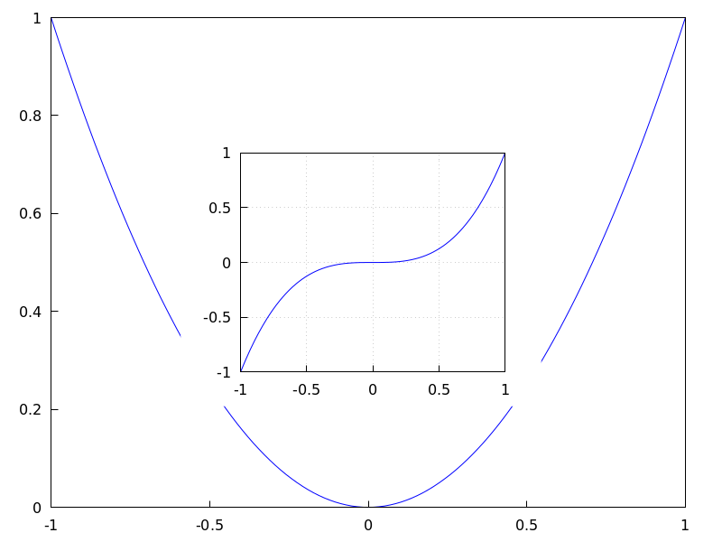


Multiplot with selected dimensions.


```maxima
(%i1) draw(
        terminal = wxt,
        gr2d(
          grid=[5,5],
          allocation = [[0, 0],[1, 1/4]],
          explicit(x^2,x,-1,1)),
        gr3d(
          allocation = [[0, 1/4],[1, 3/4]],
          explicit(x^2+y^2,x,-1,1,y,-1,1) ))$
```

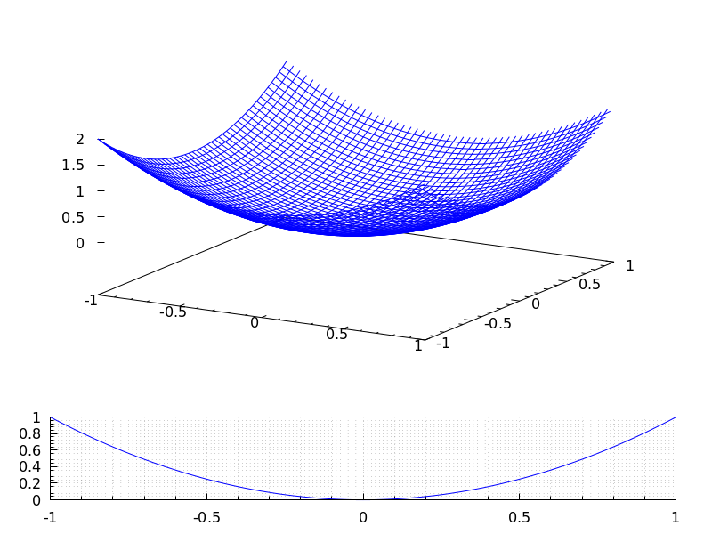


See also option `columns`.

See also: `columns`.

### Variable: axis_3d

Default value: `true`


If `axis_3d` is `true`, the *x*, *y* and *z* axis are shown in 3d scenes.


Since this is a global graphics option, its position in the scene description
does not matter.


Example:


```maxima
(%i1) draw3d(axis_3d = false,
             explicit(sin(x^2+y^2),x,-2,2,y,-2,2) )$
```

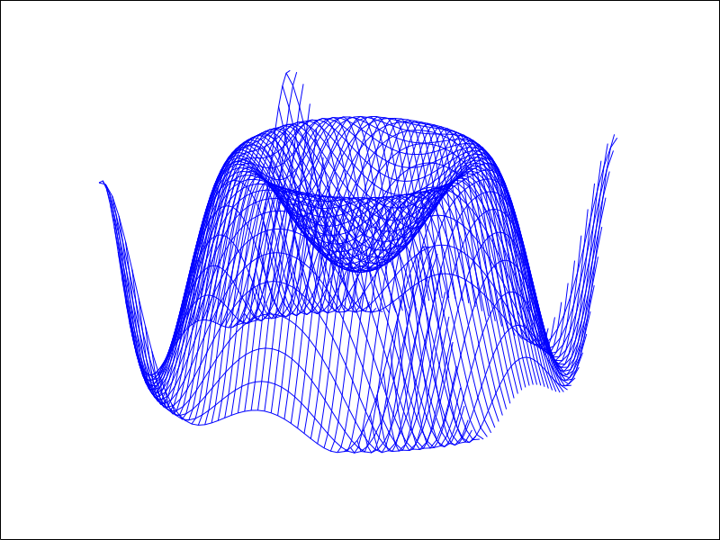


See also `axis_bottom`,  `axis_left`, `axis_top`, and `axis_right` for axis in 2d.

See also: `axis_bottom`, `axis_left`, `axis_top`, `axis_right`.

### Variable: axis_bottom

Default value: `true`


If `axis_bottom` is `true`, the bottom axis is shown in 2d scenes.


Since this is a global graphics option, its position in the scene description
does not matter.


Example:


```maxima
(%i1) draw2d(axis_bottom = false,
             explicit(x^3,x,-1,1))$
```

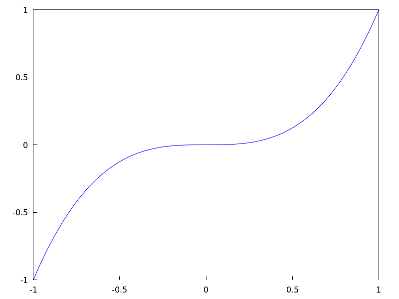


See also `axis_left`,  `axis_top`, `axis_right` and `axis_005f3d`.

See also: `axis_left`, `axis_top`, `axis_right`, `axis_3d`.

### Variable: axis_left

Default value: `true`


If `axis_left` is `true`, the left axis is shown in 2d scenes.


Since this is a global graphics option, its position in the scene description
does not matter.


Example:


```maxima
(%i1) draw2d(axis_left = false,
             explicit(x^3,x,-1,1))$
```


See also `axis_bottom`,  `axis_top`, `axis_right` and `axis_005f3d`.

See also: `axis_bottom`, `axis_top`, `axis_right`, `axis_3d`.

### Variable: axis_right

Default value: `true`


If `axis_right` is `true`, the right axis is shown in 2d scenes.


Since this is a global graphics option, its position in the scene description
does not matter.


Example:


```maxima
(%i1) draw2d(axis_right = false,
             explicit(x^3,x,-1,1))$
```


See also `axis_bottom`,  `axis_left`, `axis_top` and `axis_005f3d`.

See also: `axis_bottom`, `axis_left`, `axis_top`, `axis_3d`.

### Variable: axis_top

Default value: `true`


If `axis_top` is `true`, the top axis is shown in 2d scenes.


Since this is a global graphics option, its position in the scene description
does not matter.


Example:


```maxima
(%i1) draw2d(axis_top = false,
             explicit(x^3,x,-1,1))$
```


See also `axis_bottom`,   `axis_left`,  `axis_right`,  and `axis_005f3d`.

See also: `axis_bottom`, `axis_left`, `axis_right`, `axis_3d`.

### Variable: background_color

Default value: `white`


Sets the background color for terminals. Default background color is white.


Since this is a global graphics option, its position in the scene description
does not matter.


This option does not work with terminals `epslatex` and `epslatex_standalone`.


See also `color`

### Function: bars (x1, h1, w1, x2, h2, w2, ...)

Draws vertical bars in 2D.


**2D**


`bars ([x1,h1,w1], [x2,h2,w2, ...])` 
draws bars centered at values *x1*, *x2*, ... with heights *h1*, *h2*, ...
and widths *w1*, *w2*, ...


This object is affected by the following *graphic options*: `key`, 
`fill_color`, `fill_density` and `line_005fwidth`.


Example:


```maxima
(%i1) draw2d(
       key          = "Group A",
       fill_color   = blue,
       fill_density = 0.2,
       bars([0.8,5,0.4],[1.8,7,0.4],[2.8,-4,0.4]),
       key          = "Group B",
       fill_color   = red,
       fill_density = 0.6,
       line_width   = 4,
       bars([1.2,4,0.4],[2.2,-2,0.4],[3.2,5,0.4]),
       xaxis = true);
```

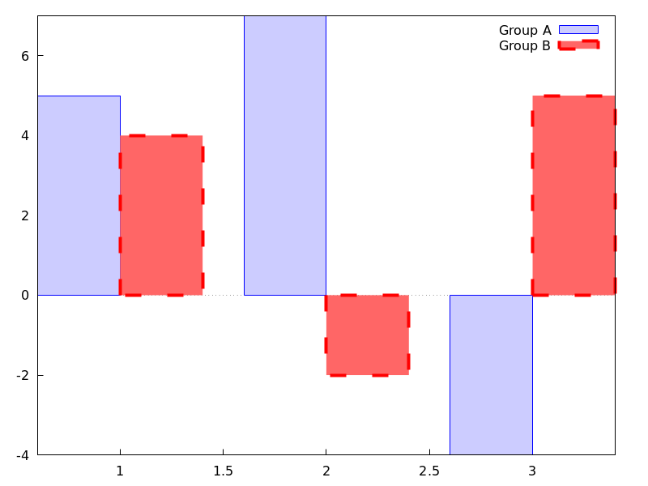

See also: `key`, `fill_color`, `fill_density`, `line_width`.

### Variable: border

Default value: `true`


If `border` is `true`, borders of polygons are painted
according to `line_type` and `line_width`.


This option affects the following graphic objects:


- *
`gr2d`: `polygon`, `rectangle` and `ellipse`.


Example:


```maxima
(%i1) draw2d(color       = brown,
             line_width  = 8,
             polygon([[3,2],[7,2],[5,5]]),
             border      = false,
             fill_color  = blue,
             polygon([[5,2],[9,2],[7,5]]) )$
```

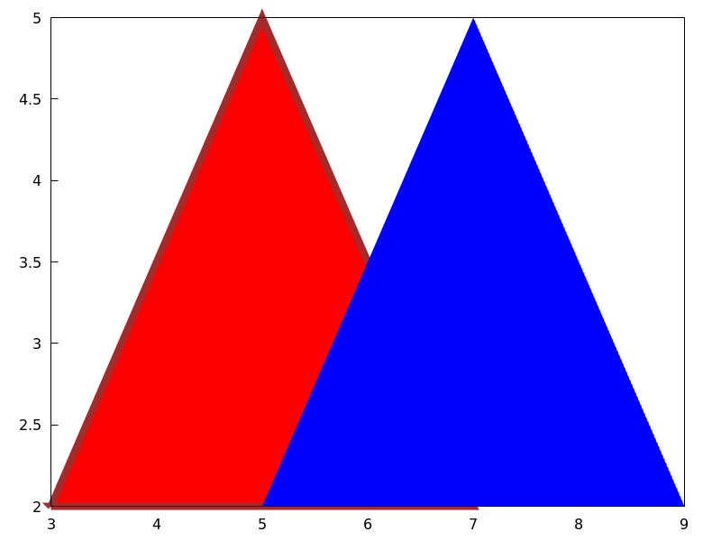

See also: `polygon`, `rectangle`, `ellipse`.

### Variable: boundaries_array

Default value: `false`


`boundaries_array` is where the graphic object `geomap` looks
for boundaries coordinates.


Each component of `boundaries_array` is an array of floating
point quantities, the coordinates of a polygonal segment or map boundary.


See also `geomap`.

See also: `geomap`.

### Variable: capping

Default value: `[false, false]`


A list with two possible elements, `true` and `false`,
indicating whether the extremes of a graphic object `tube` remain closed
or open. By default, both extremes are left open.


Setting `capping = false` is equivalent to `capping = [false, false]`,
and `capping = true` is equivalent to `capping = [true, true]`.


Example:


```maxima
(%i1) draw3d(
        capping = [false, true],
        tube(0, 0, a, 1,
             a, 0, 8) )$
```

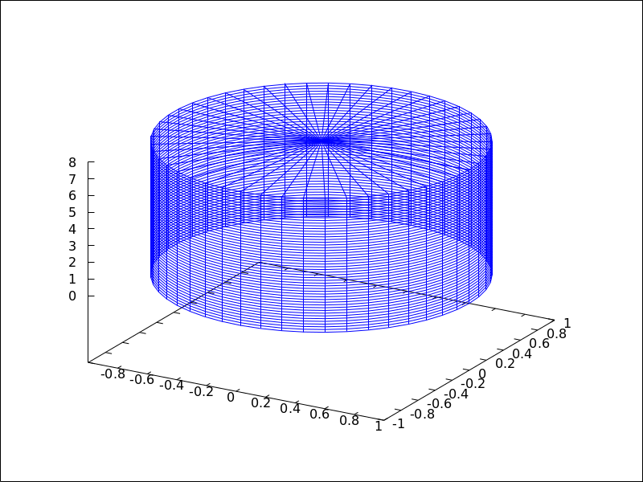

### Variable: cbrange

Default value: `auto`


If `cbrange` is `auto`, the range for the values which are
colored when `enhanced3d` is not `false` is computed
automatically. Values outside of the color range use color of the
nearest extreme.


When `enhanced3d` or `colorbox` is `false`, option `cbrange` has
no effect.


If the user wants a specific interval for the colored values, it must
be given as a Maxima list, as in `cbrange=[-2, 3]`.


Since this is a global graphics option, its position in the scene description
does not matter.


Example:


```maxima
(%i1) draw3d (
        enhanced3d     = true,
        color          = green,
        cbrange = [-3,10],
        explicit(x^2+y^2, x,-2,2,y,-2,2)) $
```

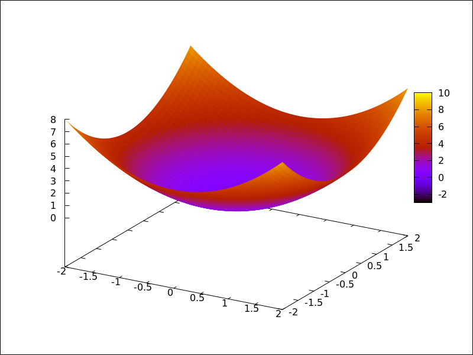


See also `enhanced3d`,  `colorbox` and `cbtics`.

See also: `enhanced3d`, `colorbox`, `cbtics`.

### Variable: cbtics

Default value: `auto`


This graphic option controls the way tic marks are drawn on the colorbox
when option `enhanced3d` is not `false`.


When `enhanced3d` or `colorbox` is `false`, option `cbtics` has
no effect.


See `xtics` for a complete description.


Example :


```maxima
(%i1) draw3d (
        enhanced3d = true,
        color      = green,
        cbtics  = {["High",10],["Medium",05],["Low",0]},
        cbrange = [0, 10],
        explicit(x^2+y^2, x,-2,2,y,-2,2)) $
```

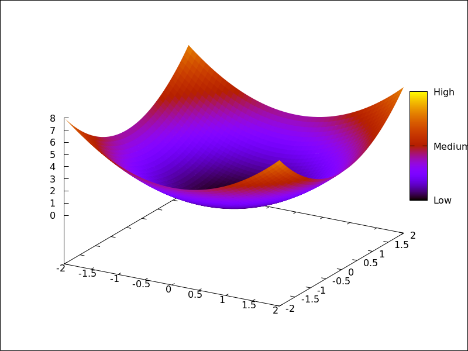


See also `enhanced3d`,  `colorbox` and `cbrange`.

See also: `enhanced3d`, `colorbox`, `cbrange`.

### Variable: colorbox

Default value: `true`


If `colorbox` is `true`, a color scale without label is drawn together with 
`image` 2D objects, or coloured 3d objects. If `colorbox` is `false`, no 
color scale is shown. If `colorbox` is a string, a color scale with label is drawn.


Since this is a global graphics option, its position in the scene description
does not matter.


Example:


Color scale and images.


```maxima
(%i1) im: apply('matrix,
                 makelist(makelist(random(200),i,1,30),i,1,30))$
(%i2) draw(
          gr2d(image(im,0,0,30,30)),
          gr2d(colorbox = false, image(im,0,0,30,30))
      )$
```

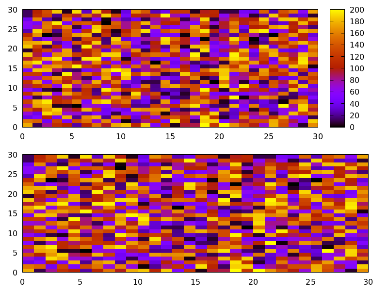
Color scale and 3D coloured object.


```maxima
(%i1) draw3d(
        colorbox   = "Magnitude",
        enhanced3d = true,
        explicit(x^2+y^2,x,-1,1,y,-1,1))$
```

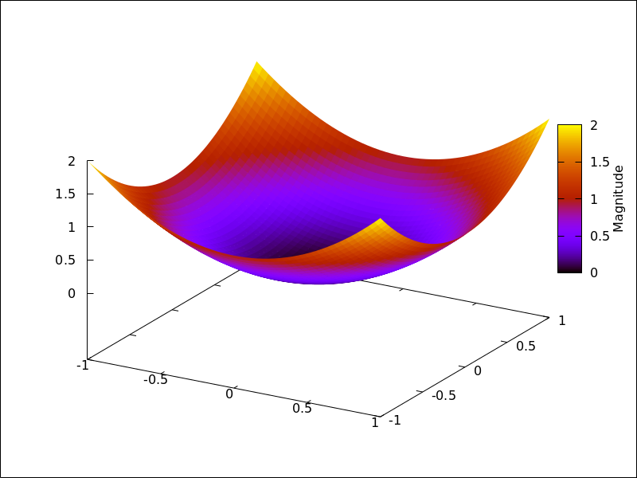


See also `palette_005fdraw`.

See also: `palette_draw`.

### Variable: columns

Default value: 1


`columns` is the number of columns in multiple plots.


Since this is a global graphics option, its position in the scene description
does not matter. It can be also used as an argument of function `draw`.


Example:


```maxima
(%i1) scene1: gr2d(title="Ellipse",
                   nticks=30,
                   parametric(2*cos(t),5*sin(t),t,0,2*%pi))$
(%i2) scene2: gr2d(title="Triangle",
                   polygon([4,5,7],[6,4,2]))$
(%i3) draw(scene1, scene2, columns = 2)$
```

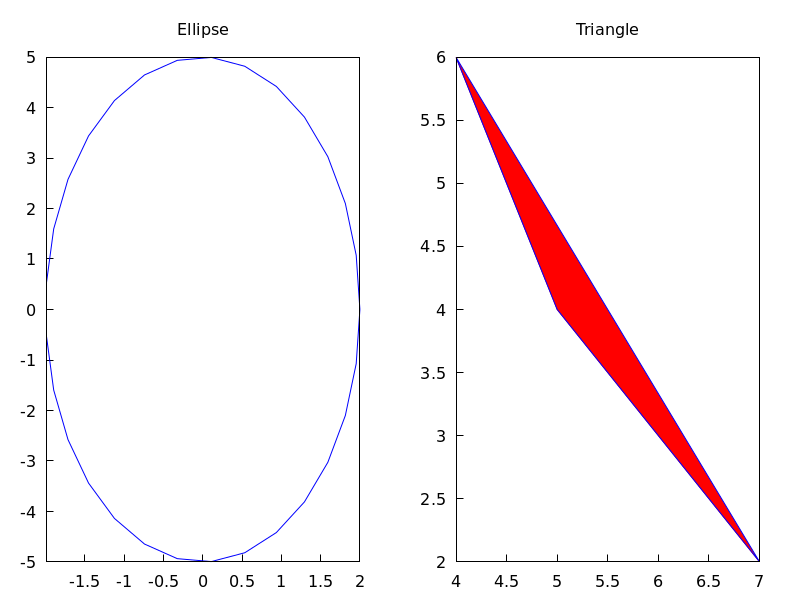

### Variable: contour

Default value: `none`


Option `contour` enables the user to select where to plot contour lines.
Possible values are:


- *
`none`:
no contour lines are plotted.
- *
`base`:
contour lines are projected on the xy plane.
- *
`surface`:
contour lines are plotted on the surface.
- *
`both`:
two contour lines are plotted: on the xy plane and on the surface.
- *
`map`:
contour lines are projected on the xy plane, and the view point is
set just in the vertical.


Since this is a global graphics option, its position in the scene description
does not matter.


Example:


```maxima
(%i1) draw3d(explicit(20*exp(-x^2-y^2)-10,x,0,2,y,-3,3),
             contour_levels = 15,
             contour        = both,
             surface_hide   = true) $
```

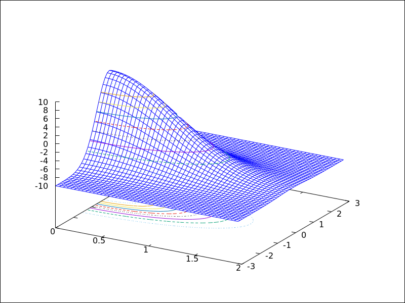


```maxima
(%i1) draw3d(explicit(20*exp(-x^2-y^2)-10,x,0,2,y,-3,3),
             contour_levels = 15,
             contour        = map
      ) $
```

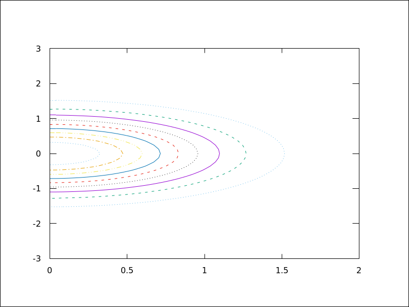

### Variable: contour_levels

Default value: 5


This graphic option controls the way contours are drawn. 
`contour_levels` can be set to a positive integer number, a list of three
numbers or an arbitrary set of numbers:


- *
When option `contour_levels` is bounded to positive integer *n*,
*n* contour lines will be drawn at equal intervals. By default, five
equally spaced contours are plotted.
- *
When option `contour_levels` is bounded to a list of length three of the
form `[lowest,s,highest]`, contour lines are plotted from `lowest` 
to `highest` in steps of `s`.
- *
When option `contour_levels` is bounded to a set of numbers of the
form `{n1, n2, ...}`, contour lines are plotted at values `n1`,
`n2`, ...


Since this is a global graphics option, its position in the scene description
does not matter.


Examples:


Ten equally spaced contour lines. The actual number of
levels can be adjusted to give simple labels.


```maxima
(%i1) draw3d(color = green,
             explicit(20*exp(-x^2-y^2)-10,x,0,2,y,-3,3),
             contour_levels = 10,
             contour        = both,
             surface_hide   = true) $
```


From -8 to 8 in steps of 4.


```maxima
(%i1) draw3d(color = green,
             explicit(20*exp(-x^2-y^2)-10,x,0,2,y,-3,3),
             contour_levels = [-8,4,8],
             contour        = both,
             surface_hide   = true) $
```


Isolines at levels -7, -6, 0.8 and 5.


```maxima
(%i1) draw3d(color = green,
             explicit(20*exp(-x^2-y^2)-10,x,0,2,y,-3,3),
             contour_levels = {-7, -6, 0.8, 5},
             contour        = both,
             surface_hide   = true) $
```


See also `contour`.

See also: `contour`.

### Function: cylindrical (radius, z, minz, maxz, azi, minazi, maxazi)

Draws 3D functions defined in cylindrical coordinates.


**3D**


`cylindrical(radius, z, minz, maxz, azi, minazi, maxazi)` plots the function `radius(z, azi)` defined in cylindrical coordinates, with variable *z* taking
values from *minz* to *maxz* and *azimuth* *azi* taking values
from *minazi* to *maxazi*.


This object is affected by the following *graphic options*: `xu_grid`, 
`yv_grid`, `line_type`, `key`, `wired_surface`, `enhanced3d` and `color`


Example:


```maxima
(%i1) draw3d(cylindrical(1,z,-2,2,az,0,2*%pi))$
```

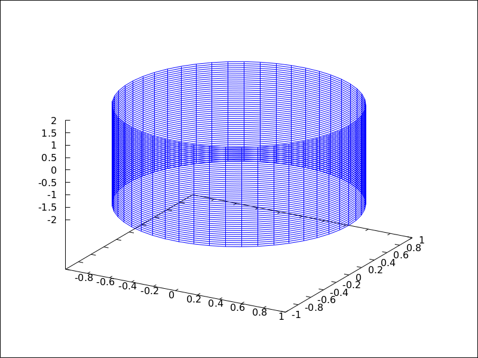

See also: `xu_grid`, `yv_grid`, `line_type`, `key`, `wired_surface`.

### Variable: data_file_name

Default value: `"data.gnuplot"`


This is the name of the file with the numeric data needed
by Gnuplot to build the requested plot.


Since this is a global graphics option, its position in the scene description
does not matter. It can be also used as an argument of function `draw`.


See example in `gnuplot_file_name`.

### Variable: delay

Default value: 5


This is the delay in 1/100 seconds of frames in animated gif files.


Since this is a global graphics option, its position in the scene description
does not matter. It can be also used as an argument of function `draw`.


Example:


```maxima
(%i1) draw(
        delay     = 100,
        file_name = "zzz",
        terminal  = 'animated_gif,
        gr2d(explicit(x^2,x,-1,1)),
        gr2d(explicit(x^3,x,-1,1)),
        gr2d(explicit(x^4,x,-1,1)));
End of animation sequence
(%o2)          [gr2d(explicit), gr2d(explicit), gr2d(explicit)]
```


Option `delay` is only active in animated gif’s; it is ignored in
any other case.


See also `terminal`, and `dimensions`.

See also: `terminal`.

### Variable: dimensions

Default value: `[600,500]`


Dimensions of the output terminal. Its value is a list formed by
the width and the height. The meaning of the two numbers depends on
the terminal you are working with.


With terminals `gif`, `animated_gif`, `png`, `jpg`,
`svg`, `screen`, `wxt`, `qt`, `x11`,
`windows` and `aquaterm`, the integers represent the number of
points in each direction. If they are not integers, they are rounded.


With terminals `eps`, `epslatex`, `epslatex_standalone`,
`eps_color`, `multipage_eps`, `multipage_eps_color`,
`cairolatex_pdf`, `cairolatex_pdf_standalone`,
`pdf`, `multipage_pdf`, `pdfcairo`,
`multipage_pdfcairo`, `tikz`, and `tikz_standalone`, both
numbers represent hundredths of cm, which means that, by default,
pictures in these formats are 6 cm in width and 5 cm in height.


Since this is a global graphics option, its position in the scene description
does not matter. It can be also used as an argument of function `draw`.


Examples:


Option `dimensions` applied to file output
and to wxt canvas.


```maxima
(%i1) draw2d(
        dimensions = [300,300],
        terminal   = 'png,
        explicit(x^4,x,-1,1)) $
(%i2) draw2d(
        dimensions = [300,300],
        terminal   = 'wxt,
        explicit(x^4,x,-1,1)) $
```


Option `dimensions` applied to eps output.
We want an eps file with A4 portrait dimensions.


```maxima
(%i1) A4portrait: 100*[21, 29.7]$
(%i2) draw3d(
        dimensions = A4portrait,
        terminal   = 'eps,
        explicit(x^2-y^2,x,-2,2,y,-2,2)) $
```

### Function: draw (<arg_1>, ...)

Plots a series of scenes; its arguments are `gr2d` and/or `gr3d` 
objects, together with some options, or lists of scenes and options.
By default, the scenes are put together
in one column.


Besides scenes the function `draw` accepts the following global options:
`terminal`, `columns`, `dimensions`, `file_name`
and `delay`.


Functions `draw2d` and `draw3d` short cuts that can be used 
when only one scene is required, in two or three dimensions, respectively.


See also `gr2d` and `gr3d`.


Examples:


```maxima
(%i1) scene1: gr2d(title="Ellipse",
                   nticks=300,
                   parametric(2*cos(t),5*sin(t),t,0,2*%pi))$
(%i2) scene2: gr2d(title="Triangle",
                   polygon([4,5,7],[6,4,2]))$
(%i3) draw(scene1, scene2, columns = 2)$
```


```maxima
(%i1) scene1: gr2d(title="A sinus",
        grid=true,
        explicit(sin(t),t,0,2*%pi))$
(%i2) scene2: gr2d(title="A cosinus",
        grid=true,
        explicit(cos(t),t,0,2*%pi))$
(%i3) draw(scene1, scene2)$
```

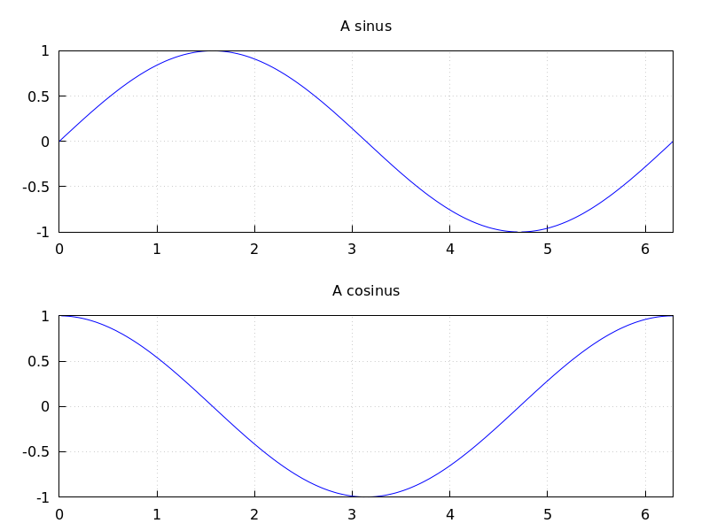


The following two draw sentences are equivalent:


```maxima
(%i1) draw(gr3d(explicit(x^2+y^2,x,-1,1,y,-1,1)));
(%o1)                          [gr3d(explicit)]
(%i2) draw3d(explicit(x^2+y^2,x,-1,1,y,-1,1));
(%o2)                          [gr3d(explicit)]
```


Creating an animated gif file:


```maxima
(%i1) draw(
        delay     = 100,
        file_name = "zzz",
        terminal  = 'animated_gif,
        gr2d(explicit(x^2,x,-1,1)),
        gr2d(explicit(x^3,x,-1,1)),
        gr2d(explicit(x^4,x,-1,1)));
End of animation sequence
(%o1)          [gr2d(explicit), gr2d(explicit), gr2d(explicit)]
```

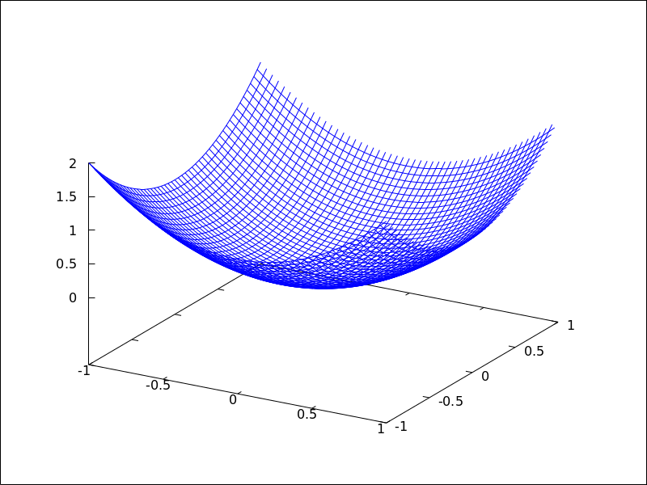
See also `gr2d`, `gr3d`, `draw2d` and `draw3d`.

See also: `terminal`, `columns`, `dimensions`, `file_name`, `delay`, `draw2d`, `draw3d`, `gr2d`, `gr3d`.

### Function: draw2d (argument_1, ...)

This function is a shortcut for
`draw(gr2d(options, ..., graphic_object, ...))`.


It can be used to plot a unique scene in 2d, as can be seen in most examples below.


See also `draw` and `gr2d`.

See also: `draw`, `gr2d`.

### Function: draw3d (argument_1, ...)

This function is a shortcut for
`draw(gr3d(options, ..., graphic_object, ...))`.


It can be used to plot a unique scene in 3d, as can be seen in many examples below.


See also `draw` and `gr3d`.

See also: `draw`, `gr3d`.

### Function: draw_file (graphic option, ..., graphic object, ...)

Saves the current plot into a file. Accepted graphics options are:
`terminal`, `dimensions` and `file_name`. 


Example:


```maxima
(%i1) /* screen plot */
      draw(gr3d(explicit(x^2+y^2,x,-1,1,y,-1,1)))$
(%i2) /* same plot in eps format */
      draw_file(terminal  = eps,
                dimensions = [5,5]) $
```

### Variable: draw_realpart

Default value: `true`


When `true`, functions to be drawn are considered as complex functions whose
real part value should be plotted; when `false`, nothing will be plotted when
the function does not give a real value. 


This option affects objects `explicit` and `parametric` in 2D and 3D, and
`parametric_005fsurface`.


Example:


```maxima
(%i1) draw2d(
        draw_realpart = false,
        explicit(sqrt(x^2  - 4*x) - x, x, -1, 5),
        color         = red,
        draw_realpart = true,
        parametric(x,sqrt(x^2  - 4*x) - x + 1, x, -1, 5) );
```

See also: `explicit`, `parametric`, `parametric_surface`.

### Variable: draw_renderer

Default value: `gnuplot_pipes`


The only permitted values are `gnuplot_pipes`, `gnuplot`,
`vtk`, `vtk6` or `vtk7`. When `draw_renderer` is set
to `vtk`, the VTK interface is used for draw.

### Function: elevation_grid (mat, x0, y0, width, height)

Draws matrix *mat* in 3D space. *z* values are taken from *mat*,
the abscissas range from *x0* to $x0 + width$
and ordinates from *y0* to $y0 + height$. Element $a(1,1)$
is projected on point $(x0,y0+height)$, $a(1,n)$ on $(x0+width,y0+height)$,
$a(m,1)$ on $(x0,y0)$, and $a(m,n)$ on $(x0+width,y0)$.


This object is affected by the following *graphic options*: `line_type`,,
`line_width`  `key`,  `wired_surface`,  `enhanced3d` and `color`


In older versions of Maxima, `elevation_grid` was called `mesh`.
See also `mesh`.


Example:


```maxima
(%i1) m: apply(
            matrix,
            makelist(makelist(random(10.0),k,1,30),i,1,20)) $
(%i2) draw3d(
         color = blue,
         elevation_grid(m,0,0,3,2),
         xlabel = "x",
         ylabel = "y",
         surface_hide = true);
```

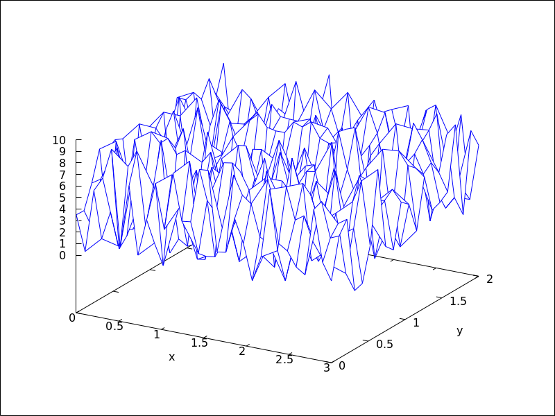

See also: `line_type`, `line_width`, `key`, `wired_surface`, `enhanced3d`, `elevation_grid`, `mesh`.

### Function: ellipse (xc, yc, a, b, ang1, ang2)

Draws ellipses and circles in 2D.


**2D**


`ellipse (xc, yc, a, b, ang1, ang2)`
plots an ellipse centered at `[xc, yc]` with horizontal and vertical
semi axis *a* and *b*, respectively, starting at angle *ang1* with an amplitude
equal to angle *ang2*.


This object is affected by the following *graphic options*: `nticks`, 
`transparent`, `fill_color`, `fill_density`, `border`, `line_width`, 
`line_type`, `key` and `color`


Example:


```maxima
(%i1) draw2d(transparent = false,
             fill_color  = red,
             color       = gray30,
             transparent = false,
             line_width  = 5,
             ellipse(0,6,3,2,270,-270),
             /* center (x,y), a, b, start & end in degrees */
             transparent = true,
             color       = blue,
             line_width  = 3,
             ellipse(2.5,6,2,3,30,-90),
             xrange      = [-3,6],
             yrange      = [2,9] )$
```

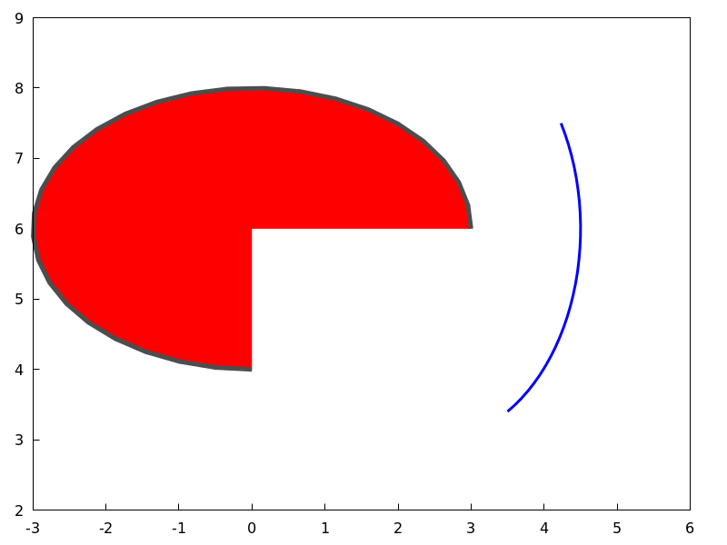

See also: `nticks`, `transparent`, `fill_color`, `fill_density`, `border`, `line_type`, `key`.

### Variable: enhanced3d

Default value: `none`


If `enhanced3d` is `none`, surfaces are not colored in 3D plots.
In order to get a colored surface, a list must be assigned to option
`enhanced3d`, where the first element is an expression and the rest
are the names of the variables or parameters used in that expression. A list such 
`[f(x,y,z), x, y, z]` means that point `[x,y,z]` of the surface 
is assigned number `f(x,y,z)`, which will be colored according to 
the actual `palette`. For those 3D graphic objects defined in terms of
parameters, it is possible to define the color number in terms of
the parameters, as in `[f(u), u]`, as in objects `parametric` and 
`tube`, or `[f(u,v), u, v]`, as in object `parametric_surface`.
While all 3D objects admit the model based on absolute coordinates,
`[f(x,y,z), x, y, z]`, only two of them, namely `explicit`
and `elevation_grid`, accept also models defined on the `[x,y]` coordinates,
`[f(x,y), x, y]`. 3D graphic object `implicit` accepts only the
`[f(x,y,z), x, y, z]` model. Object `points` accepts also the
`[f(x,y,z), x, y, z]` model, but when points have a chronological nature,
model `[f(k), k]` is also valid, being `k` an ordering parameter.


When `enhanced3d` is assigned something different to `none`, options
`color` and `surface_hide` are ignored.


The names of the variables defined in the lists may be different to those
used in the definitions of the graphic objects.


In order to maintain back compatibility, `enhanced3d = false` is equivalent
to `enhanced3d = none`, and `enhanced3d = true` is equivalent to 
`enhanced3d = [z, x, y, z]`.  If an expression is given to `enhanced3d`,
its variables must be the same used in the surface definition. This is not
necessary when using lists.


See option `palette` to learn how palettes are specified.


Examples:


`explicit` object with coloring defined by the `[f(x,y,z), x, y, z]` model.


```maxima
(%i1) draw3d(
         enhanced3d = [x-z/10,x,y,z],
         palette    = gray,
         explicit(20*exp(-x^2-y^2)-10,x,-3,3,y,-3,3))$
```

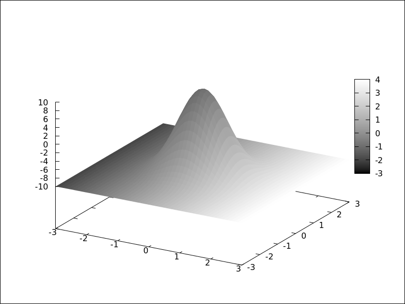


`explicit` object with coloring defined by the `[f(x,y), x, y]` model.
The names of the variables defined in the lists may be different to those
used in the definitions of the graphic objects; in this case, `r` corresponds
to `x`, and `s` to `y`.


```maxima
(%i1) draw3d(
         enhanced3d = [sin(r*s),r,s],
         explicit(20*exp(-x^2-y^2)-10,x,-3,3,y,-3,3))$
```

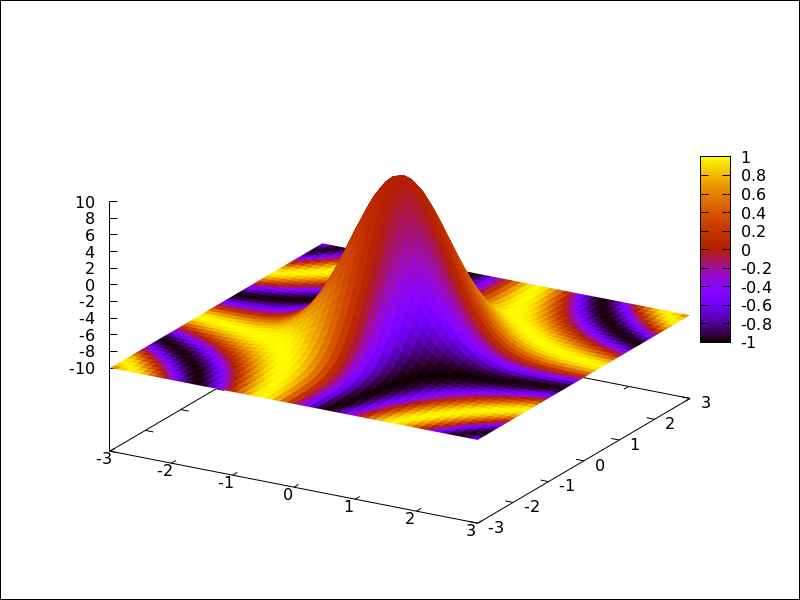


`parametric` object with coloring defined by the `[f(x,y,z), x, y, z]` model.


```maxima
(%i1) draw3d(
         nticks = 100,
         line_width = 2,
         enhanced3d = [if y>= 0 then 1 else 0, x, y, z],
         parametric(sin(u)^2,cos(u),u,u,0,4*%pi)) $
```

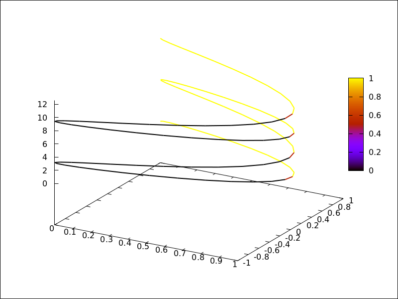


`parametric` object with coloring defined by the `[f(u), u]` model.
In this case, `(u-1)^2` is a shortcut for `[(u-1)^2,u]`.


```maxima
(%i1) draw3d(
         nticks = 60,
         line_width = 3,
         enhanced3d = (u-1)^2,
         parametric(cos(5*u)^2,sin(7*u),u-2,u,0,2))$
```

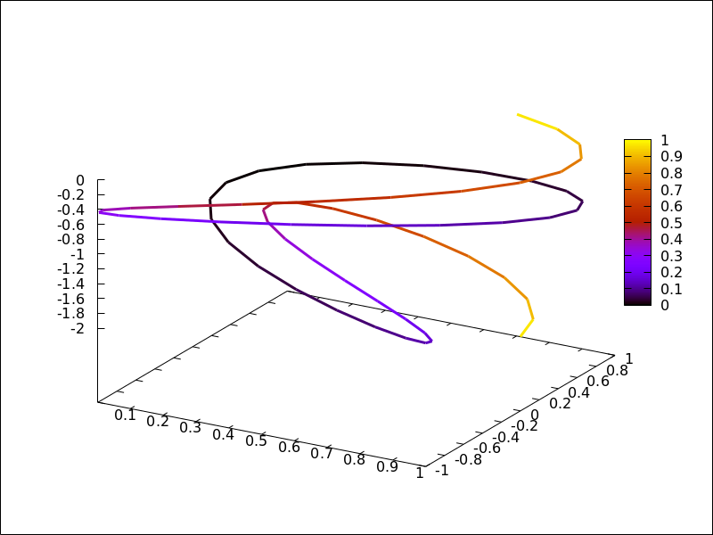


`elevation_grid` object with coloring defined by the `[f(x,y), x, y]` model.


```maxima
(%i1) m: apply(
           matrix,
           makelist(makelist(cos(i^2/80-k/30),k,1,30),i,1,20)) $
(%i2) draw3d(
         enhanced3d = [cos(x*y*10),x,y],
         elevation_grid(m,-1,-1,2,2),
         xlabel = "x",
         ylabel = "y");
```

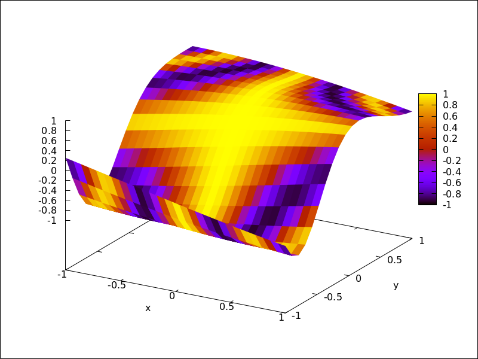


`tube` object with coloring defined by the `[f(x,y,z), x, y, z]` model.


```maxima
(%i1) draw3d(
         enhanced3d = [cos(x-y),x,y,z],
         palette = gray,
         xu_grid = 50,
         tube(cos(a), a, 0, 1, a, 0, 4*%pi) )$
```

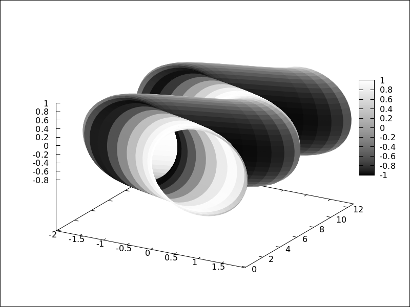


`tube` object with coloring defined by the `[f(u), u]` model.
Here, `enhanced3d = -a` would be the shortcut for `enhanced3d = [-foo,foo]`.


```maxima
(%i1) draw3d(
         capping = [true, false],
         palette = [26,15,-2],
         enhanced3d = [-foo, foo],
         tube(a, a, a^2, 1, a, -2, 2) )$
```

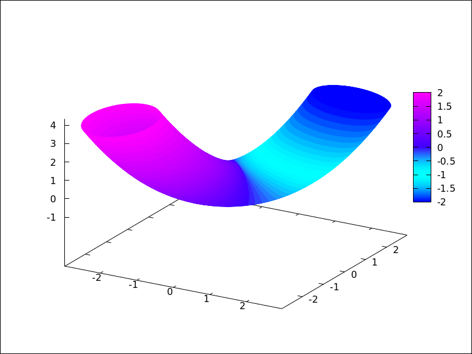


`implicit` and `points` objects with coloring defined by the `[f(x,y,z), x, y, z]` model.


```maxima
(%i1) draw3d(
         enhanced3d = [x-y,x,y,z],
         implicit((x^2+y^2+z^2-1)*(x^2+(y-1.5)^2+z^2-0.5)=0.015,
                  x,-1,1,y,-1.2,2.3,z,-1,1)) $
(%i2) m: makelist([random(1.0),random(1.0),random(1.0)],k,1,2000)$
```

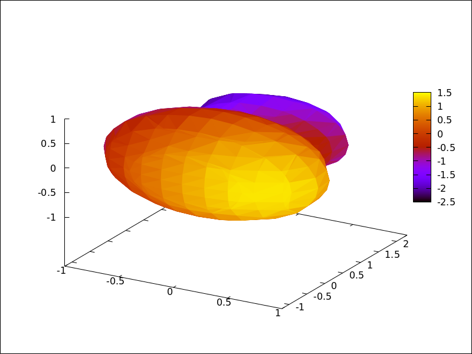


```maxima
(%i3) draw3d(
         point_type = filled_circle,
         point_size = 2,
         enhanced3d = [u+v-w,u,v,w],
         points(m) ) $
```

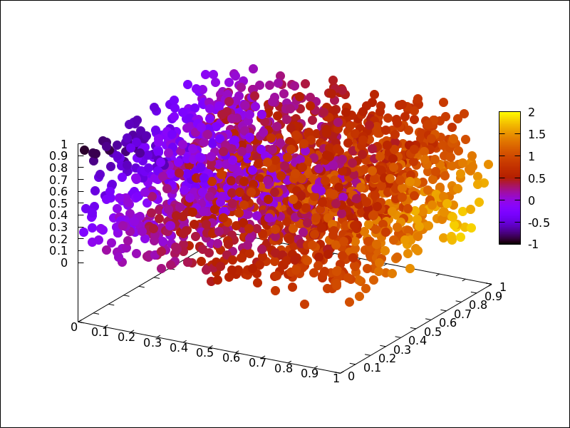


When points have a chronological nature, model `[f(k), k]` is also valid,
being `k` an ordering parameter.


```maxima
(%i1) m:makelist([random(1.0), random(1.0), random(1.0)],k,1,5)$
(%i2) draw3d(
         enhanced3d = [sin(j), j],
         point_size = 3,
         point_type = filled_circle,
         points_joined = true,
         points(m)) $
```

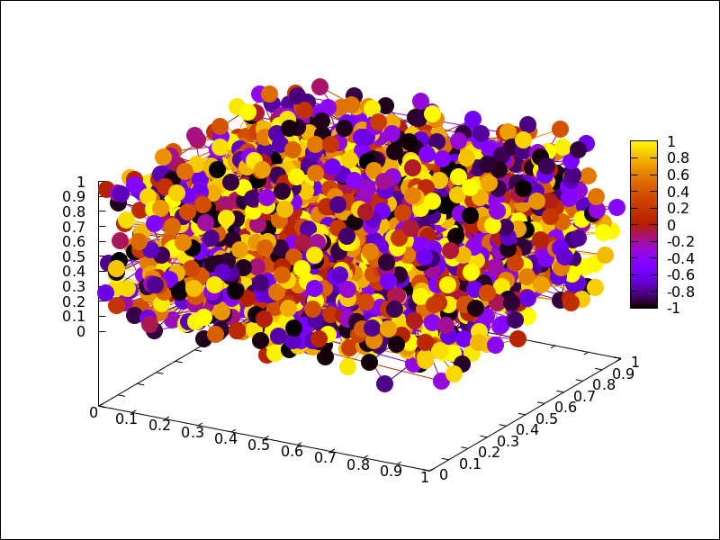

See also: `enhanced3d`, `parametric`, `tube`, `elevation_grid`.

### Variable: error_type

Default value: `y`


Depending on its value, which can be `x`, `y`, or `xy`,
graphic object `errors` will draw points with horizontal, vertical,
or both, error bars. When `error_type=boxes`, boxes will be drawn
instead of crosses.


See also `errors`.

See also: `errors`.

### Function: errors (x1, x2, ..., y1, y2, ...)

Draws points with error bars, horizontally, vertically or both, depending on the
value of option `error_type`.


**2D**


If `error_type = x`, arguments to `errors` must be of the form
`[x, y, xdelta]` or `[x, y, xlow, xhigh]`.  If `error_type = y`, 
arguments must be of the form `[x, y, ydelta]` or
`[x, y, ylow, yhigh]`.  If `error_type = xy` or
`error_type = boxes`, arguments to `errors` must be of the form
`[x, y, xdelta, ydelta]` or `[x, y, xlow, xhigh, ylow, yhigh]`.


See also `error_005ftype`.


This object is affected by the following *graphic options*: `error_type`,  
`points_joined`,  `line_width`,  `key`,  `line_type`,  
`color`  `fill_density`,  `xaxis_secondary`  and  `yaxis_005fsecondary`.


Option `fill_density` is only relevant when `error_type=boxes`.


Examples:


Horizontal error bars.


```maxima
(%i1) draw2d(
        error_type = 'y,
        errors([[1,2,1], [3,5,3], [10,3,1], [17,6,2]]))$
```

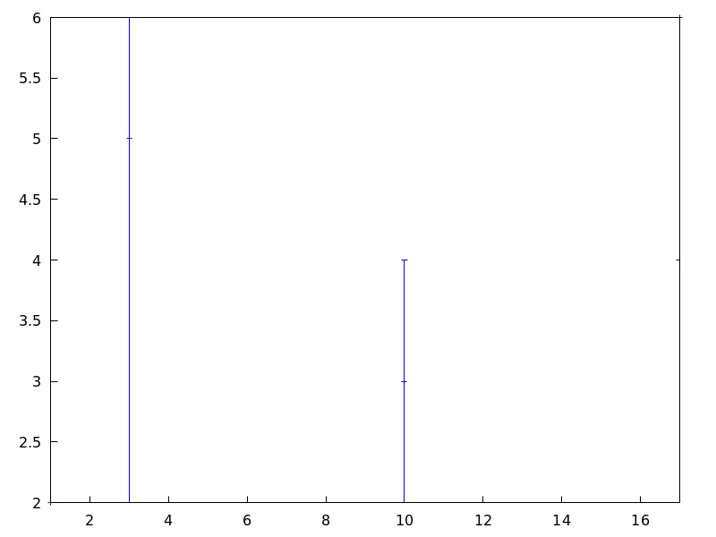


Vertical and horizontal error bars.


```maxima
(%i1) draw2d(
        error_type = 'xy,
        points_joined = true,
        color = blue,
        errors([[1,2,1,2], [3,5,2,1], [10,3,1,1], [17,6,1/2,2]]));
```

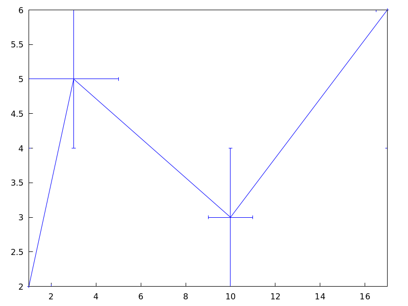

See also: `error_type`, `points_joined`, `line_width`, `key`, `line_type`, `fill_density`, `xaxis_secondary`, `yaxis_secondary`.

### Function: explicit (explicit, expr, var, minval, maxval, explicit, fcn, var, minval, maxval, explicit, expr, var1, minval1, maxval1, var2, minval2, maxval2, explicit, fcn, var1, minval1, maxval1, var2, minval2, maxval2)

Draws explicit functions in 2D and 3D.


**2D**


`explicit(fcn,var,minval,maxval)` plots explicit function *fcn*,
with variable *var* taking values from *minval* to *maxval*.


This object is affected by the following *graphic options*: `nticks`, 
`adapt_depth`, `draw_realpart`, `line_width`, `line_type`, `key`, 
`filled_func`, `fill_color`, `fill_density`, and `color`


Example:


```maxima
(%i1) draw2d(line_width = 3,
             color      = blue,
             explicit(x^2,x,-3,3) )$
```

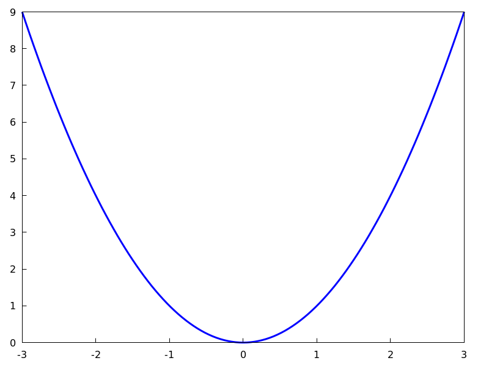


```maxima
(%i2) draw2d(fill_color  = brown,
             filled_func = true,
             explicit(x^2,x,-3,3) )$
```

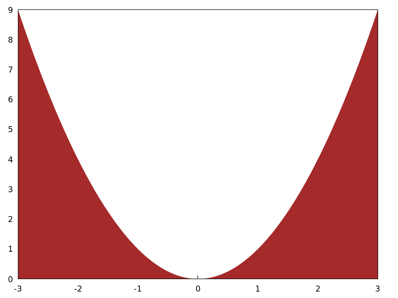


**3D**


`explicit(fcn, var1, minval1, maxval1, var2, minval2, maxval2)` plots the explicit function *fcn*, with
variable *var1* taking values from *minval1* to *maxval1* and
variable *var2* taking values from *minval2* to *maxval2*.


This object is affected by the following *graphic options*: `draw_realpart`, `xu_grid`,
`yv_grid`, `line_type`, `line_width`, `key`, `wired_surface`,
`enhanced3d` and `color`.


Example:


```maxima
(%i1) draw3d(key   = "Gauss",
             color = "#a02c00",
             explicit(20*exp(-x^2-y^2)-10,x,-3,3,y,-3,3),
             yv_grid     = 10,
             color = blue,
             key   = "Plane",
             explicit(x+y,x,-5,5,y,-5,5),
             surface_hide = true)$
```

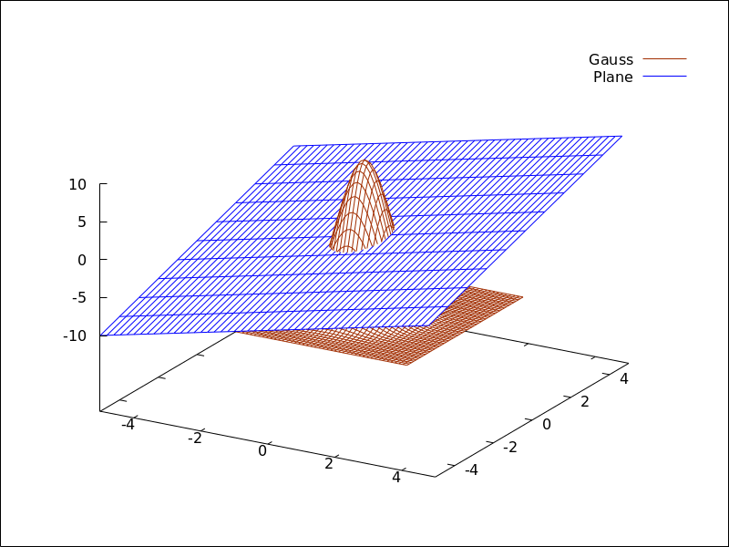


See also `filled_func` for filled functions.

See also: `nticks`, `draw_realpart`, `line_width`, `line_type`, `key`, `filled_func`, `fill_color`, `fill_density`, `xu_grid`, `yv_grid`, `wired_surface`, `enhanced3d`.

### Variable: file_name

Default value: `"maxima_out"`


This is the name of the file where terminals `png`, `jpg`, `gif`,
`eps`, `eps_color`, `pdf`, `pdfcairo` and `svg`
will save the graphic.


Since this is a global graphics option, its position in the scene description
does not matter. It can be also used as an argument of function `draw`.


Example:


```maxima
(%i1) draw2d(file_name = "myfile",
             explicit(x^2,x,-1,1),
             terminal  = 'png)$
```


See also `terminal`,  `dimensions_005fdraw`.

See also: `terminal`, `dimensions_draw`.

### Variable: fill_color

Default value: `"red"`


`fill_color` specifies the color for filling polygons and
2d `explicit` functions.


See `color` to learn how colors are specified.

### Variable: fill_density

Default value: 0


`fill_density` is a number between 0 and 1 that specifies
the intensity of the `fill_color` in `bars` objects.


See `bars` for examples.

### Variable: filled_func

Default value: `false`


Option `filled_func` controls how regions limited by functions
should be filled. When `filled_func` is `true`, the region
bounded by the function defined with object `explicit` and the
bottom of the graphic window is filled with `fill_color`. When 
`filled_func` contains a function expression, then the region bounded
by this function and the function defined with object `explicit` 
will be filled. By default, explicit functions are not filled.


A useful special case is `filled_func=0`, which generates the region 
bond by the horizontal axis and the explicit function.


This option affects only the 2d graphic object `explicit`.


Example:


Region bounded by an `explicit` object and the bottom of the
graphic window.


```maxima
(%i1) draw2d(fill_color  = red,
             filled_func = true,
             explicit(sin(x),x,0,10) )$
```

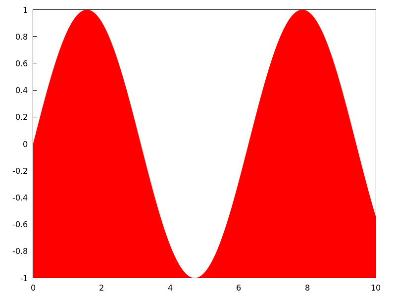


Region bounded by an `explicit` object and the function
defined by option `filled_func`. Note that the variable in
`filled_func` must be the same as that used in `explicit`.


```maxima
(%i1) draw2d(fill_color  = grey,
             filled_func = sin(x),
             explicit(-sin(x),x,0,%pi));
```

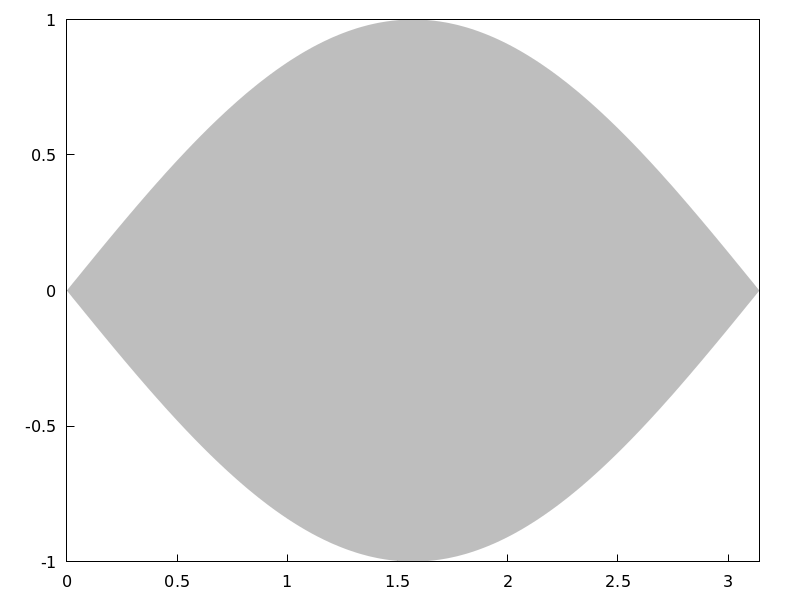
See also `fill_color` and `explicit`.

See also: `explicit`, `fill_color`.

### Variable: font

Default value: `""` (empty string)


This option can be used to set the font face to be used by the terminal.
Only one font face and size can be used throughout the plot.


Since this is a global graphics option, its position in the scene description
does not matter.


See also `font_005fsize`.


Gnuplot doesn’t handle fonts by itself, it leaves this task to the
support libraries of the different terminals, each one with its own
philosophy about it. A brief summary follows:


- *
*x11*:
Uses the normal x11 font server mechanism.

Example:

```maxima
(%i1) draw2d(font      = "Arial", 
             font_size = 20,
             label(["Arial font, size 20",1,1]))$
```
- *
*windows*:
The windows terminal doesn’t support changing of fonts from inside the plot.
Once the plot has been generated, the font can be changed right-clicking on
the menu of the graph window.
- *
*png, jpeg, gif*:
The *libgd* library uses the font path stored in the environment
variable `GDFONTPATH`; in this case, it is only necessary to
set option `font` to the font’s name. It is also possible to
give the complete path to the font file.

Examples:

Option `font` can be given the complete path to the font file:

```maxima
(%i1) path: "/usr/share/fonts/truetype/freefont/" $
(%i2) file: "FreeSerifBoldItalic.ttf" $
(%i3) draw2d(
        font      = concat(path, file), 
        font_size = 20,
        color     = red,
        label(["FreeSerifBoldItalic font, size 20",1,1]),
        terminal  = png)$
```

If environment variable `GDFONTPATH` is set to the
path where font files are allocated, it is possible to
set graphic option `font` to the name of the font.

```maxima
(%i1) draw2d(
        font      = "FreeSerifBoldItalic", 
        font_size = 20,
        color     = red,
        label(["FreeSerifBoldItalic font, size 20",1,1]),
        terminal  = png)$
```
- *
*Postscript*:
Standard Postscript fonts are:
`"Times-Roman"`, `"Times-Italic"`, `"Times-Bold"`,
`"Times-BoldItalic"`,
`"Helvetica"`, `"Helvetica-Oblique"`, `"Helvetica-Bold"`,
`"Helvetic-BoldOblique"`, `"Courier"`,
`"Courier-Oblique"`, `"Courier-Bold"`,
and `"Courier-BoldOblique"`.
  
Example:

```maxima
(%i1) draw2d(
        font      = "Courier-Oblique", 
        font_size = 15,
        label(["Courier-Oblique font, size 15",1,1]),
        terminal = eps)$
```
- *
*pdf*:
Uses same fonts as *Postscript*.
- *
*pdfcairo*:
Uses same fonts as *wxt*.
- *
*wxt*:
The *pango* library finds fonts via the `fontconfig` utility.
- *
*aqua*:
Default is `"Times-Roman"`.


The gnuplot documentation is an important source of information about terminals and fonts.

See also: `font_size`.

### Variable: font_size

Default value: 10


This option can be used to set the font size to be used by the terminal.
Only one font face and size can be used throughout the plot. `font_size` is
active only when option `font` is not equal to the empty string.


Since this is a global graphics option, its position in the scene description
does not matter.


See also `font`.

See also: `font`.

### Function: geomap (geomap, numlist, geomap, numlist, 3Dprojection)

Draws cartographic maps in 2D and 3D.


**2D**


This function works together with global variable `boundaries_array`.


Argument *numlist* is a list containing numbers or lists of numbers.
All these numbers must be integers greater or equal than zero, 
representing the components of global array `boundaries_array`.


Each component of `boundaries_array` is an array of floating
point quantities, the coordinates of a polygonal segment or map boundary.


`geomap (numlist)` flattens its arguments and draws the
associated boundaries in `boundaries_array`.


This object is affected by the following *graphic options*: `line_width`, 
`line_type` and `color`.


Examples:


A simple map defined by hand:


```maxima
(%i1) load("worldmap")$
(%i2) /* Vertices of boundary #0: {(1,1),(2,5),(4,3)} */
   ( bnd0: make_array(flonum,6),
     bnd0[0]:1.0, bnd0[1]:1.0, bnd0[2]:2.0,
     bnd0[3]:5.0, bnd0[4]:4.0, bnd0[5]:3.0 )$
(%i3) /* Vertices of boundary #1: {(4,3),(5,4),(6,4),(5,1)} */
   ( bnd1: make_array(flonum,8),
     bnd1[0]:4.0, bnd1[1]:3.0, bnd1[2]:5.0, bnd1[3]:4.0,
     bnd1[4]:6.0, bnd1[5]:4.0, bnd1[6]:5.0, bnd1[7]:1.0)$
(%i4) /* Vertices of boundary #2: {(5,1), (3,0), (1,1)} */
   ( bnd2: make_array(flonum,6),
     bnd2[0]:5.0, bnd2[1]:1.0, bnd2[2]:3.0,
     bnd2[3]:0.0, bnd2[4]:1.0, bnd2[5]:1.0 )$
(%i5) /* Vertices of boundary #3: {(1,1), (4,3)} */
   ( bnd3: make_array(flonum,4),
     bnd3[0]:1.0, bnd3[1]:1.0, bnd3[2]:4.0, bnd3[3]:3.0)$
(%i6) /* Vertices of boundary #4: {(4,3), (5,1)} */
   ( bnd4: make_array(flonum,4),
     bnd4[0]:4.0, bnd4[1]:3.0, bnd4[2]:5.0, bnd4[3]:1.0)$
(%i7) /* Pack all together in boundaries_array */
   ( boundaries_array: make_array(any,5),
     boundaries_array[0]: bnd0, boundaries_array[1]: bnd1,
     boundaries_array[2]: bnd2, boundaries_array[3]: bnd3,
     boundaries_array[4]: bnd4 )$
(%i8) draw2d(geomap([0,1,2,3,4]))$
```

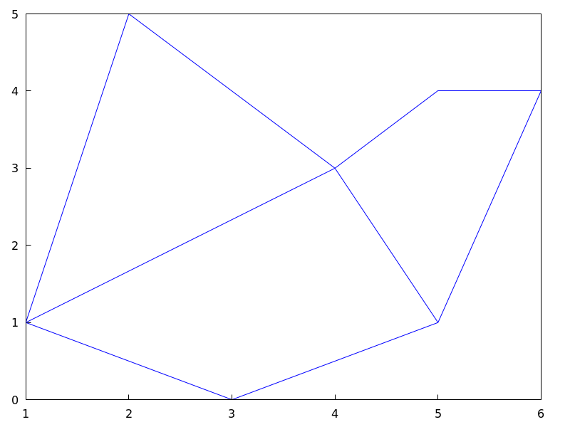


The auxiliary package `worldmap` sets the global variable
`boundaries_array` to real world boundaries in
(longitude, latitude) coordinates. These data are in the 
public domain and come from 

[https://web.archive.org/web/20100310124019/http://www-cger.nies.go.jp/grid-e/gridtxt/grid19.html]().
Package `worldmap` defines also boundaries for countries,
continents and coastlines as lists with the necessary components of 
`boundaries_array` (see file `share/draw/worldmap.mac`
for more information). Package `worldmap` automatically loads 
package `worldmap`.


```maxima
(%i1) load("worldmap")$
(%i2) c1: gr2d(geomap([Canada,United_States,
                       Mexico,Cuba]))$
(%i3) c2: gr2d(geomap(Africa))$
(%i4) c3: gr2d(geomap([Oceania,China,Japan]))$
(%i5) c4: gr2d(geomap([France,Portugal,Spain,
                       Morocco,Western_Sahara]))$
(%i6) draw(columns  = 2,
           c1,c2,c3,c4)$
```

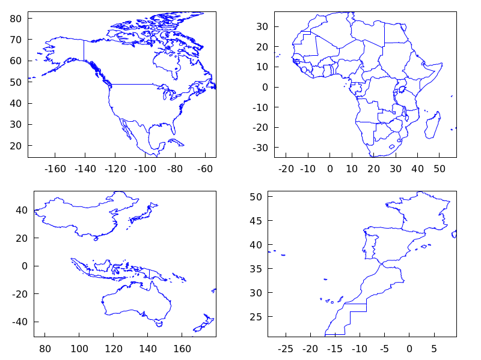


Package `worldmap` is also useful for plotting
countries as polygons. In this case, graphic object
`geomap` is no longer necessary and the `polygon`
object is used instead. Since lists are now used and not
arrays, maps rendering will be slower. See also `make_poly_country`
and `make_poly_continent` to understand the following code.


```maxima
(%i1) load("worldmap")$
(%i2) mymap: append(
   [color      = white],  /* borders are white */
   [fill_color = red],             make_poly_country(Bolivia),
   [fill_color = cyan],            make_poly_country(Paraguay),
   [fill_color = green],           make_poly_country(Colombia),
   [fill_color = blue],            make_poly_country(Chile),
   [fill_color = "#23ab0f"],       make_poly_country(Brazil),
   [fill_color = goldenrod],       make_poly_country(Argentina),
   [fill_color = "midnight-blue"], make_poly_country(Uruguay))$
(%i3) apply(draw2d, mymap)$
```

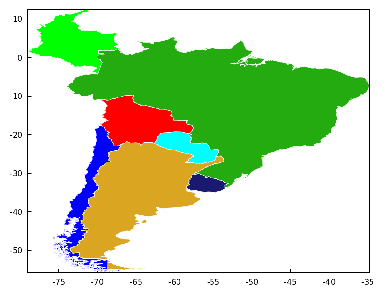


**3D**


`geomap (numlist)` projects map boundaries on the sphere of radius 1
centered at (0,0,0). It is possible to change the sphere or the projection type
by using `geomap (numlist,3Dprojection)`.


Available 3D projections:


- *
`[spherical_projection,x,y,z,r]`: projects map boundaries on the sphere of
radius *r* centered at (*x*,*y*,*z*).

```maxima
(%i1) load("worldmap")$
(%i2) draw3d(geomap(Australia), /* default projection */
             geomap(Australia,
                    [spherical_projection,2,2,2,3]))$
```
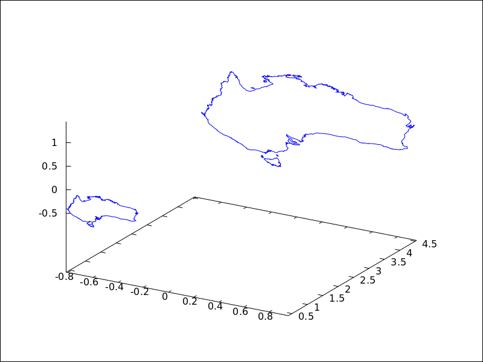
- *
`[cylindrical_projection,x,y,z,r,rc]`: re-projects spherical map boundaries on the cylinder of radius
*rc* and axis passing through the poles of the globe of radius *r* centered at (*x*,*y*,*z*).

```maxima
(%i1) load("worldmap")$
(%i2) draw3d(geomap([America_coastlines,Eurasia_coastlines],
                    [cylindrical_projection,2,2,2,3,4]))$
```
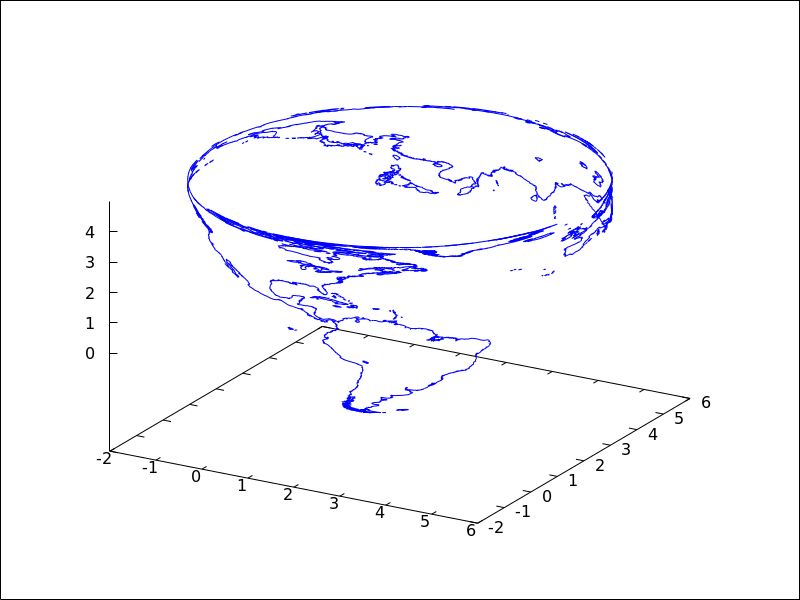
- *
`[conic_projection,x,y,z,r,alpha]`: re-projects spherical map boundaries on the cones of angle *alpha*,
with axis passing through the poles of the globe of radius *r* centered at (*x*,*y*,*z*). Both 
the northern and southern cones are tangent to sphere.

```maxima
(%i1) load("worldmap")$
(%i2) draw3d(geomap(World_coastlines,
                    [conic_projection,0,0,0,1,90]))$
```

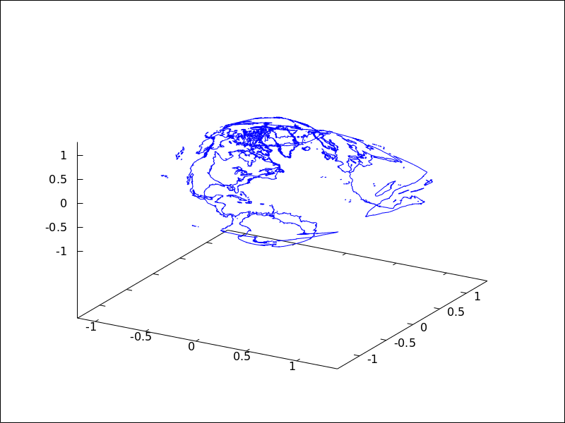


See also [https://riotorto.users.sourceforge.net/Maxima/gnuplot/geomap/]()
for more elaborated examples.

See also: `line_width`, `line_type`, `make_poly_country`, `make_poly_continent`.

### Function: get_pixel (pic, x, y)

Returns pixel from picture. Coordinates *x* and *y* range from 0 to
`width-1` and `height-1`, respectively.

### Variable: gnuplot_file_name

Default value: `"maxout_xxx.gnuplot"` with `"xxx"`
being a number that is unique to each concurrently-running
maxima process.


This is the name of the file with the necessary commands to
be processed by Gnuplot.


Since this is a global graphics option, its position in the scene description
does not matter. It can be also used as an argument of function `draw`.


Example:


```maxima
(%i1) draw2d(
       file_name = "my_file",
       gnuplot_file_name = "my_commands_for_gnuplot",
       data_file_name    = "my_data_for_gnuplot",
       terminal          = png,
       explicit(x^2,x,-1,1)) $
```


See also `data_005ffile_005fname`.

See also: `data_file_name`.

### Function: gr2d (argument_1, ...)

Function `gr2d` builds an object describing a 2D scene. Arguments are
*graphic options*, *graphic objects*, or lists containing both graphic options and objects.
This scene is interpreted sequentially: *graphic options* affect those *graphic objects*
placed on its right. Some *graphic options* affect the global appearance of the scene.


This is the list of *graphic objects* available for scenes in two dimensions:
`bars`, `ellipse`, `explicit`, `image`, `implicit`, `label`,
`parametric`, `points`, `polar`, `polygon`, `quadrilateral`,
`rectangle`, `triangle`, `vector` and `geomap`
(this one defined in package `worldmap`).


See also `draw`
and `draw2d`.


```maxima
(%i1) draw(
    gr2d(
        key="sin (x)",grid=[2,2],
        explicit(
            sin(x),
            x,0,2*%pi
        )
    ),
    gr2d(
        key="cos (x)",grid=[2,2],
        explicit(
            cos(x),
            x,0,2*%pi
        )
    )
 );
(%o1)           [gr2d(explicit), gr2d(explicit)]
```

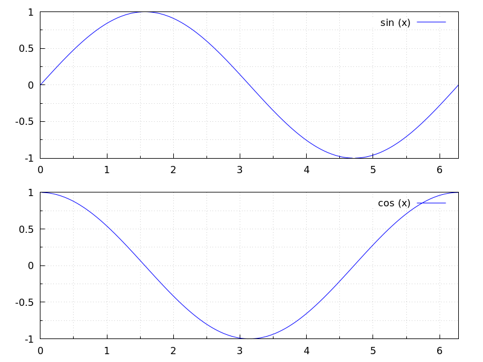

See also: `bars`, `ellipse`, `explicit`, `image`, `implicit`, `label`, `parametric`, `points`, `polar`, `polygon`, `quadrilateral`, `rectangle`, `triangle`, `vector`, `draw`, `draw2d`.

### Function: gr3d (argument_1, ...)

Function `gr3d` builds an object describing a 3d scene. Arguments are
*graphic options*, *graphic objects*, or lists containing both graphic options
and objects. This scene is interpreted sequentially: *graphic options* affect those 
*graphic objects* placed on its right. Some *graphic options* affect the global
appearance of the scene.


This is the list of *graphic objects* available for scenes in three
dimensions:

`cylindrical`, `elevation_grid`, `explicit`, `implicit`,
`label`, `mesh`, `parametric`,

`parametric_surface`, `points`, `quadrilateral`,
`spherical`, `triangle`, `tube`,

`vector`, and `geomap` (this one defined in package `worldmap`).


See also `draw` and `draw3d`.

See also: `cylindrical`, `elevation_grid`, `explicit`, `implicit`, `label`, `mesh`, `parametric`, `parametric_surface`, `points`, `quadrilateral`, `spherical`, `triangle`, `tube`, `vector`, `geomap`, `draw`, `draw3d`.

### Variable: head_angle

Default value: 45


`head_angle` indicates the angle, in degrees, between the arrow heads and
the segment.


This option is relevant only for `vector` objects.


Example:


```maxima
(%i1) draw2d(xrange      = [0,10],
             yrange      = [0,9],
             head_length = 0.7,
             head_angle  = 10,
             vector([1,1],[0,6]),
             head_angle  = 20,
             vector([2,1],[0,6]),
             head_angle  = 30,
             vector([3,1],[0,6]),
             head_angle  = 40,
             vector([4,1],[0,6]),
             head_angle  = 60,
             vector([5,1],[0,6]),
             head_angle  = 90,
             vector([6,1],[0,6]),
             head_angle  = 120,
             vector([7,1],[0,6]),
             head_angle  = 160,
             vector([8,1],[0,6]),
             head_angle  = 180,
             vector([9,1],[0,6]) )$
```

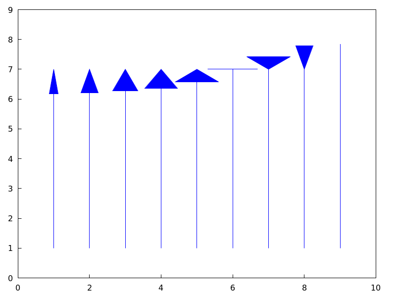


See also `head_both`,  `head_length`,  and `head_005ftype`.

See also: `head_both`, `head_length`, `head_type`.

### Variable: head_both

Default value: `false`


If `head_both` is `true`, vectors are plotted with two arrow heads.
If `false`, only one arrow is plotted.


This option is relevant only for `vector` objects.


Example:


```maxima
(%i1) draw2d(xrange      = [0,8],
             yrange      = [0,8],
             head_length = 0.7,
             vector([1,1],[6,0]),
             head_both   = true,
             vector([1,7],[6,0]) )$
```

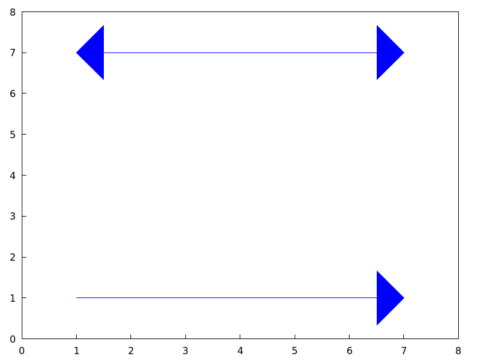


See also `head_length`,  `head_angle`,  and `head_005ftype`.

See also: `head_length`, `head_angle`, `head_type`.

### Variable: head_length

Default value: 2


`head_length` indicates, in *x*-axis units, the length of arrow heads.


This option is relevant only for `vector` objects.


Example:


```maxima
(%i1) draw2d(xrange      = [0,12],
             yrange      = [0,8],
             vector([0,1],[5,5]),
             head_length = 1,
             vector([2,1],[5,5]),
             head_length = 0.5,
             vector([4,1],[5,5]),
             head_length = 0.25,
             vector([6,1],[5,5]))$
```

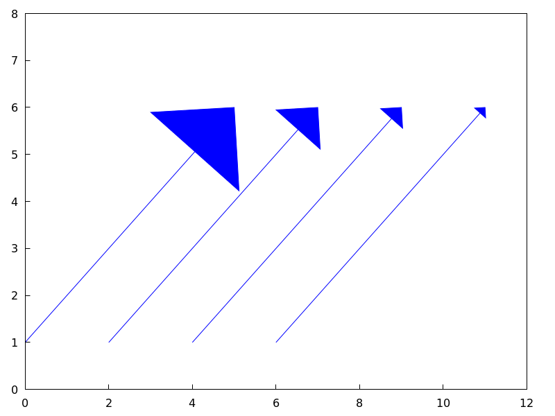


See also `head_both`,  `head_angle`,  and `head_005ftype`.

See also: `head_both`, `head_angle`, `head_type`.

### Variable: head_type

Default value: `filled`


`head_type` is used to specify how arrow heads are plotted. Possible
values are: `filled` (closed and filled arrow heads), `empty`
(closed but not filled arrow heads), and `nofilled` (open arrow heads).


This option is relevant only for `vector` objects.


Example:


```maxima
(%i1) draw2d(xrange      = [0,12],
             yrange      = [0,10],
             head_length = 1,
             vector([0,1],[5,5]), /* default type */
             head_type = 'empty,
             vector([3,1],[5,5]),
             head_type = 'nofilled,
             vector([6,1],[5,5]))$
```

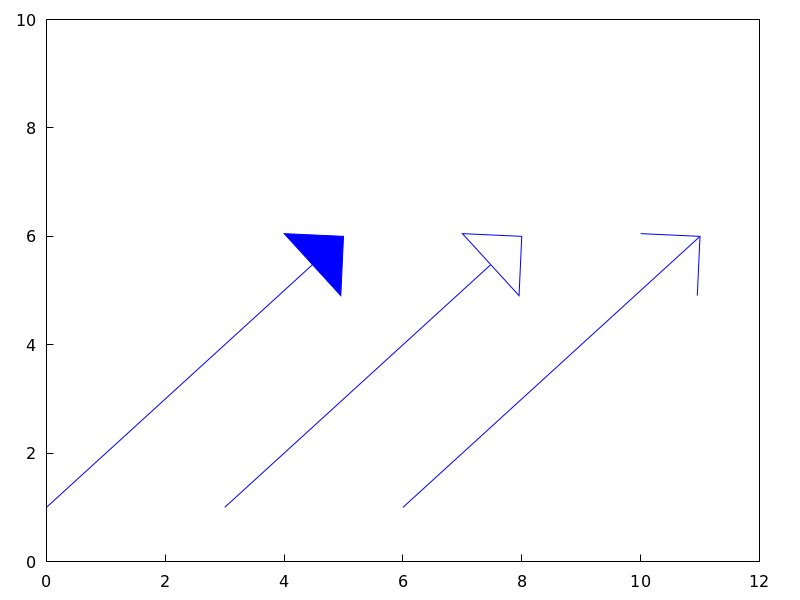


See also `head_both`,  `head_angle`,  and `head_005flength`.

See also: `head_both`, `head_angle`, `head_length`.

### Function: image (im, x0, y0, width, height)

Renders images in 2D.


**2D**


`image (im,x0,y0,width,height)` plots image *im* in the rectangular
region from vertex `(x0,y0)` to `(x0+width,y0+height)` on the real
plane. Argument *im* must be a matrix of real numbers, a matrix of
vectors of length three or a *picture* object.


If *im* is a matrix of real numbers or a *levels picture* object,
pixel values are interpreted according to graphic option `palette`,
which is a vector of length three with components 
ranging from -36 to +36; each value is an index for a formula mapping the levels
onto red, green and blue colors, respectively:


```maxima
0: 0               1: 0.5           2: 1
 3: x               4: x^2           5: x^3
 6: x^4             7: sqrt(x)       8: sqrt(sqrt(x))
 9: sin(90x)       10: cos(90x)     11: |x-0.5|
12: (2x-1)^2       13: sin(180x)    14: |cos(180x)|
15: sin(360x)      16: cos(360x)    17: |sin(360x)|
18: |cos(360x)|    19: |sin(720x)|  20: |cos(720x)|
21: 3x             22: 3x-1         23: 3x-2
24: |3x-1|         25: |3x-2|       26: (3x-1)/2
27: (3x-2)/2       28: |(3x-1)/2|   29: |(3x-2)/2|
30: x/0.32-0.78125                  31: 2*x-0.84
32: 4x;1;-2x+1.84;x/0.08-11.5
33: |2*x - 0.5|    34: 2*x          35: 2*x - 0.5
36: 2*x - 1
```

negative numbers mean negative colour component.


`palette = gray` and `palette = color` are short cuts for
`palette = [3,3,3]` and `palette = [7,5,15]`, respectively.


If *im* is a matrix of vectors of length three or an *rgb picture* object,
they are interpreted as red, green and blue color components.


Examples:


If *im* is a matrix of real numbers, pixel values are interpreted according
to graphic option `palette`.


```maxima
(%i1) im: apply(
           'matrix,
            makelist(makelist(random(200),i,1,30),i,1,30))$
(%i2) /* palette = color, default */
      draw2d(image(im,0,0,30,30))$
```

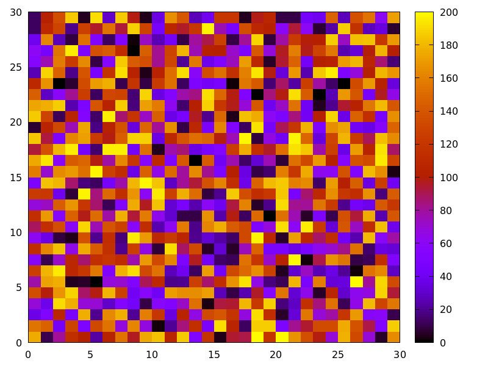


```maxima
(%i3) draw2d(palette = gray, image(im,0,0,30,30))$
```

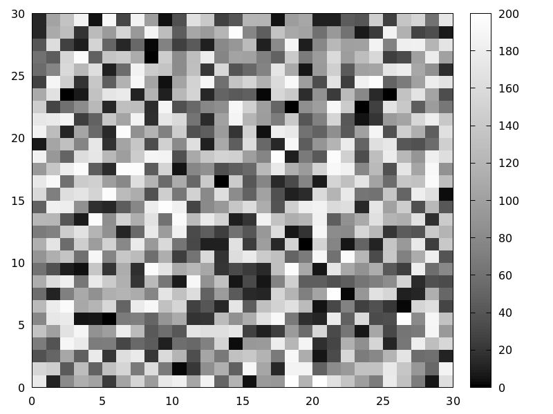


```maxima
(%i4) draw2d(palette = [15,20,-4],
             colorbox=false,
             image(im,0,0,30,30))$
```

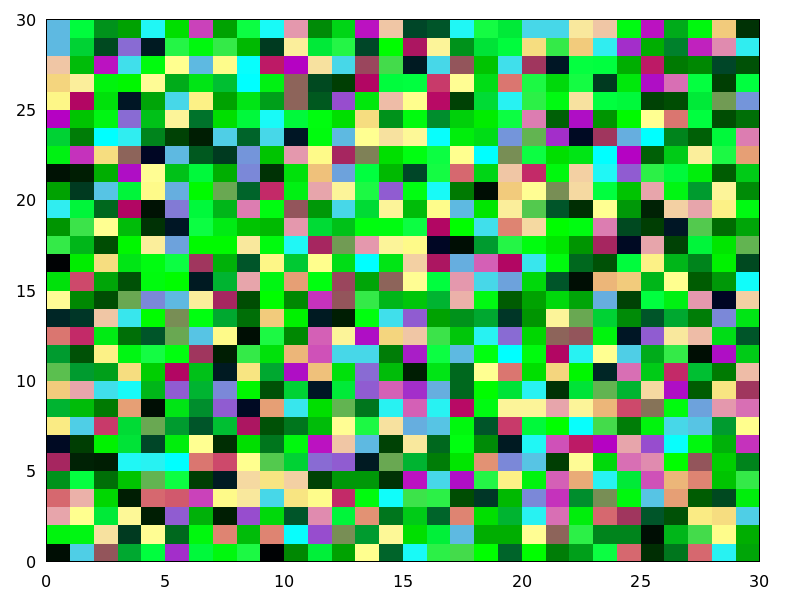


See also `colorbox`.


If *im* is a matrix of vectors of length three, they are interpreted
as red, green and blue color components.


```maxima
(%i1) im: apply(
            'matrix,
             makelist(
               makelist([random(300),
                         random(300),
                         random(300)],i,1,30),i,1,30))$
(%i2) draw2d(image(im,0,0,30,30))$
```

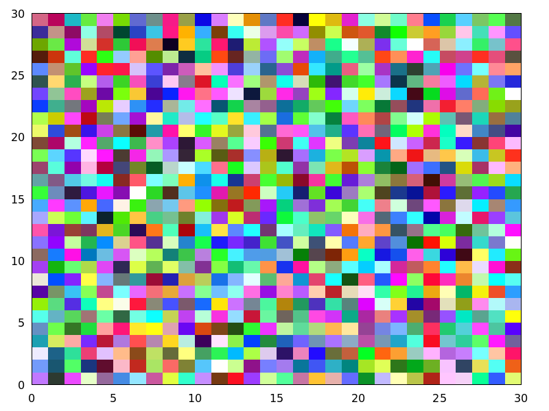


Package `draw` automatically loads package `picture`. In this
example, a level picture object is built by hand and then rendered.


```maxima
(%i1) im: make_level_picture([45,87,2,134,204,16],3,2);
(%o1)       picture(level, 3, 2, {Array:  #(45 87 2 134 204 16)})
(%i2) /* default color palette */
      draw2d(image(im,0,0,30,30))$
```

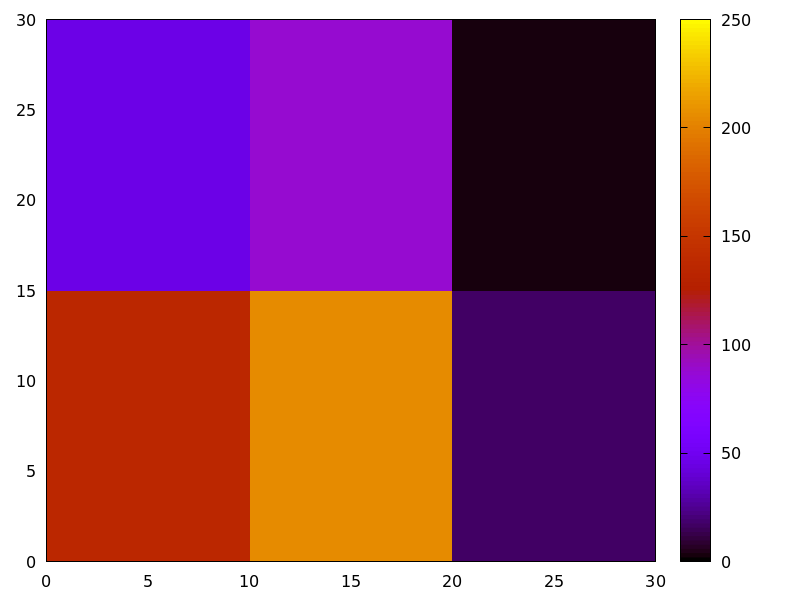


```maxima
(%i3) /* gray palette */
      draw2d(palette = gray,
             image(im,0,0,30,30))$
```

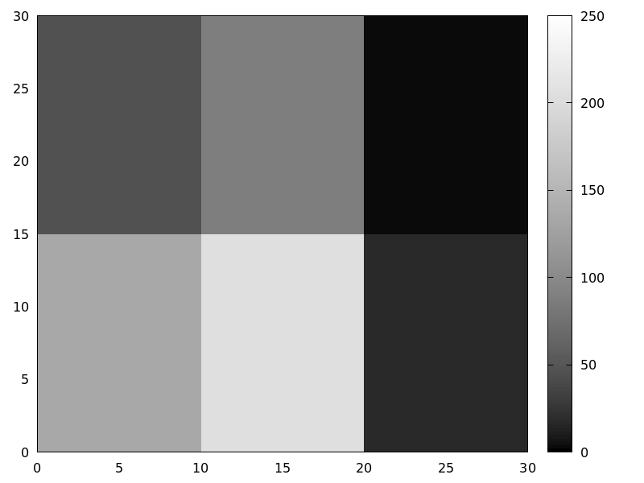


An xpm file is read and then rendered.


```maxima
(%i1) im: read_xpm("myfile.xpm")$
(%i2) draw2d(image(im,0,0,10,7))$
```


See also `make_level_picture`,  `make_rgb_picture` and `read_005fxpm`.


[http://www.telefonica.net/web2/biomates/maxima/gpdraw/image]()

contains more elaborated examples.

See also: `colorbox`, `make_level_picture`, `make_rgb_picture`, `read_xpm`.

### Function: implicit (implicit, fcn, x, xmin, xmax, y, ymin, ymax, implicit, fcn, x, xmin, xmax, y, ymin, ymax, z, zmin, zmax)

Draws implicit functions in 2D and 3D.


**2D**


`implicit(fcn,x,xmin,xmax,y,ymin,ymax)`
plots the implicit function defined by *fcn*, with variable *x* taking values
from *xmin* to *xmax*, and variable *y* taking values
from *ymin* to *ymax*.


This object is affected by the following *graphic options*: `ip_grid`, 
`ip_grid_in`, `line_width`, `line_type`, `key` and `color`.


Example:


```maxima
(%i1) draw2d(grid      = true,
             line_type = solid,
             key       = "y^2=x^3-2*x+1",
             implicit(y^2=x^3-2*x+1, x, -4,4, y, -4,4),
             line_type = dots,
             key       = "x^3+y^3 = 3*x*y^2-x-1",
             implicit(x^3+y^3 = 3*x*y^2-x-1, x,-4,4, y,-4,4),
             title     = "Two implicit functions" )$
```

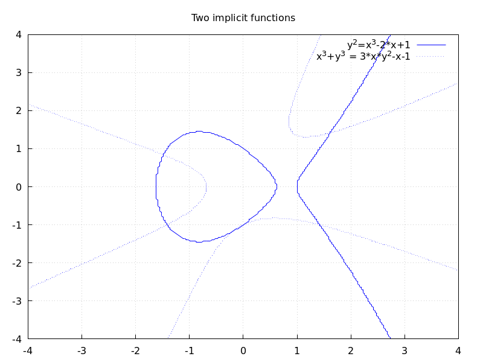


**3D**


`implicit (fcn,x,xmin,xmax, y,ymin,ymax, z,zmin,zmax)`
plots the implicit surface defined by *fcn*, with variable *x* taking values
from *xmin* to *xmax*, variable *y* taking values
from *ymin* to *ymax* and variable *z* taking values
from *zmin* to *zmax*. This object implements the *marching cubes algorithm*.


This object is affected by the following *graphic options*: `x_voxel`, 
`y_voxel`, `z_voxel`, `line_width`, `line_type`, `key`,
`wired_surface`, `enhanced3d` and `color`.


Example:


```maxima
(%i1) draw3d(
        color=blue,
        implicit((x^2+y^2+z^2-1)*(x^2+(y-1.5)^2+z^2-0.5)=0.015,
                 x,-1,1,y,-1.2,2.3,z,-1,1),
        surface_hide=true);
```

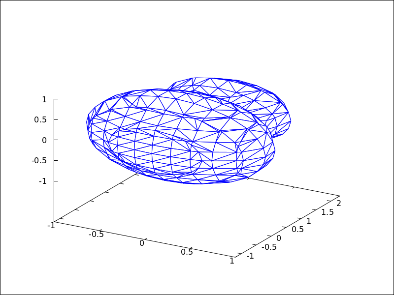

See also: `ip_grid`, `ip_grid_in`, `line_width`, `line_type`, `key`, `x_voxel`, `y_voxel`, `z_voxel`, `wired_surface`, `enhanced3d`.

### Variable: interpolate_color

Default value: `false`


This option is relevant only when `enhanced3d` is not `false`.


When `interpolate_color` is `false`, surfaces are colored with
homogeneous quadrangles. When `true`, color transitions are smoothed
by interpolation.


`interpolate_color` also accepts a list of two numbers, `[m,n]`.
For positive *m* and *n*, each quadrangle or triangle is interpolated
*m* times and *n* times in the respective direction. For negative
*m* and *n*, the interpolation frequency is chosen so that there will be at least
*|m|* and *|n|* points drawn; you can consider this as a special gridding function.
Zeros, i.e. `interpolate_color=[0,0]`, will automatically choose an
optimal number of interpolated surface points.


Also, `interpolate_color=true` is equivalent to `interpolate_color=[0,0]`.


Examples:


Color interpolation with explicit functions.


```maxima
(%i1) draw3d(
        enhanced3d   = sin(x*y),
        explicit(20*exp(-x^2-y^2)-10, x ,-3, 3, y, -3, 3)) $
```


```maxima
(%i2) draw3d(
        interpolate_color = true,
        enhanced3d   = sin(x*y),
        explicit(20*exp(-x^2-y^2)-10, x ,-3, 3, y, -3, 3)) $
```


```maxima
(%i3) draw3d(
        interpolate_color = [-10,0],
        enhanced3d   = sin(x*y),
        explicit(20*exp(-x^2-y^2)-10, x ,-3, 3, y, -3, 3)) $
```


Color interpolation with the `mesh` graphic object.


Interpolating colors in parametric surfaces can give unexpected results.


```maxima
(%i1) draw3d( 
        enhanced3d = true,
        mesh([[1,1,3],   [7,3,1],[12,-2,4],[15,0,5]],
             [[2,7,8],   [4,3,1],[10,5,8], [12,7,1]],
             [[-2,11,10],[6,9,5],[6,15,1], [20,15,2]])) $
```

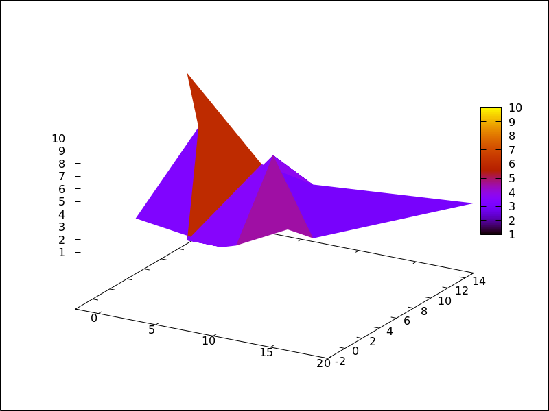


```maxima
(%i2) draw3d( 
        enhanced3d        = true,
        interpolate_color = true,
        mesh([[1,1,3],   [7,3,1],[12,-2,4],[15,0,5]],
             [[2,7,8],   [4,3,1],[10,5,8], [12,7,1]],
             [[-2,11,10],[6,9,5],[6,15,1], [20,15,2]])) $
```

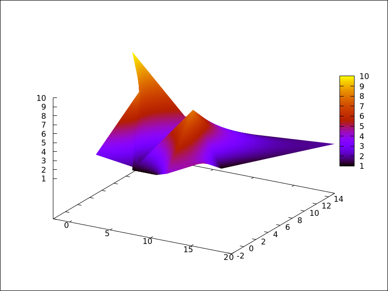


```maxima
(%i3) draw3d( 
        enhanced3d        = true,
        interpolate_color = true,
        view=map,
        mesh([[1,1,3],   [7,3,1],[12,-2,4],[15,0,5]],
             [[2,7,8],   [4,3,1],[10,5,8], [12,7,1]],
             [[-2,11,10],[6,9,5],[6,15,1], [20,15,2]])) $
```

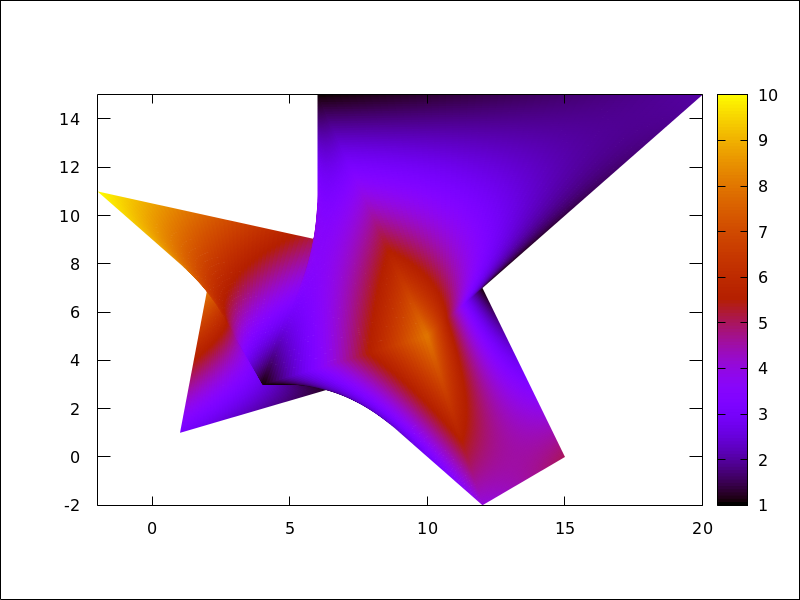


See also `enhanced3d`.

See also: `enhanced3d`.

### Variable: ip_grid

Default value: `[50, 50]`


`ip_grid` sets the grid for the first sampling in implicit plots.


This option is relevant only for `implicit` objects.

### Variable: ip_grid_in

Default value: `[5, 5]`


`ip_grid_in` sets the grid for the second sampling in implicit plots.


This option is relevant only for `implicit` objects.

### Variable: key

Default value: `""` (empty string)


`key` is the name of a function in the legend. If `key` is an
empty string, no key is assigned to the function.


This option affects the following graphic objects:


- *
`gr2d`: `points`, `polygon`, `rectangle`,
`ellipse`, `vector`, `explicit`, `implicit`,
`parametric` and `polar`.
- *
`gr3d`: `points`, `explicit`, `parametric`
and `parametric_005fsurface`.


Example:


```maxima
(%i1) draw2d(key   = "Sinus",
             explicit(sin(x),x,0,10),
             key   = "Cosinus",
             color = red,
             explicit(cos(x),x,0,10) )$
```

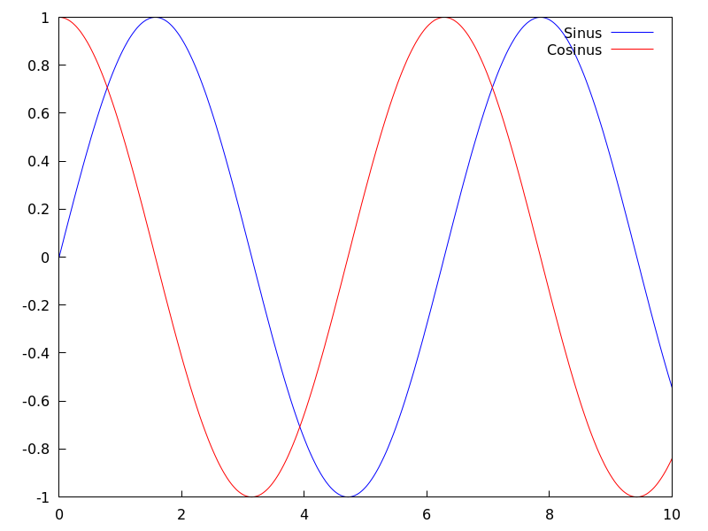

See also: `points`, `polygon`, `rectangle`, `ellipse`, `vector`, `explicit`, `implicit`, `parametric`, `polar`, `parametric_surface`.

### Variable: key_pos

Default value: `""` (empty string)


`key_pos` defines at which position the legend will be drawn. If `key` is an
empty string, `"top_right"` is used.
Available position specifiers are: `top_left`, `top_center`, `top_right`,
`center_left`, `center`, `center_right`,
`bottom_left`, `bottom_center`, and `bottom_right`.


Since this is a global graphics option, its position in the scene description
does not matter.


Example:


```maxima
(%i1) draw2d(
        key_pos = top_left,
        key   = "x",
        explicit(x,  x,0,10),
        color= red,
        key   = "x squared",
        explicit(x^2,x,0,10))$
(%i3) draw3d(
        key_pos = center,
        key   = "x",
        explicit(x+y,x,0,10,y,0,10),
        color= red,
        key   = "x squared",
        explicit(x^2+y^2,x,0,10,y,0,10))$
```

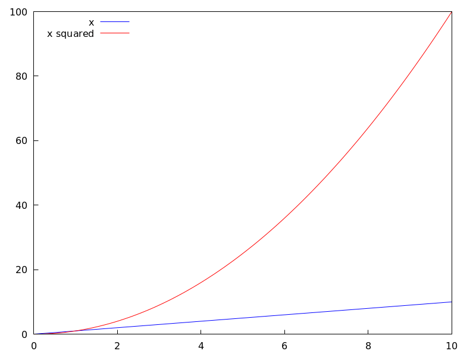

### Variable: label_alignment

Default value: `center`


`label_alignment` is used to specify where to write labels with
respect to the given coordinates. Possible values are: `center`,
`left`, and `right`.


This option is relevant only for `label` objects.


Example:


```maxima
(%i1) draw2d(xrange          = [0,10],
             yrange          = [0,10],
             points_joined   = true,
             points([[5,0],[5,10]]),
             color           = blue,
             label(["Centered alignment (default)",5,2]),
             label_alignment = 'left,
             label(["Left alignment",5,5]),
             label_alignment = 'right,
             label(["Right alignment",5,8]))$
```

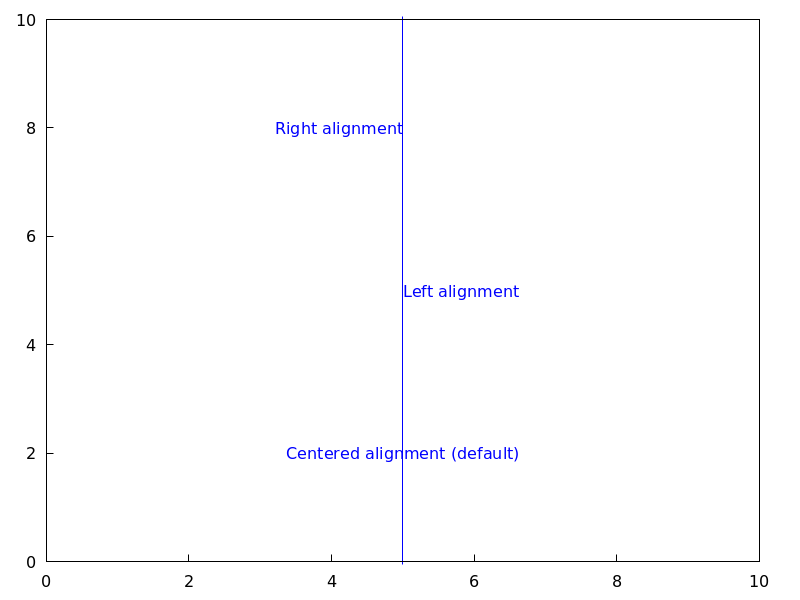


See also `label_orientation`,  and `color`

See also: `label_orientation`.

### Variable: label_orientation

Default value: `horizontal`


`label_orientation` is used to specify orientation of labels.
Possible values are: `horizontal`, and `vertical`.


This option is relevant only for `label` objects.


Example:


In this example, a dummy point is added to get an image.
Package `draw` needs always data to draw an scene.


```maxima
(%i1) draw2d(xrange     = [0,10],
             yrange     = [0,10],
             point_size = 0,
             points([[5,5]]),
             color      = navy,
             label(["Horizontal orientation (default)",5,2]),
             label_orientation = 'vertical,
             color             = "#654321",
             label(["Vertical orientation",1,5]))$
```

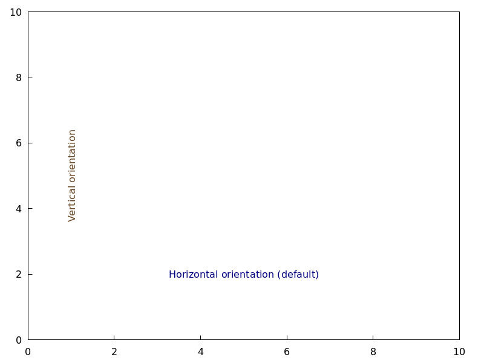


See also `label_alignment` and `color`

See also: `label_alignment`.

### Variable: line_type

Default value: `solid`


`line_type` indicates how lines are displayed; possible values are
`solid` and `dots`, both available in all terminals, and
`dashes`, `short_dashes`, `short_long_dashes`, `short_short_long_dashes`, 
and `dot_dash`, which are not available in `png`, `jpg`, and `gif` terminals. 


This option affects the following graphic objects:


- *
`gr2d`: `points`, `polygon`, `rectangle`,
`ellipse`, `vector`, `explicit`, `implicit`, 
`parametric` and `polar`.
- *
`gr3d`: `points`, `explicit`, `parametric` and `parametric_005fsurface`.


Example:


```maxima
(%i1) draw2d(line_type = dots,
             explicit(1 + x^2,x,-1,1),
             line_type = solid, /* default */
             explicit(2 + x^2,x,-1,1))$
```

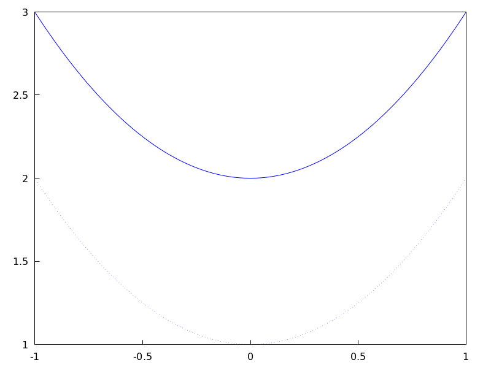


See also `line_005fwidth`.

See also: `points`, `polygon`, `rectangle`, `ellipse`, `vector`, `explicit`, `implicit`, `parametric`, `polar`, `parametric_surface`, `line_width`.

### Variable: line_width

Default value: 1


`line_width` is the width of plotted lines.
Its value must be a positive number.


This option affects the following graphic objects:


- *
`gr2d`: `points`, `polygon`, `rectangle`, 
`ellipse`, `vector`, `explicit`, `implicit`, 
`parametric` and `polar`.
- *
`gr3d`: `points` and `parametric`.


Example:


```maxima
(%i1) draw2d(explicit(x^2,x,-1,1), /* default width */
             line_width = 5.5,
             explicit(1 + x^2,x,-1,1),
             line_width = 10,
             explicit(2 + x^2,x,-1,1))$
```

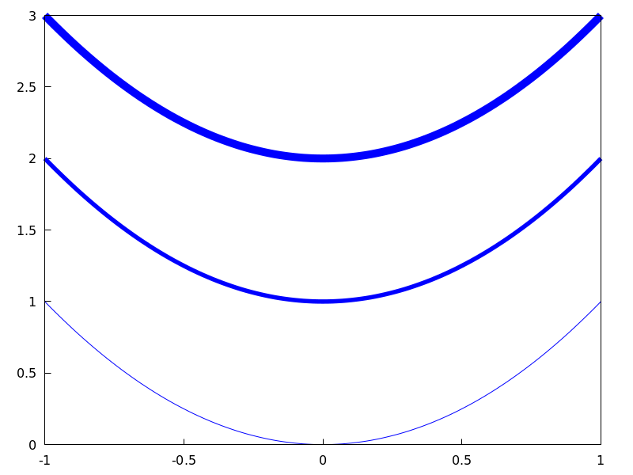


See also `line_005ftype`.

See also: `points`, `polygon`, `rectangle`, `ellipse`, `vector`, `explicit`, `implicit`, `parametric`, `polar`, `line_type`.

### Variable: logcb

Default value: `false`


If `logcb` is `true`, the tics in the colorbox will be drawn in the
logarithmic scale.


When `enhanced3d` or `colorbox` is `false`, option `logcb` has
no effect.


Since this is a global graphics option, its position in the scene description
does not matter.


Example:


```maxima
(%i1) draw3d (
        enhanced3d = true,
        color      = green,
        logcb = true,
        logz  = true,
        palette = [-15,24,-9],
        explicit(exp(x^2-y^2), x,-2,2,y,-2,2)) $
```

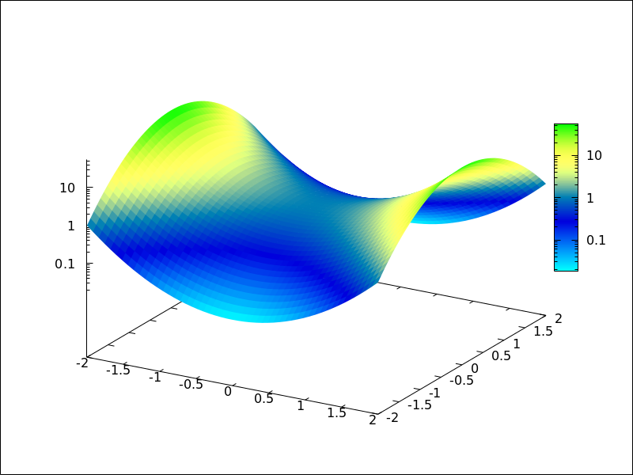


See also `enhanced3d`,  `colorbox` and `cbrange`.

See also: `logcb`, `enhanced3d`, `colorbox`, `cbrange`.

### Variable: logx_secondary

Default value: `false`


If `logx_secondary` is `true`, the secondary *x* axis 
will be drawn in the logarithmic scale.


This option is relevant only for 2d scenes.


Since this is a global graphics option, its position in the scene description
does not matter.


Example:


```maxima
(%i1) draw2d(
        grid = true,
        key="x^2, linear scale",
        color=red,
        explicit(x^2,x,1,100),
        xaxis_secondary = true,
        xtics_secondary = true,
        logx_secondary  = true,
        key = "x^2, logarithmic x scale",
        color = blue,
        explicit(x^2,x,1,100) )$
```

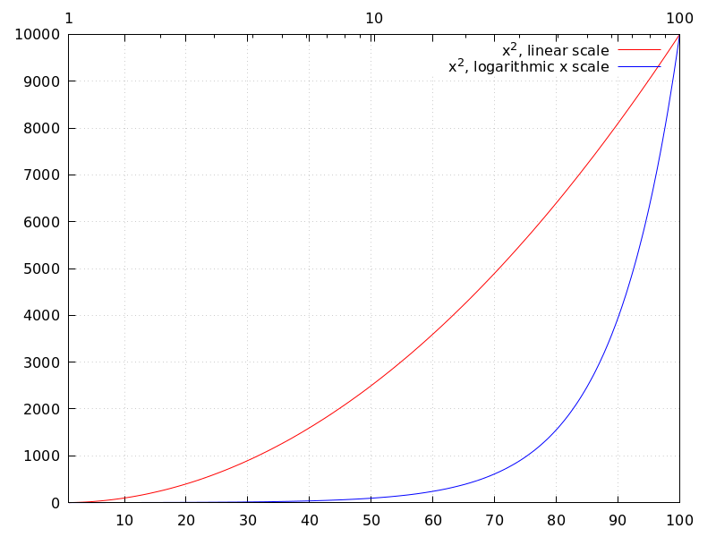


See also `logx_draw`,  `logy_draw`,  `logy_secondary`,  and `logz`.

See also: `logx_draw`, `logy_draw`, `logy_secondary`, `logz`.

### Variable: logy_secondary

Default value: `false`


If `logy_secondary` is `true`, the secondary *y* axis 
will be drawn in the logarithmic scale.


This option is relevant only for 2d scenes.


Since this is a global graphics option, its position in the scene description
does not matter.


Example:


```maxima
(%i1) draw2d(
        grid = true,
        key="x^2, linear scale",
        color=red,
        explicit(x^2,x,1,100),
        yaxis_secondary = true,
        ytics_secondary = true,
        logy_secondary  = true,
        key = "x^2, logarithmic y scale",
        color = blue,
        explicit(x^2,x,1,100) )$
```


See also `logx_draw`,  `logy_draw`,  `logx_secondary`,  and `logz`.

See also: `logx_draw`, `logy_draw`, `logx_secondary`, `logz`.

### Variable: logz

Default value: `false`


If `logz` is `true`, the *z* axis will be drawn in the
logarithmic scale.


Since this is a global graphics option, its position in the scene description
does not matter.


Example:


```maxima
(%i1) draw3d(logz = true,
             explicit(exp(u^2+v^2),u,-2,2,v,-2,2))$
```


See also `logx_draw` and `logy_005fdraw`.

See also: `logx_draw`, `logy_draw`.

### Function: make_level_picture (make_level_picture, data, make_level_picture, data, width, height)

Returns a levels *picture* object. `make_level_picture (data)`
builds the *picture* object from matrix *data*.
`make_level_picture (data,width,height)`
builds the object from a list of numbers; in this case, both the
*width* and the *height* must be given.


The returned *picture* object contains the following 
four parts:


1. symbol `level`
2. image width
3. image height
4. an integer array with pixel data ranging from 0 to 255.
Argument *data* must contain only numbers ranged from 0 to 255;
negative numbers are substituted by 0, and those which are
greater than 255 are set to 255.


Example:


Level picture from matrix.


```maxima
(%i1) make_level_picture(matrix([3,2,5],[7,-9,3000]));
(%o1)         picture(level, 3, 2, {Array:  #(3 2 5 7 0 255)})
```


Level picture from numeric list.


```maxima
(%i1) make_level_picture([-2,0,54,%pi],2,2);
(%o1)            picture(level, 2, 2, {Array:  #(0 0 54 3)})
```

### Function: make_poly_continent (make_poly_continent, continent_name, make_poly_continent, country_list)

Makes the necessary polygons to draw a colored continent
or a list of countries.


Example:


```maxima
(%i1) load("worldmap")$
(%i2) /* A continent */
      make_poly_continent(Africa)$
(%i3) apply(draw2d, %)$
```

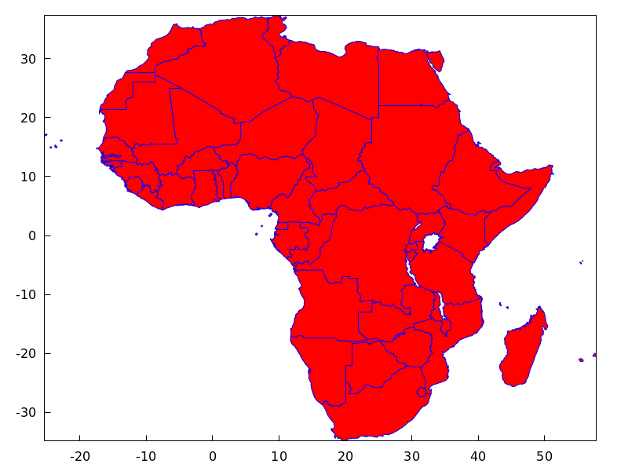


```maxima
(%i4) /* A list of countries */
      make_poly_continent([Germany,Denmark,Poland])$
(%i5) apply(draw2d, %)$
```

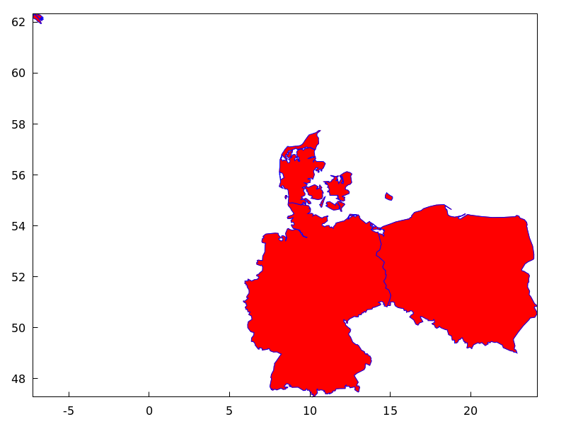

### Function: make_poly_country (country_name)

Makes the necessary polygons to draw a colored country.
If islands exist, one country can be defined with more than
just one polygon.


Example:


```maxima
(%i1) load("worldmap")$
(%i2) make_poly_country(India)$
(%i3) apply(draw2d, %)$
```

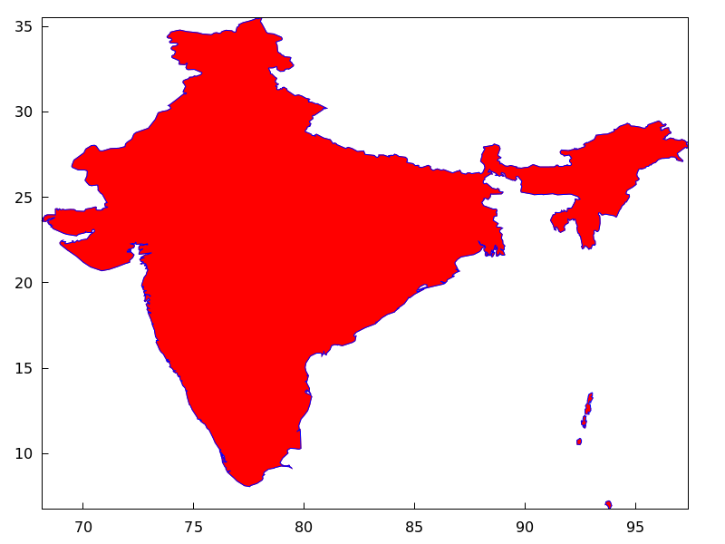

### Function: make_polygon (nlist)

Returns a `polygon` object from boundary indices. Argument
*nlist* is a list of components of `boundaries_array`.


Example:


Bhutan is defined by boundary numbers 171, 173
and 1143, so that `make_polygon([171,173,1143])`
appends arrays of coordinates `boundaries_array[171]`,
`boundaries_array[173]` and `boundaries_array[1143]` and 
returns a `polygon` object suited to be plotted by 
`draw`. To avoid an error message, arrays must be
compatible in the sense that any two consecutive
arrays have two coordinates in the extremes in common. In this
example, the two first components of `boundaries_array[171]` are
equal to the last two coordinates of `boundaries_array[173]`, and 
the two first of `boundaries_array[173]` are equal to the two first
of `boundaries_array[1143]`; in conclusion, boundary numbers
171, 173 and 1143 (in this order) are compatible and the colored 
polygon can be drawn.


```maxima
(%i1) load("worldmap")$
(%i2) Bhutan;
(%o2)                        [[171, 173, 1143]]
(%i3) boundaries_array[171];
(%o3) {Array:  
       #(88.750549 27.14727 88.806351 27.25305 88.901367 27.282221
         88.917877 27.321039)}
(%i4) boundaries_array[173];
(%o4) {Array:
       #(91.659554 27.76511 91.6008 27.66666 91.598022 27.62499
         91.631348 27.536381 91.765533 27.45694 91.775253 27.4161 
         92.007751 27.471939 92.11441 27.28583 92.015259 27.168051
         92.015533 27.08083 92.083313 27.02277 92.112183 26.920271
         92.069977 26.86194 91.997192 26.85194 91.915253 26.893881
         91.916924 26.85416 91.8358 26.863331 91.712479 26.799999 
         91.542191 26.80444 91.492188 26.87472 91.418854 26.873329
         91.371353 26.800831 91.307457 26.778049 90.682457 26.77417
         90.392197 26.903601 90.344131 26.894159 90.143044 26.75333
         89.98996 26.73583 89.841919 26.70138 89.618301 26.72694 
         89.636093 26.771111 89.360786 26.859989 89.22081 26.81472
         89.110237 26.829161 88.921631 26.98777 88.873016 26.95499
         88.867737 27.080549 88.843307 27.108601 88.750549 
         27.14727)}
(%i5) boundaries_array[1143];
(%o5) {Array:  
       #(91.659554 27.76511 91.666924 27.88888 91.65831 27.94805 
         91.338028 28.05249 91.314972 28.096661 91.108856 27.971109
         91.015808 27.97777 90.896927 28.05055 90.382462 28.07972
         90.396088 28.23555 90.366074 28.257771 89.996353 28.32333
         89.83165 28.24888 89.58609 28.139999 89.35997 27.87166 
         89.225517 27.795 89.125793 27.56749 88.971077 27.47361
         88.917877 27.321039)}
(%i6) Bhutan_polygon: make_polygon([171,173,1143])$
(%i7) draw2d(Bhutan_polygon)$
```

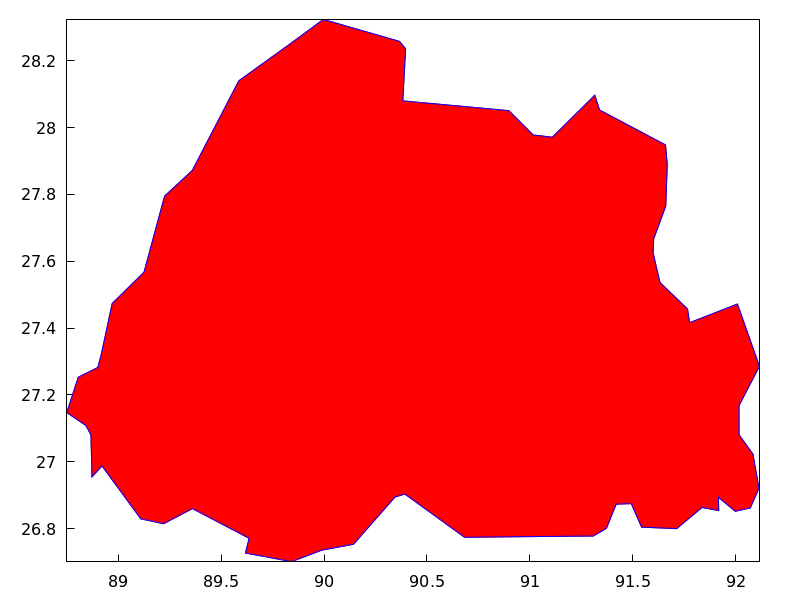

### Function: make_rgb_picture (redlevel, greenlevel, bluelevel)

Returns an rgb-coloured *picture* object. All three arguments must
be levels picture; with red, green and blue levels.


The returned *picture* object contains the following 
four parts:


1. symbol `rgb`
2. image width
3. image height
4. an integer array of length *3*width*height* with pixel data ranging
from 0 to 255. Each pixel is represented by three consecutive numbers
(red, green, blue).


Example:


```maxima
(%i1) red: make_level_picture(matrix([3,2],[7,260]));
(%o1)           picture(level, 2, 2, {Array:  #(3 2 7 255)})
(%i2) green: make_level_picture(matrix([54,23],[73,-9]));
(%o2)           picture(level, 2, 2, {Array:  #(54 23 73 0)})
(%i3) blue: make_level_picture(matrix([123,82],[45,32.5698]));
(%o3)          picture(level, 2, 2, {Array:  #(123 82 45 33)})
(%i4) make_rgb_picture(red,green,blue);
(%o4) picture(rgb, 2, 2, 
              {Array:  #(3 54 123 2 23 82 7 73 45 255 0 33)})
```

### Function: mesh (row_1, row_2, ...)

Draws a quadrangular mesh in 3D.


**3D**


Argument *row_i* is a list of *n* 3D points of the form
`[[x_i1,y_i1,z_i1], ...,[x_in,y_in,z_in]]`, and all rows are
of equal length. All these points define an arbitrary surface in 3D and
in some sense it’s a generalization of the `elevation_grid` object.


This object is affected by the following *graphic options*: `line_type`, 
`line_width`, `color`, `key`, `wired_surface`, `enhanced3d` and `transform`.


Examples:


A simple example.


```maxima
(%i1) draw3d( 
         mesh([[1,1,3],   [7,3,1],[12,-2,4],[15,0,5]],
              [[2,7,8],   [4,3,1],[10,5,8], [12,7,1]],
              [[-2,11,10],[6,9,5],[6,15,1], [20,15,2]])) $
```

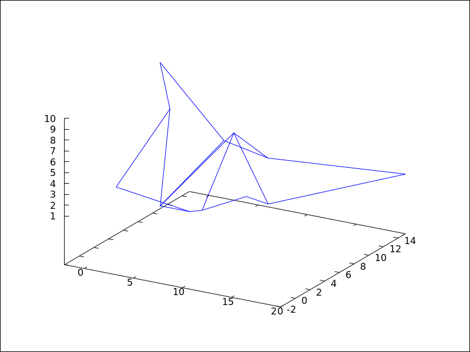


Plotting a triangle in 3D.


```maxima
(%i1) draw3d(
        line_width = 2,
        mesh([[1,0,0],[0,1,0]],
             [[0,0,1],[0,0,1]])) $
```

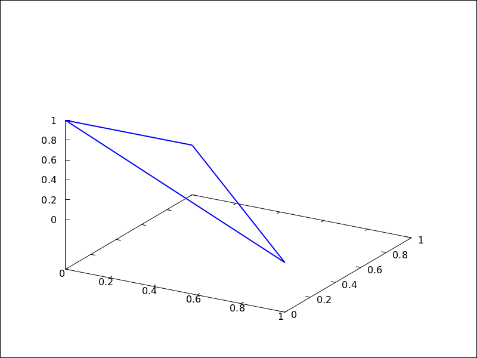


Two quadrilaterals.


```maxima
(%i1) draw3d(
        surface_hide = true,
        line_width   = 3,
        color = red,
        mesh([[0,0,0], [0,1,0]],
             [[2,0,2], [2,2,2]]),
        color = blue,
        mesh([[0,0,2], [0,1,2]],
             [[2,0,4], [2,2,4]])) $
```

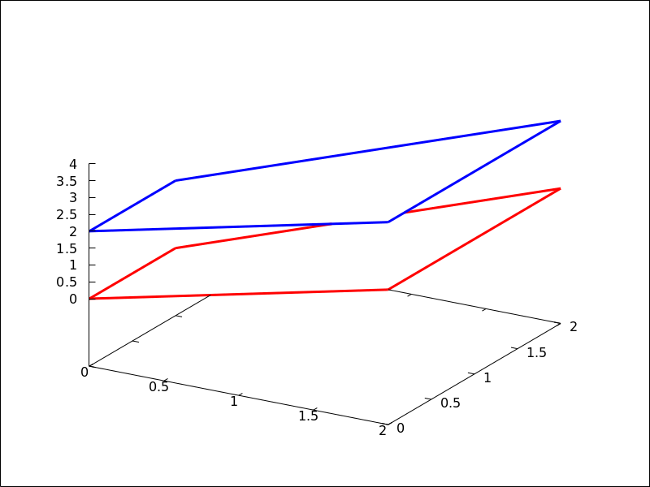

See also: `line_type`, `line_width`, `color`, `key`, `wired_surface`, `enhanced3d`, `transform`.

### Function: multiplot_mode (term)

This function enables Maxima to work in one-window multiplot mode with terminal
*term*; accepted arguments for this function are `screen`, 
`wxt`, `aquaterm`, `windows` and `none`.


When multiplot mode is enabled, each call to `draw` sends a new plot to the
same window, without erasing the previous ones. To disable the multiplot mode,
write `multiplot_mode(none)`.


When multiplot mode is enabled, global option `terminal` is blocked and you
have to disable this working mode before changing to another terminal.


On Windows this feature requires Gnuplot 5.0 or newer.
Note, that just plotting multiple expressions into the same plot doesn’t require
multiplot: It can be done by just issuing multiple `explicit` or similar
commands in a row.


Example:


```maxima
(%i1) set_draw_defaults(
         xrange = [-1,1],
         yrange = [-1,1],
         grid   = true,
         title  = "Step by step plot" )$
(%i2) multiplot_mode(screen)$
(%i3) draw2d(color=blue,  explicit(x^2,x,-1,1))$
(%i4) draw2d(color=red,   explicit(x^3,x,-1,1))$
(%i5) draw2d(color=brown, explicit(x^4,x,-1,1))$
(%i6) multiplot_mode(none)$
```

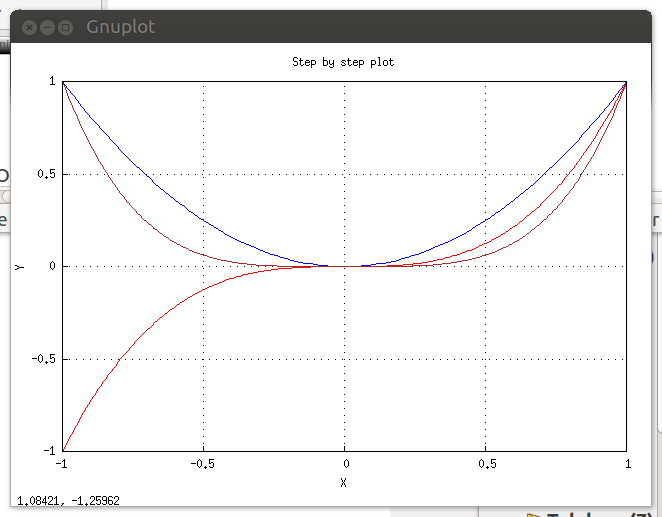

See also: `explicit`.

### Function: negative_picture (pic)

Returns the negative of a (*level* or *rgb*) picture.

### Function: numbered_boundaries (nlist)

Draws a list of polygonal segments (boundaries), labeled by
its numbers (`boundaries_array` coordinates). This is of great
help when building new geographical entities.


Example:


Map of Europe labeling borders with their component number in
`boundaries_array`.


```maxima
(%i1) load("worldmap")$
(%i2) european_borders: 
           region_boundaries(-31.81,74.92,49.84,32.06)$
(%i3) numbered_boundaries(european_borders)$
```

### Function: parametric (parametric, xfun, yfun, par, parmin, parmax, parametric, xfun, yfun, zfun, par, parmin, parmax)

Draws parametric functions in 2D and 3D.


This object is affected by the following *graphic options*: `nticks`, 
`line_width`, `line_type`, `key`, `color` and `enhanced3d`.


**2D**


The command `parametric(xfun, yfun, par, parmin, parmax)` plots the parametric function `[xfun, yfun]`,
with parameter *par* taking values from *parmin* to *parmax*.


Example:


```maxima
(%i1) draw2d(explicit(exp(x),x,-1,3),
             color = red,
             key   = "This is the parametric one!!",
             parametric(2*cos(rrr),rrr^2,rrr,0,2*%pi))$
```

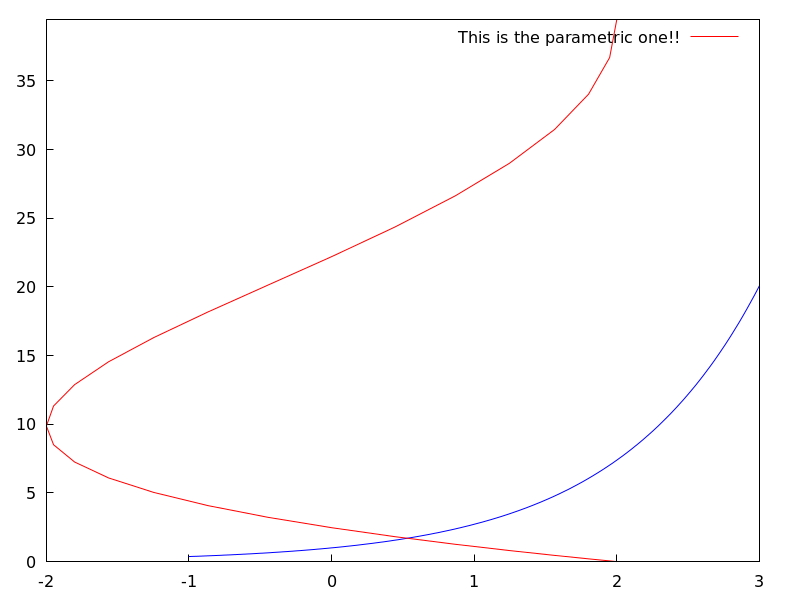


**3D**


`parametric(xfun, yfun, zfun, par, parmin, parmax)` plots the parametric curve `[xfun, yfun, zfun]`, with parameter *par* taking values from *parmin* to
*parmax*.


Example:


```maxima
(%i1) draw3d(explicit(exp(sin(x)+cos(x^2)),x,-3,3,y,-3,3),
             color = royalblue,
             parametric(cos(5*u)^2,sin(7*u),u-2,u,0,2),
             color      = turquoise,
             line_width = 2,
             parametric(t^2,sin(t),2+t,t,0,2),
             surface_hide = true,
             title = "Surface & curves" )$
```

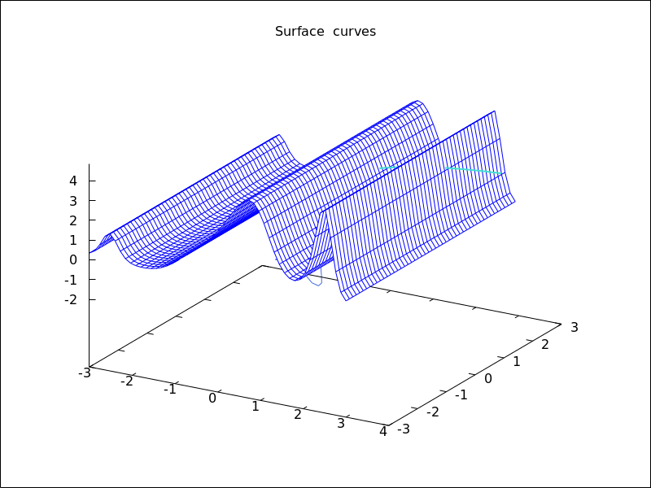

See also: `nticks`, `line_width`, `line_type`, `key`, `color`, `enhanced3d`.

### Function: parametric_surface (xfun, yfun, zfun, par1, par1min, par1max, par2, par2min, par2max)

Draws parametric surfaces in 3D.


**3D**


The command `parametric_surface(xfun, yfun, zfun, par1, par1min, par1max, par2, par2min, par2max)` plots the parametric surface `[xfun, yfun, zfun]`, with parameter *par1* taking values from *par1min* to
*par1max* and parameter *par2* taking values from *par2min* to
*par2max*.


This object is affected by the following *graphic options*: `draw_realpart`, `xu_grid`, 
`yv_grid`, `line_type`, `line_width`, `key`, `wired_surface`, `enhanced3d`
 and `color`.


Example:


```maxima
(%i1) draw3d(title          = "Sea shell",
             xu_grid        = 100,
             yv_grid        = 25,
             view           = [100,20],
             surface_hide   = true,
             parametric_surface(0.5*u*cos(u)*(cos(v)+1),
                           0.5*u*sin(u)*(cos(v)+1),
                           u*sin(v) - ((u+3)/8*%pi)^2 - 20,
                           u, 0, 13*%pi, v, -%pi, %pi) )$
```

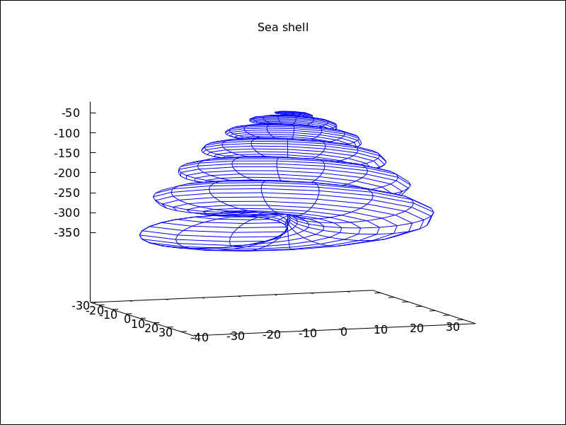

See also: `draw_realpart`, `xu_grid`, `yv_grid`, `line_type`, `line_width`, `key`, `wired_surface`, `enhanced3d`.

### Function: picture_equalp (x, y)

Returns `true` in case of equal pictures, and `false` otherwise.

### Function: picturep (x)

Returns `true` if the argument is a well formed image,
and `false` otherwise.

### Variable: point_size

Default value: 1


`point_size` sets the size for plotted points. It must be a
non negative number.


This option has no effect when graphic option `point_type` is
set to `dot`.


This option affects the following graphic objects:


- *
`gr2d`: `points`.
- *
`gr3d`: `points`.


Example:


```maxima
(%i1) draw2d(points(makelist([random(20),random(50)],k,1,10)),
        point_size = 5,
        points(makelist(k,k,1,20),makelist(random(30),k,1,20)))$
```

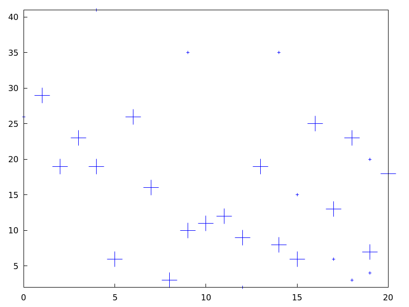

See also: `points`.

### Function: points (points, x1, y1, x2, y2, ..., points, x1, x2, ..., y1, y2, ..., points, y1, y2, ..., points, x1, y1, z1, x2, y2, z2, ..., points, x1, x2, ..., y1, y2, ..., z1, z2, ..., points, matrix, points, 1d_y_array, points, 1d_x_array, 1d_y_array, points, 1d_x_array, 1d_y_array, 1d_z_array, points, 2d_xy_array, points, 2d_xyz_array)

Draws points in 2D and 3D.


This object is affected by the following *graphic options*: `point_size`, 
`point_type`, `points_joined`, `line_width`, `key`,
`line_type` and `color`. In 3D mode, it is also affected by `enhanced3d`


**2D**


`points ([[x1,y1], [x2,y2],...])` or
`points ([x1,x2,...], [y1,y2,...])`
plots points `[x1,y1]`, `[x2,y2]`, etc. If abscissas
are not given, they are set to consecutive positive integers, so that 
`points ([y1,y2,...])` draws points `[1,y1]`, `[2,y2]`, etc.
If *matrix* is a two-column or two-row matrix, `points (matrix)`
draws the associated points. If *matrix* is an one-column or one-row matrix,
abscissas are assigned automatically.


If *1d_y_array* is a 1D lisp array of numbers, `points (1d_y_array)` plots them
setting abscissas to consecutive positive integers. `points (1d_x_array, 1d_y_array)`
plots points with their coordinates taken from the two arrays passed as arguments. If
*2d_xy_array* is a 2D array with two columns, or with two rows, `points (2d_xy_array)`
plots the corresponding points on the plane.


Examples:


Two types of arguments for `points`, a list of pairs and two lists
of separate coordinates.


```maxima
(%i1) draw2d(
        key = "Small points",
        points(makelist([random(20),random(50)],k,1,10)),
        point_type    = circle,
        point_size    = 3,
        points_joined = true,
        key           = "Great points",
        points(makelist(k,k,1,20),makelist(random(30),k,1,20)),
        point_type    = filled_down_triangle,
        key           = "Automatic abscissas",
        color         = red,
        points([2,12,8]))$
```

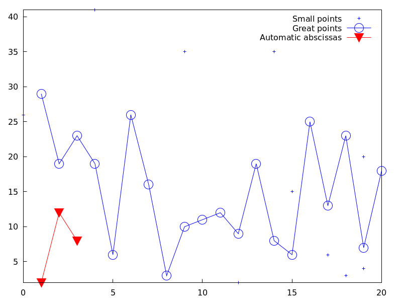


Drawing impulses.


```maxima
(%i1) draw2d(
        points_joined = impulses,
        line_width    = 2,
        color         = red,
        points(makelist([random(20),random(50)],k,1,10)))$
```

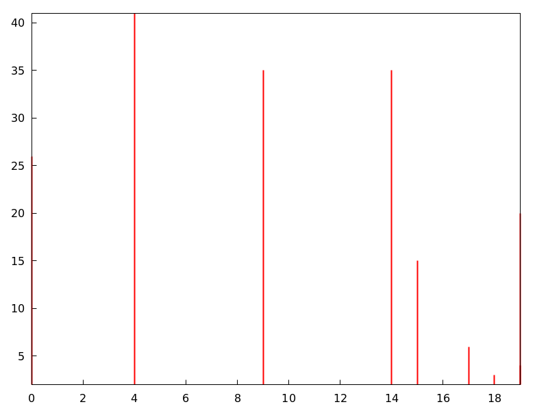


Array with ordinates.


```maxima
(%i1) a: make_array (flonum, 100) $
(%i2) for i:0 thru 99 do a[i]: random(1.0) $
(%i3) draw2d(points(a)) $
```

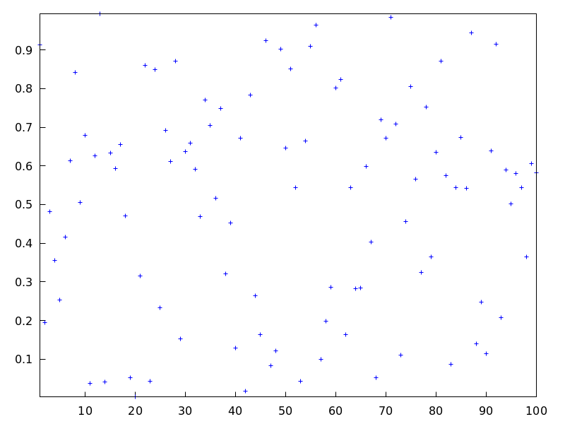


Two arrays with separate coordinates.


```maxima
(%i1) x: make_array (flonum, 100) $
(%i2) y: make_array (fixnum, 100) $
(%i3) for i:0 thru 99 do (
        x[i]: float(i/100),
        y[i]: random(10) ) $
(%i4) draw2d(points(x, y)) $
```


A two-column 2D array.


```maxima
(%i1) xy: make_array(flonum, 100, 2) $
(%i2) for i:0 thru 99 do (
        xy[i, 0]: float(i/100),
        xy[i, 1]: random(10) ) $
(%i3) draw2d(points(xy)) $
```

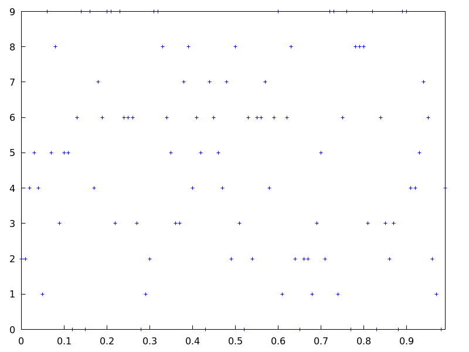


Drawing an array filled with function `read_array`.


```maxima
(%i1) a: make_array(flonum,100) $
(%i2) read_array (file_search ("pidigits.data"), a) $
(%i3) draw2d(points(a)) $
```


**3D**


`points([[x1, y1, z1], [x2, y2, z2], ...])` or `points([x1, x2, ...], [y1, y2, ...], [z1, z2,...])` plots points `[x1, y1, z1]`,
`[x2, y2, z2]`, etc.  If *matrix* is a three-column
or three-row matrix, `points (matrix)` draws the associated points.


When arguments are lisp arrays, `points (1d_x_array, 1d_y_array, 1d_z_array)`
takes coordinates from the three 1D arrays.  If *2d_xyz_array* is a 2D array with three columns,
or with three rows, `points (2d_xyz_array)` plots the corresponding points.


Examples:


One tridimensional sample,


```maxima
(%i1) load ("numericalio")$
(%i2) s2 : read_matrix (file_search ("wind.data"))$
(%i3) draw3d(title = "Daily average wind speeds",
             point_size = 2,
             points(args(submatrix (s2, 4, 5))) )$
```


Two tridimensional samples,


```maxima
(%i1) load ("numericalio")$
(%i2) s2 : read_matrix (file_search ("wind.data"))$
(%i3) draw3d(
         title = "Daily average wind speeds. Two data sets",
         point_size = 2,
         key        = "Sample from stations 1, 2 and 3",
         points(args(submatrix (s2, 4, 5))),
         point_type = 4,
         key        = "Sample from stations 1, 4 and 5",
         points(args(submatrix (s2, 2, 3))) )$
```


Unidimensional arrays,


```maxima
(%i1) x: make_array (fixnum, 10) $
(%i2) y: make_array (fixnum, 10) $
(%i3) z: make_array (fixnum, 10) $
(%i4) for i:0 thru 9 do (
        x[i]: random(10),
        y[i]: random(10),
        z[i]: random(10) ) $
(%i5) draw3d(points(x,y,z)) $
```

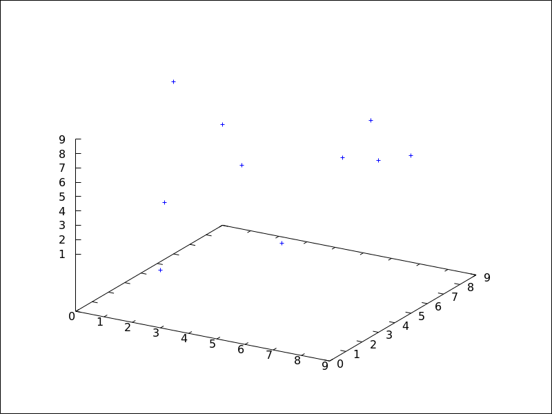


Bidimensional colored array,


```maxima
(%i1) xyz: make_array(fixnum, 10, 3) $
(%i2) for i:0 thru 9 do (
        xyz[i, 0]: random(10),
        xyz[i, 1]: random(10),
        xyz[i, 2]: random(10) ) $
(%i3) draw3d(
         enhanced3d = true,
         points_joined = true,
         points(xyz)) $
```

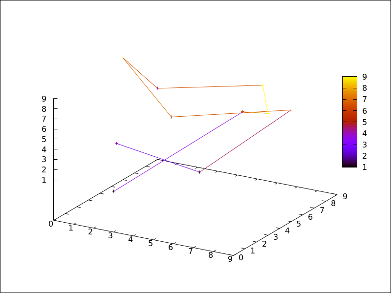


Color numbers explicitly specified by the user.


```maxima
(%i1) pts: makelist([t,t^2,cos(t)], t, 0, 15)$
(%i2) col_num: makelist(k, k, 1, length(pts))$
(%i3) draw3d(
        enhanced3d = ['part(col_num,k),k],
        point_size = 3,
        point_type = filled_circle,
        points(pts))$
```

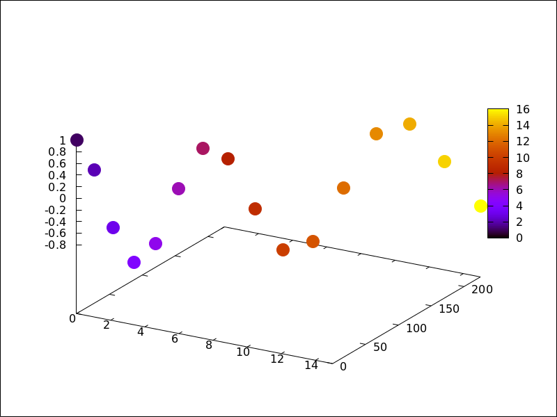

See also: `point_size`, `point_type`, `points_joined`, `line_width`, `key`, `line_type`, `enhanced3d`.

### Variable: points_joined

Default value: `false`


When `points_joined` is `true`, points are joined by lines; when `false`,
isolated points are drawn. A third possible value for this graphic option is 
`impulses`; in such case, vertical segments are drawn from points to the x-axis (2D)
or to the xy-plane (3D).


This option affects the following graphic objects:


- *
`gr2d`: `points`.
- *
`gr3d`: `points`.


Example:


```maxima
(%i1) draw2d(xrange        = [0,10],
             yrange        = [0,4],
             point_size    = 3,
             point_type    = up_triangle,
             color         = blue,
             points([[1,1],[5,1],[9,1]]),
             points_joined = true,
             point_type    = square,
             line_type     = dots,
             points([[1,2],[5,2],[9,2]]),
             point_type    = circle,
             color         = red,
             line_width    = 7,
             points([[1,3],[5,3],[9,3]]) )$
```

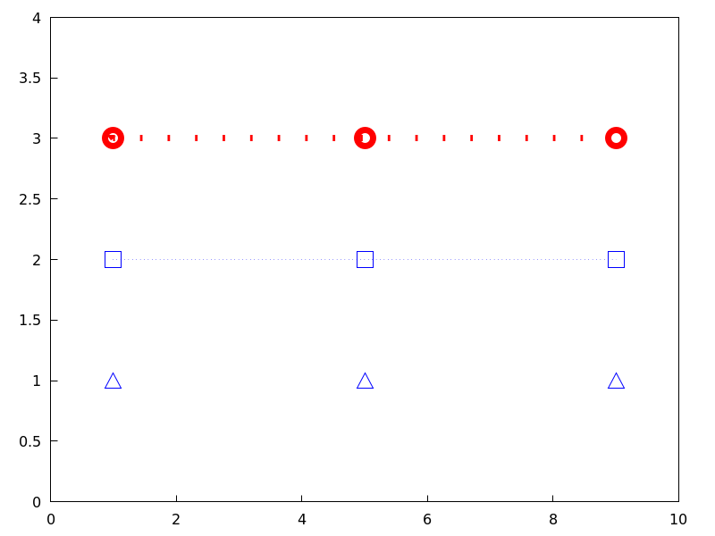

See also: `points`.

### Function: polar (radius, ang, minang, maxang)

Draws 2D functions defined in polar coordinates.


**2D**


`polar (radius,ang,minang,maxang)` plots function 
`radius(ang)` defined in polar coordinates, with variable 
*ang* taking values from 
*minang* to *maxang*.


This object is affected by the following *graphic options*: `nticks`, 
`line_width`, `line_type`, `key` and `color`.


Example:


```maxima
(%i1) draw2d(user_preamble = "set grid polar",
             nticks        = 200,
             xrange        = [-5,5],
             yrange        = [-5,5],
             color         = blue,
             line_width    = 3,
             title         = "Hyperbolic Spiral",
             polar(10/theta,theta,1,10*%pi) )$
```

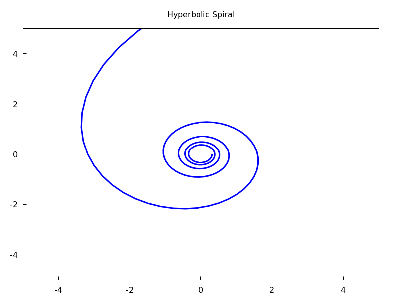

See also: `nticks`, `line_width`, `line_type`, `key`.

### Function: polygon (polygon, x1, y1, x2, y2, ..., polygon, x1, x2, ..., y1, y2, ...)

Draws polygons in 2D.


**2D**


The commands `polygon([[x1, y1], [x2, y2], ...])`
or `polygon([x1, x2, ...], [y1, y2, ...])` plot on
the plane a polygon with vertices `[x1, y1]`, `[x2, y2]`, etc.


This object is affected by the following *graphic options*: `transparent`, 
`fill_color`, `fill_density`, `border`, `line_width`, `key`,
 `line_type` and `color`.


Example:


```maxima
(%i1) draw2d(color      = "#e245f0",
             line_width = 8,
             polygon([[3,2],[7,2],[5,5]]),
             border      = false,
             fill_color  = yellow,
             polygon([[5,2],[9,2],[7,5]]) )$
```

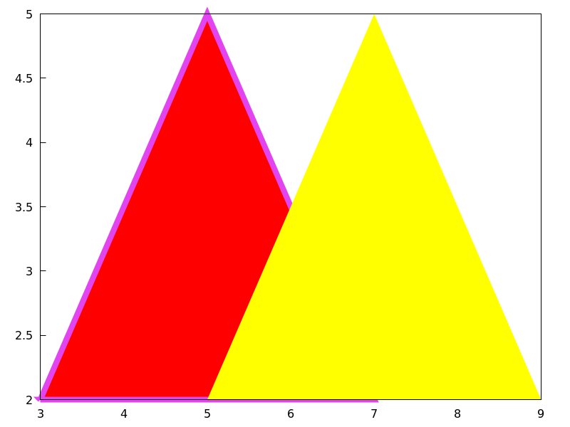

See also: `transparent`, `fill_color`, `fill_density`, `border`, `line_width`, `key`, `line_type`.

### Variable: proportional_axes

Default value: `none`


When `proportional_axes` is equal to `xy` or `xyz`,
the aspect ratio of the axis units will be set to 1:1 resulting in a 2D or 3D
scene that will be drawn with axes proportional to their relative lengths.


Since this is a global graphics option, its position in the scene description
does not matter.


This option works with Gnuplot version 4.2.6 or greater.


Examples:


Single 2D plot.


```maxima
(%i1) draw2d(
        ellipse(0,0,1,1,0,360),
        transparent=true,
        color = blue,
        line_width = 4,
        ellipse(0,0,2,1/2,0,360),
        proportional_axes = 'xy) $
```

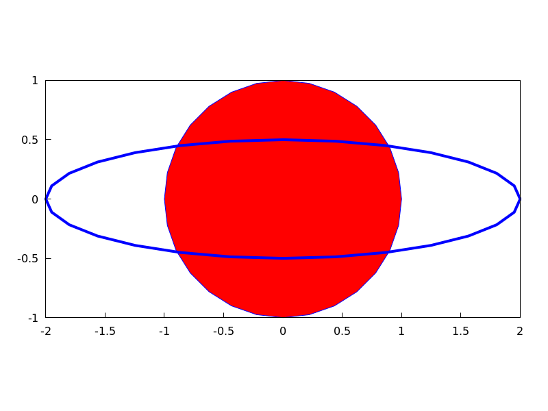


Multiplot.


```maxima
(%i1) draw(
        terminal = wxt,
        gr2d(proportional_axes = 'xy,
             explicit(x^2,x,0,1)),
        gr2d(explicit(x^2,x,0,1),
             xrange = [0,1],
             yrange = [0,2],
             proportional_axes='xy),
        gr2d(explicit(x^2,x,0,1)))$
```

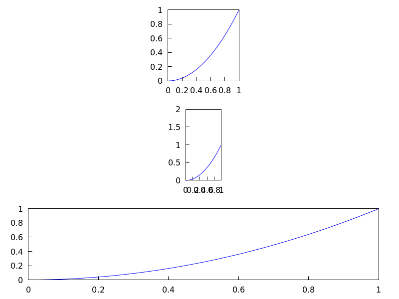

### Function: quadrilateral (point_1, point_2, point_3, point_4)

Draws a quadrilateral.


**2D**


`quadrilateral([x1, y1], [x2, y2], [x3, y3], [x4, y4])` draws a quadrilateral with vertices
`[x1, y1]`, `[x2, y2]`, 
`[x3, y3]`, and `[x4, y4]`.


This object is affected by the following *graphic options*:

`transparent`, `fill_color`, `border`, `line_width`,
`key`, `xaxis_secondary`, `yaxis_secondary`, `line_type`,
`transform` and `color`.


Example:


```maxima
(%i1) draw2d(
        quadrilateral([1,1],[2,2],[3,-1],[2,-2]))$
```

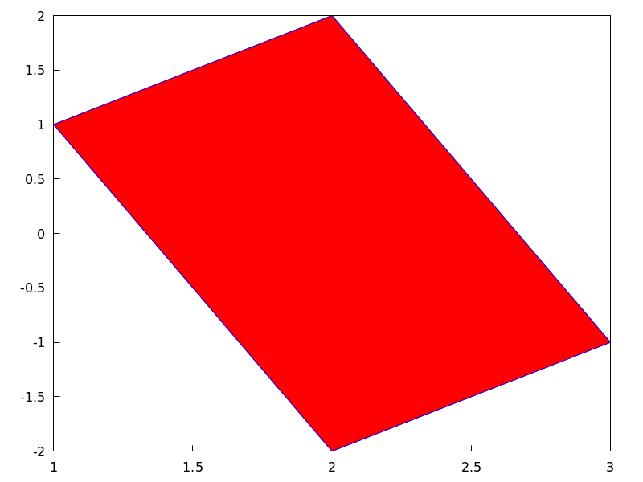


**3D**


`quadrilateral([x1, y1, z1], [x2, y2, z2], [x3, y3, z3], [x4, y4, z4])`
draws a quadrilateral with vertices `[x1, y1, z1]`,
`[x2, y2, z2]`, `[x3, y3, z3]`,
and `[x4, y4, z4]`.


This object is affected by the following *graphic options*: `line_type`, 
`line_width`, `color`, `key`, `enhanced3d` and
`transform`.

See also: `transparent`, `fill_color`, `border`, `line_width`, `key`, `xaxis_secondary`, `yaxis_secondary`, `line_type`, `color`, `enhanced3d`, `transform`.

### Function: read_xpm (xpm_file)

Reads a file in xpm and returns a picture object.

### Function: rectangle (x1, y1, x2, y2)

Draws rectangles in 2D.


**2D**


`rectangle ([x1,y1], [x2,y2])` draws a rectangle with opposite vertices
`[x1,y1]` and `[x2,y2]`.


This object is affected by the following *graphic options*: `transparent`, 
`fill_color`, `border`, `line_width`, `key`,
`line_type` and `color`.


Example:


```maxima
(%i1) draw2d(fill_color  = red,
             line_width  = 6,
             line_type   = dots,
             transparent = false,
             fill_color  = blue,
             rectangle([-2,-2],[8,-1]), /* opposite vertices */
             transparent = true,
             line_type   = solid,
             line_width  = 1,
             rectangle([9,4],[2,-1.5]),
             xrange      = [-3,10],
             yrange      = [-3,4.5] )$
```

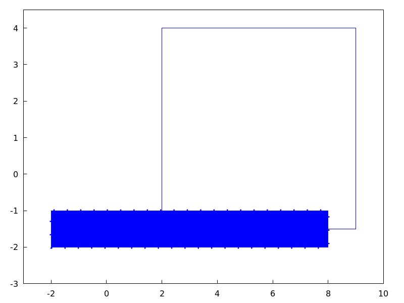

See also: `transparent`, `fill_color`, `border`, `line_width`, `key`, `line_type`.

### Function: region (expr, var1, minval1, maxval1, var2, minval2, maxval2)

Plots a region on the plane defined by inequalities.


**2D**
*expr* is an expression formed by inequalities and boolean operators
`and`, `or`, and `not`. The region is bounded by the rectangle
defined by $[minval1, maxval1]$ and $[minval2, maxval2]$.


This object is affected by the following *graphic options*: `fill_color`, `fill_density`,
`key`, `x_voxel` and `y_005fvoxel`.


Example:


```maxima
(%i1) draw2d(
        x_voxel = 30,
        y_voxel = 30,
        region(x^2+y^2<1 and x^2+y^2 > 1/2,
               x, -1.5, 1.5, y, -1.5, 1.5));
```

See also: `not`, `fill_color`, `fill_density`, `key`, `x_voxel`, `y_voxel`.

### Function: region_boundaries (x1, y1, x2, y2)

Detects polygonal segments of global variable `boundaries_array`
fully contained in the rectangle with vertices (*x1*,*y1*) -upper left- 
and (*x2*,*y2*) -bottom right-.


Example:


Returns segment numbers for plotting southern Italy.


```maxima
(%i1) load("worldmap")$
(%i2) region_boundaries(10.4,41.5,20.7,35.4);
(%o2)                [1846, 1863, 1864, 1881, 1888, 1894]
(%i3) draw2d(geomap(%))$
```

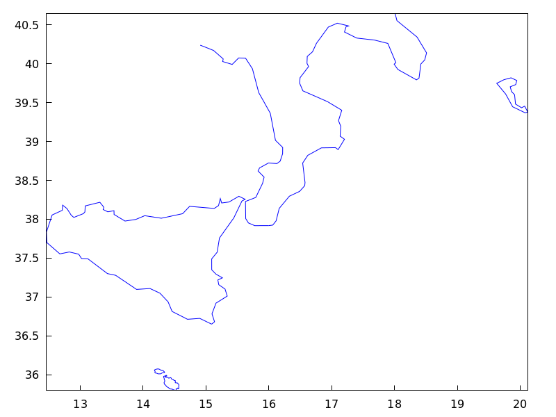

### Function: region_boundaries_plus (x1, y1, x2, y2)

Detects polygonal segments of global variable `boundaries_array`
containing at least one vertex in the rectangle defined by vertices (*x1*,*y1*)
-upper left- and (*x2*,*y2*) -bottom right-.


Example:


```maxima
(%i1) load("worldmap")$
(%i2) region_boundaries_plus(10.4,41.5,20.7,35.4);
(%o2) [1060, 1062, 1076, 1835, 1839, 1844, 1846, 1858,
       1861, 1863, 1864, 1871, 1881, 1888, 1894, 1897]
(%i3) draw2d(geomap(%))$
```

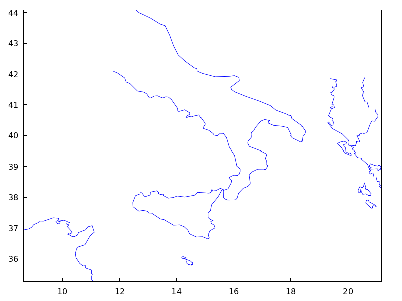

### Function: rgb2level (pic)

Transforms an *rgb* picture into a *level* one by
averaging the red, green and blue channels.

### Function: set_draw_defaults (graphic option, ..., graphic object, ...)

Sets user graphics options. This function is useful for plotting a sequence
of graphics with common graphics options. Calling this function without
arguments removes user defaults.


Example:


```maxima
(%i1) set_draw_defaults(
         xrange = [-10,10],
         yrange = [-2, 2],
         color  = blue,
         grid   = true)$
(%i2) /* plot with user defaults */
      draw2d(explicit(((1+x)**2/(1+x*x))-1,x,-10,10))$
(%i3) set_draw_defaults()$
(%i4) /* plot with standard defaults */
      draw2d(explicit(((1+x)**2/(1+x*x))-1,x,-10,10))$
```

### Function: spherical (radius, azi, minazi, maxazi, zen, minzen, maxzen)

Draws 3D functions defined in spherical coordinates.


**3D**


`spherical(radius, azi, minazi, maxazi, zen, minzen, maxzen)` plots the function `radius(azi, zen)` defined in spherical coordinates, with *azimuth* *azi* taking
values from *minazi* to *maxazi* and *zenith* *zen* taking values
from *minzen* to *maxzen*.


This object is affected by the following *graphic options*: `xu_grid`, 
`yv_grid`, `line_type`, `key`, `wired_surface`, `enhanced3d` and `color`.


Example:


```maxima
(%i1) draw3d(spherical(1,a,0,2*%pi,z,0,%pi))$
```

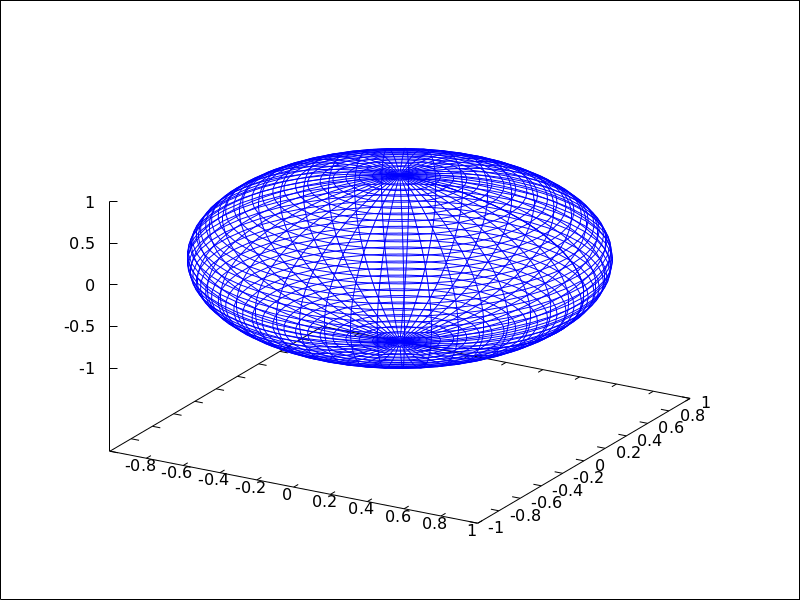

See also: `xu_grid`, `yv_grid`, `line_type`, `key`, `wired_surface`, `enhanced3d`.

### Variable: surface_hide

Default value: `false`


If `surface_hide` is `true`, hidden parts are not plotted in 3d surfaces.


Since this is a global graphics option, its position in the scene description
does not matter.


Example:


```maxima
(%i1) draw(columns=2,
           gr3d(explicit(exp(sin(x)+cos(x^2)),x,-3,3,y,-3,3)),
           gr3d(surface_hide = true,
                explicit(exp(sin(x)+cos(x^2)),x,-3,3,y,-3,3)) )$
```

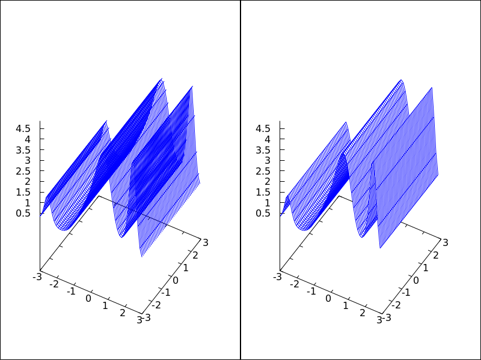

### Function: take_channel (im, color)

If argument *color* is `red`, `green` or `blue`,
function `take_channel` returns the corresponding color channel of
picture *im*.
Example:


```maxima
(%i1) red: make_level_picture(matrix([3,2],[7,260]));
(%o1)           picture(level, 2, 2, {Array:  #(3 2 7 255)})
(%i2) green: make_level_picture(matrix([54,23],[73,-9]));
(%o2)           picture(level, 2, 2, {Array:  #(54 23 73 0)})
(%i3) blue: make_level_picture(matrix([123,82],[45,32.5698]));
(%o3)          picture(level, 2, 2, {Array:  #(123 82 45 33)})
(%i4) make_rgb_picture(red,green,blue);
(%o4) picture(rgb, 2, 2, 
              {Array:  #(3 54 123 2 23 82 7 73 45 255 0 33)})
(%i5) take_channel(%,'green);  /* simple quote!!! */
(%o5)           picture(level, 2, 2, {Array:  #(54 23 73 0)})
```

### Variable: terminal

Default value: `screen`


Selects the terminal to be used by Gnuplot; possible values are:
`screen` (default), `png`, `pngcairo`, `jpg`, `gif`, 
`cairolatex_pdf`, `cairolatex_pdf_standalone`,
`eps`, `eps_color`, `epslatex`, `epslatex_standalone`, 
`svg`, `canvas`, `dumb`, `dumb_file`, `pdf`, `pdfcairo`, 
`wxt`, `animated_gif`, `multipage_pdfcairo`, `multipage_pdf`, 
`multipage_eps`, `multipage_eps_color`, `tikz`, `tikz_standalone`
and `aquaterm`.


Terminals `screen`, `wxt`, `windows` and `aquaterm` can
be also defined as a list
with two elements: the name of the terminal itself and a non negative integer number.
In this form, multiple windows can be opened at the same time, each with its
corresponding number. This feature does not work in Windows platforms.


Since this is a global graphics option, its position in the scene description
does not matter. It can be also used as an argument of function `draw`.


N.B. pdfcairo requires Gnuplot 4.3 or newer. 
`pdf` requires Gnuplot to be compiled with the option `--enable-pdf` and libpdf must
be installed. The pdf library is available from: [http://www.pdflib.com/en/download/pdflib-family/pdflib-lite/]()


Examples:


```maxima
(%i1) /* screen terminal (default) */
      draw2d(explicit(x^2,x,-1,1))$
(%i2) /* png file */
      draw2d(terminal  = 'png,
             explicit(x^2,x,-1,1))$
(%i3) /* jpg file */
      draw2d(terminal   = 'jpg,
             dimensions = [300,300],
             explicit(x^2,x,-1,1))$
(%i4) /* eps file */
      draw2d(file_name = "myfile",
             explicit(x^2,x,-1,1),
             terminal  = 'eps)$
(%i5) /* pdf file */
      draw2d(file_name = "mypdf",
             dimensions = 100*[12.0,8.0],
             explicit(x^2,x,-1,1),
             terminal  = 'pdf)$
(%i6) /* wxwidgets window */
      draw2d(explicit(x^2,x,-1,1),
             terminal  = 'wxt)$
(%i7) /* tikz file */
      draw2d(explicit(x^2,x,-1,1),
             file_name = "mytikz",
             dimensions = [8,8], /* in cms */
             terminal = 'tikz)$
```


Multiple windows.


```maxima
(%i1) draw2d(explicit(x^5,x,-2,2), terminal=[screen, 3])$
(%i2) draw2d(explicit(x^2,x,-2,2), terminal=[screen, 0])$
```


An animated gif file.


```maxima
(%i1) draw(
        delay     = 100,
        file_name = "zzz",
        terminal  = 'animated_gif,
        gr2d(explicit(x^2,x,-1,1)),
        gr2d(explicit(x^3,x,-1,1)),
        gr2d(explicit(x^4,x,-1,1)));
End of animation sequence
(%o1)          [gr2d(explicit), gr2d(explicit), gr2d(explicit)]
```


Option `delay` is only active in animated gif’s; it is ignored in
any other case.


Multipage output in eps format.


```maxima
(%i1) draw(
        file_name = "parabol",
        terminal  = multipage_eps,
        dimensions = 100*[10,10],
        gr2d(explicit(x^2,x,-1,1)),
        gr3d(explicit(x^2+y^2,x,-1,1,y,-1,1))) $
```


See also `file_name`,  `dimensions_draw` and `delay`.

See also: `file_name`, `dimensions_draw`, `delay`.

### Variable: transform

Default value: `none`


If `transform` is `none`, the space is not transformed and
graphic objects are drawn as defined. When a space transformation is
desired, a list must be assigned to option `transform`. In case of
a 2D scene, the list takes the form `[f1(x,y), f2(x,y), x, y]`.
In case of a 3D scene, the list is of the form
`[f1(x,y,z), f2(x,y,z), f3(x,y,z), x, y, z]`.


The names of the variables defined in the lists may be different to those
used in the definitions of the graphic objects.


Examples:


Rotation in 2D.


```maxima
(%i1) th : %pi / 4$
(%i2) draw2d(
        color = "#e245f0",
        proportional_axes = 'xy,
        line_width = 8,
        triangle([3,2],[7,2],[5,5]),
        border     = false,
        fill_color = yellow,
        transform  = [cos(th)*x - sin(th)*y,
                      sin(th)*x + cos(th)*y, x, y],
        triangle([3,2],[7,2],[5,5]) )$
```

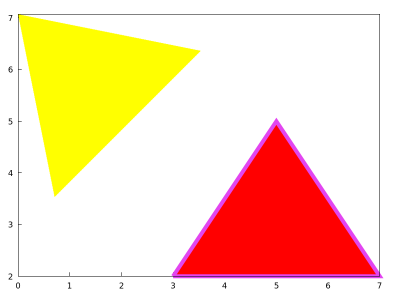


Translation in 3D.


```maxima
(%i1) draw3d(
        color     = "#a02c00",
        explicit(20*exp(-x^2-y^2)-10,x,-3,3,y,-3,3),
        transform = [x+10,y+10,z+10,x,y,z],
        color     = blue,
        explicit(20*exp(-x^2-y^2)-10,x,-3,3,y,-3,3) )$
```

### Variable: transparent

Default value: `false`


If `transparent` is `false`, interior regions of polygons are 
filled according to `fill_color`.


This option affects the following graphic objects:


- *
`gr2d`: `polygon`, `rectangle` and `ellipse`.


Example:


```maxima
(%i1) draw2d(polygon([[3,2],[7,2],[5,5]]),
             transparent = true,
             color       = blue,
             polygon([[5,2],[9,2],[7,5]]) )$
```

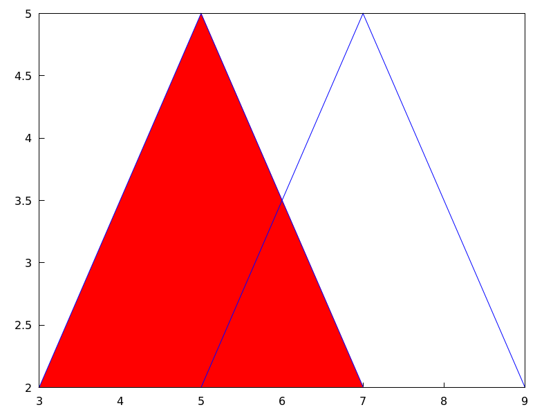

See also: `polygon`, `rectangle`, `ellipse`.

### Function: triangle (point_1, point_2, point_3)

Draws a triangle.


**2D**


`triangle ([x1,y1], [x2,y2], [x3,y3])` draws a triangle with vertices `[x1,y1]`, `[x2,y2]`,
and `[x3,y3]`.


This object is affected by the following *graphic options*:

`transparent`, `fill_color`, `border`, `line_width`,
`key`, `xaxis_secondary`, `yaxis_secondary`, `line_type`,
`transform` and `color`.


Example:


```maxima
(%i1) draw2d(
        triangle([1,1],[2,2],[3,-1]))$
```

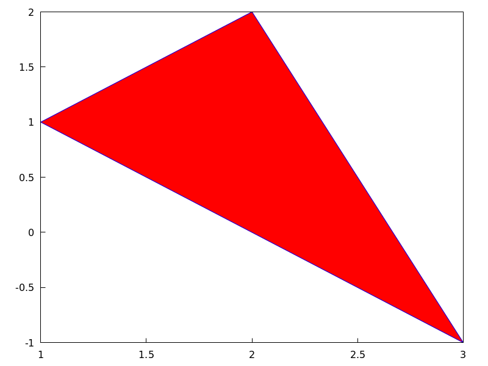


**3D**


`triangle ([x1,y1,z1], [x2,y2,z2], [x3,y3,z3])` draws a triangle with vertices `[x1,y1,z1]`,
`[x2,y2,z2]`, and `[x3,y3,z3]`.


This object is affected by the following *graphic options*: `line_type`, 
`line_width`, `color`, `key`, `enhanced3d` and `transform`.

See also: `transparent`, `fill_color`, `border`, `line_width`, `key`, `xaxis_secondary`, `yaxis_secondary`, `line_type`, `transform`, `color`, `enhanced3d`.

### Function: tube (xfun, yfun, zfun, rfun, p, pmin, pmax)

Draws a tube in 3D with varying diameter.


**3D**


`[xfun,yfun,zfun]`
is the parametric curve with parameter *p* taking values from *pmin*
to *pmax*. Circles of radius *rfun* are placed with their centers on
the parametric curve and perpendicular to it.


This object is affected by the following *graphic options*: `xu_grid`, 
`yv_grid`, `line_type`, `line_width`, `key`, `wired_surface`, `enhanced3d`,
`color` and `capping`.


Example:


```maxima
(%i1) draw3d(
        enhanced3d = true,
        xu_grid = 50,
        tube(cos(a), a, 0, cos(a/10)^2,
             a, 0, 4*%pi) )$
```

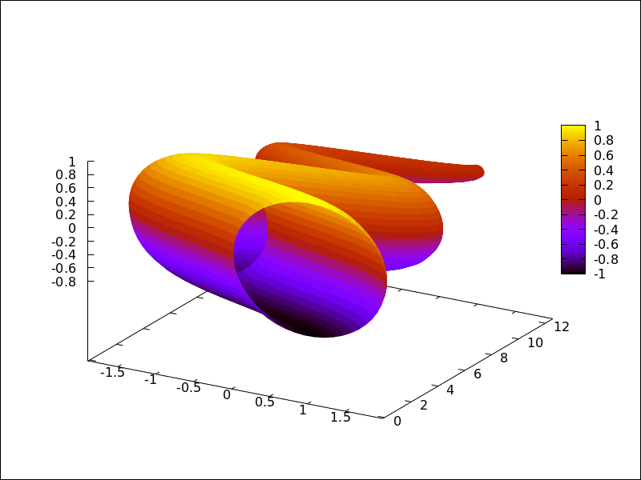

See also: `xu_grid`, `yv_grid`, `line_type`, `line_width`, `key`, `wired_surface`, `enhanced3d`, `color`, `capping`.

### Variable: unit_vectors

Default value: `false`


If `unit_vectors` is `true`, vectors are plotted with module 1.
This is useful for plotting vector fields. If `unit_vectors` is `false`,
vectors are plotted with its original length.


This option is relevant only for `vector` objects.


Example:


```maxima
(%i1) draw2d(xrange      = [-1,6],
             yrange      = [-1,6],
             head_length = 0.1,
             vector([0,0],[5,2]),
             unit_vectors = true,
             color        = red,
             vector([0,3],[5,2]))$
```

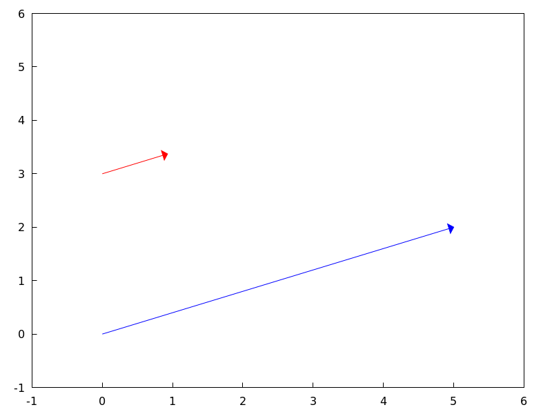

### Variable: user_preamble

Default value: `""` (empty string)


Expert Gnuplot users can make use of this option to fine tune Gnuplot’s
behaviour by writing settings to be sent before the `plot` or `splot`
command.


The value of this option must be a string or a list of strings (one per line).


Since this is a global graphics option, its position in the scene description
does not matter.


Example:


Tell Gnuplot to draw axes and grid on top of graphics objects,


```maxima
(%i1) draw2d(
        xaxis =true, xaxis_type=solid,
        yaxis =true, yaxis_type=solid,
        user_preamble="set grid front",
        region(x^2+y^2<1 ,x,-1.5,1.5,y,-1.5,1.5))$
```

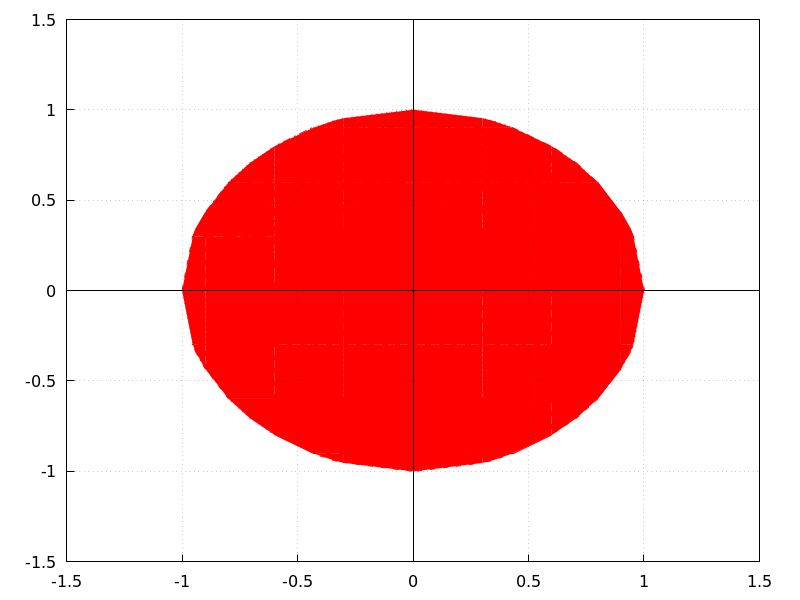


Tell gnuplot to draw all contour lines in black


```maxima
(%i1) draw3d(
          contour=both,
          surface_hide=true,enhanced3d=true,wired_surface=true,
          contour_levels=10,
          user_preamble="set for [i=1:8] linetype i dashtype i linecolor 0",
          explicit(sin(x)*cos(y),x,1,10,y,1,10)
      );
```

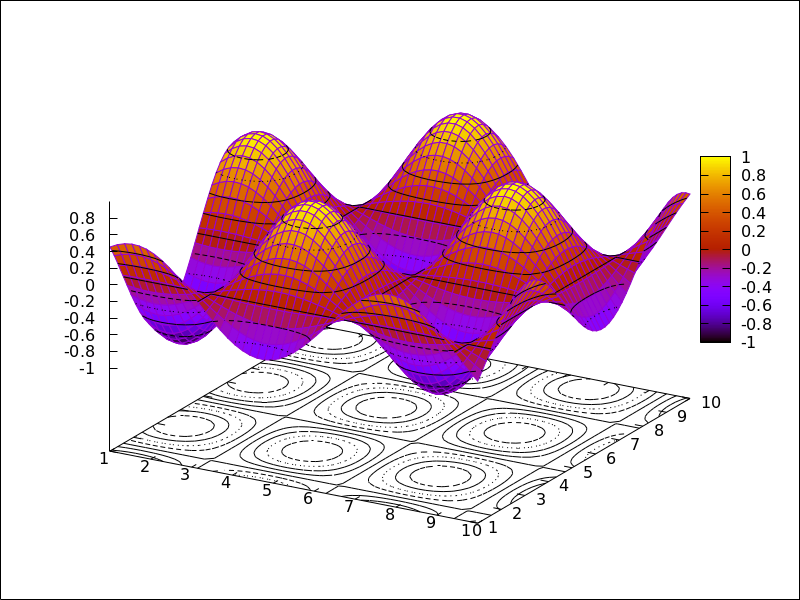

### Function: vector (vector, x, y, dx, dy, vector, x, y, z, dx, dy, dz)

Draws vectors in 2D and 3D.


This object is affected by the following *graphic options*: `head_both`, 
`head_length`, `head_angle`, `head_type`, `line_width`, 
`line_type`, `key` and `color`.


**2D**


`vector([x,y], [dx,dy])` plots vector
`[dx,dy]` with origin in `[x,y]`.


Example:


```maxima
(%i1) draw2d(xrange      = [0,12],
             yrange      = [0,10],
             head_length = 1,
             vector([0,1],[5,5]), /* default type */
             head_type = 'empty,
             vector([3,1],[5,5]),
             head_both = true,
             head_type = 'nofilled,
             line_type = dots,
             vector([6,1],[5,5]))$
```

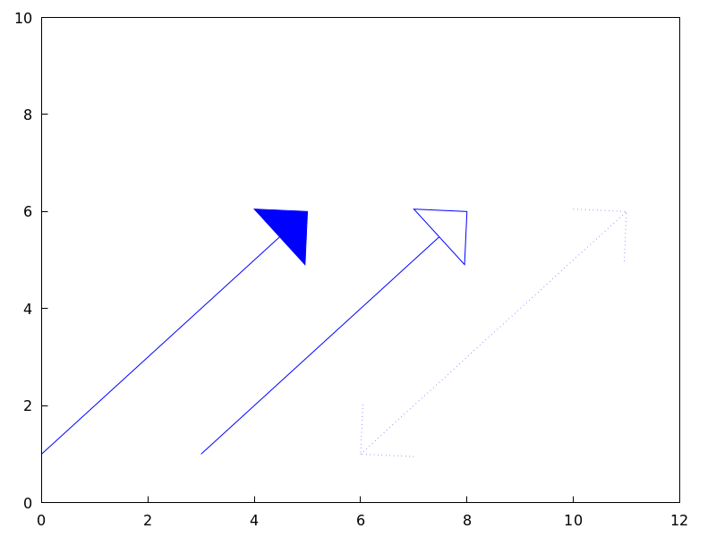


**3D**


`vector([x,y,z], [dx,dy,dz])` 
plots vector `[dx,dy,dz]` with
origin in `[x,y,z]`.


Example:


```maxima
(%i1) draw3d(color = cyan,
             vector([0,0,0],[1,1,1]/sqrt(3)),
             vector([0,0,0],[1,-1,0]/sqrt(2)),
             vector([0,0,0],[1,1,-2]/sqrt(6)) )$
```

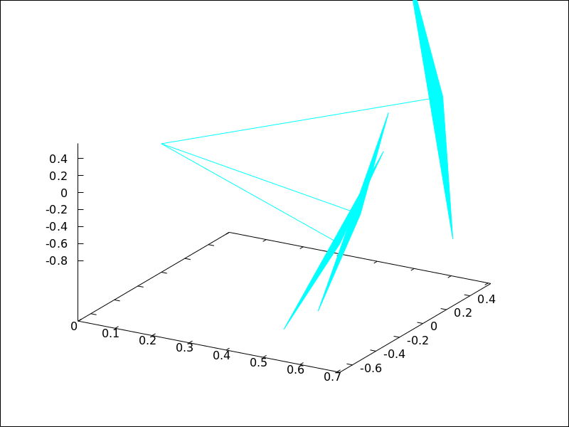

See also: `head_both`, `head_length`, `head_angle`, `head_type`, `line_width`, `line_type`, `key`.

### Variable: view

Default value: `[60,30]`


A pair of angles, measured in degrees, indicating the view direction in a 
3D scene. The first angle is the vertical rotation around the *x* axis, in 
the range $[0, 360]$. The second one is the horizontal rotation around
the *z* axis, in the range $[0, 360]$.


If option `view` is given the value `map`, the view direction is set
to be perpendicular to the xy-plane.


Since this is a global graphics option, its position in the scene description
does not matter.


Example:


```maxima
(%i1) draw3d(view = [170, 50],
             enhanced3d = true,
             explicit(sin(x^2+y^2),x,-2,2,y,-2,2) )$
```

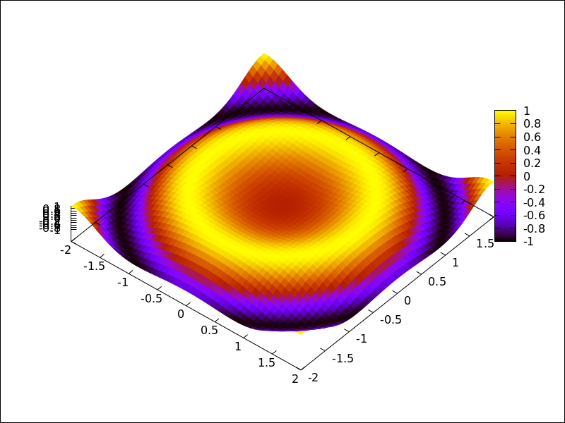


```maxima
(%i2) draw3d(view = map,
             enhanced3d = true,
             explicit(sin(x^2+y^2),x,-2,2,y,-2,2) )$
```

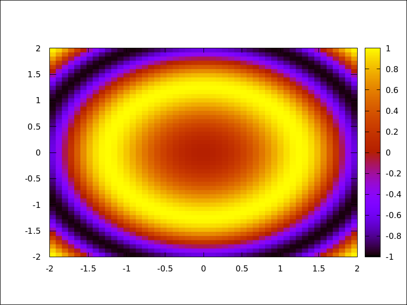

### Variable: wired_surface

Default value: `false`


Indicates whether 3D surfaces in `enhanced3d` mode show the grid joining
the points or not.


Since this is a global graphics option, its position in the scene description
does not matter.


Example:


```maxima
(%i1) draw3d(
        enhanced3d    = [sin(x),x,y],
        wired_surface = true,
        explicit(x^2+y^2,x,-1,1,y,-1,1)) $
```

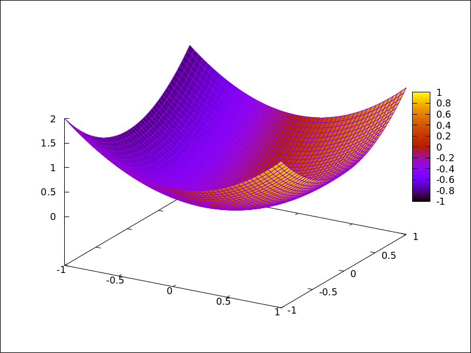

### Variable: x_voxel

Default value: 10


`x_voxel` is the number of voxels in the x direction to
be used by the *marching cubes algorithm* implemented
by the 3d `implicit` object. It is also used by graphic
object `region`.

See also: `region`.

### Variable: xaxis

Default value: `false`


If `xaxis` is `true`, the *x* axis is drawn.


Since this is a global graphics option, its position in the scene description
does not matter.


Example:


```maxima
(%i1) draw2d(explicit(x^3,x,-1,1),
             xaxis       = true,
             xaxis_color = blue)$
```

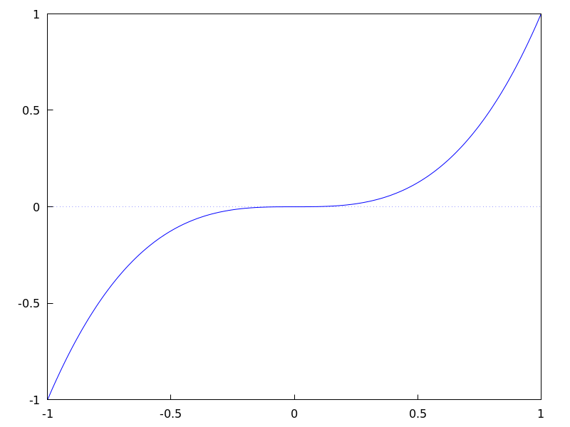


See also `xaxis_width`,  `xaxis_type` and `xaxis_005fcolor`.

See also: `xaxis_width`, `xaxis_type`, `xaxis_color`.

### Variable: xaxis_color

Default value: `"black"`


`xaxis_color` specifies the color for the *x* axis. See
`color` to know how colors are defined.


Since this is a global graphics option, its position in the scene description
does not matter.


Example:


```maxima
(%i1) draw2d(explicit(x^3,x,-1,1),
             xaxis       = true,
             xaxis_color = red)$
```


See also `xaxis`,  `xaxis_width` and `xaxis_005ftype`.

See also: `xaxis`, `xaxis_width`, `xaxis_type`.

### Variable: xaxis_secondary

Default value: `false`


If `xaxis_secondary` is `true`, function values can be plotted with 
respect to the second *x* axis, which will be drawn on top of the scene.


Note that this is a local graphics option which only affects to 2d plots.


Example:


```maxima
(%i1) draw2d(
         key   = "Bottom x-axis",
         explicit(x+1,x,1,2),
         color = red,
         key   = "Above x-axis",
         xtics_secondary = true,
         xaxis_secondary = true,
         explicit(x^2,x,-1,1)) $
```

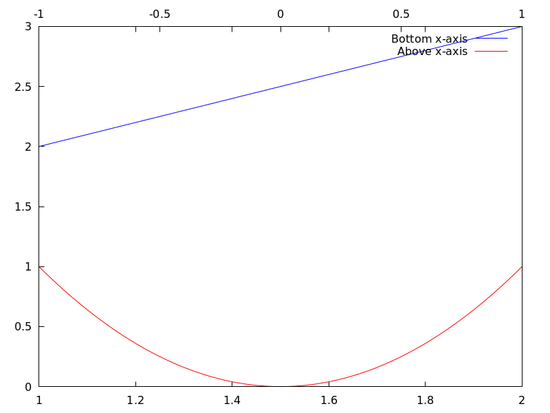


See also `xrange_secondary`,  `xtics_secondary`,  `xtics_rotate_secondary`, 
`xtics_axis_secondary` and `xaxis_005fsecondary`.

See also: `xrange_secondary`, `xtics_secondary`, `xtics_rotate_secondary`, `xaxis_secondary`.

### Variable: xaxis_type

Default value: `dots`


`xaxis_type` indicates how the *x* axis is displayed; 
possible values are `solid` and `dots`


Since this is a global graphics option, its position in the scene description
does not matter.


Example:


```maxima
(%i1) draw2d(explicit(x^3,x,-1,1),
             xaxis       = true,
             xaxis_type  = solid)$
```


See also `xaxis`,  `xaxis_width` and `xaxis_005fcolor`.

See also: `xaxis`, `xaxis_width`, `xaxis_color`.

### Variable: xaxis_width

Default value: 1


`xaxis_width` is the width of the *x* axis.
Its value must be a positive number.


Since this is a global graphics option, its position in the scene description
does not matter.


Example:


```maxima
(%i1) draw2d(explicit(x^3,x,-1,1),
             xaxis       = true,
             xaxis_width = 3)$
```


See also `xaxis`,  `xaxis_type` and `xaxis_005fcolor`.

See also: `xaxis`, `xaxis_type`, `xaxis_color`.

### Variable: xlabel_secondary

Default value: `""` (empty string)


Option `xlabel_secondary`, a string, is the label for the secondary *x* axis.
By default, no label is written.


Since this is a global graphics option, its position in the scene description
does not matter.


Example:


```maxima
(%i1) draw2d(
         xaxis_secondary=true,yaxis_secondary=true,
         xtics_secondary=true,ytics_secondary=true,
         xlabel_secondary="t[s]",
         ylabel_secondary="U[V]",
         explicit(sin(t),t,0,10) )$
```

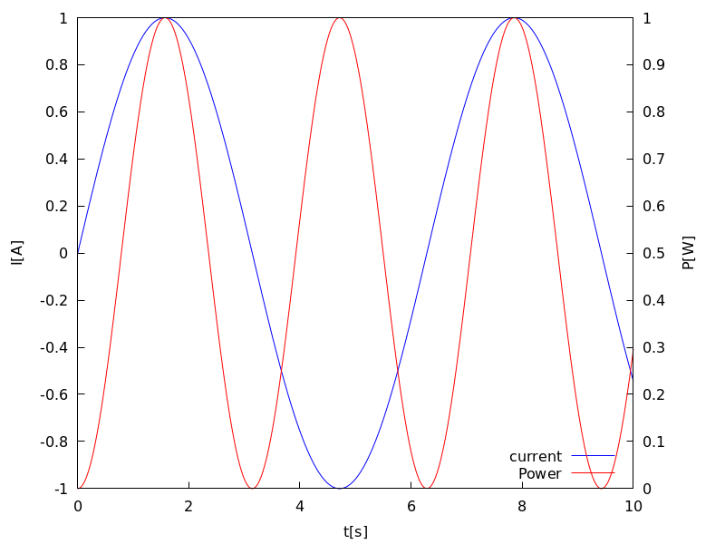


See also `xlabel_draw`,  `ylabel_draw`,  `ylabel_secondary` and `zlabel_005fdraw`.

See also: `xlabel_draw`, `ylabel_draw`, `ylabel_secondary`, `zlabel_draw`.

### Variable: xrange

Default value: `auto`


If `xrange` is `auto`, the range for the *x* coordinate is
computed automatically.


If the user wants a specific interval for *x*, it must be given as a 
Maxima list, as in `xrange=[-2, 3]`.


Since this is a global graphics option, its position in the scene description
does not matter.


Example:


```maxima
(%i1) draw2d(xrange = [-3,5],
             explicit(x^2,x,-1,1))$
```


See also `yrange` and `zrange`.

See also: `yrange`, `zrange`.

### Variable: xrange_secondary

Default value: `auto`


If `xrange_secondary` is `auto`, the range for the second *x* axis is
computed automatically.


If the user wants a specific interval for the second *x* axis, it must be given as a 
Maxima list, as in `xrange_secondary=[-2, 3]`.


Since this is a global graphics option, its position in the scene description
does not matter.


See also `xrange`,  `yrange`,  `zrange` and `yrange_005fsecondary`.

See also: `xrange`, `yrange`, `zrange`, `yrange_secondary`.

### Variable: xtics_axis

Default value: `false`


If `xtics_axis` is `true`, tic marks and their labels are plotted just
along the *x* axis, if it is `false` tics are plotted on the border.


Since this is a global graphics option, its position in the scene description
does not matter.

### Variable: xtics_rotate

Default value: `false`


If `xtics_rotate` is `true`, tic marks on the *x* axis are rotated 
90 degrees.


Since this is a global graphics option, its position in the scene description
does not matter.

### Variable: xtics_rotate_secondary

Default value: `false`


If `xtics_rotate_secondary` is `true`, tic marks on the secondary *x* axis are rotated 
90 degrees.


Since this is a global graphics option, its position in the scene description
does not matter.

### Variable: xtics_secondary

Default value: `auto`


This graphic option controls the way tic marks are drawn on the second *x* axis.


See `xtics_draw` for a complete description.

See also: `xtics_draw`.

### Variable: xtics_secondary_axis

Default value: `false`


If `xtics_secondary_axis` is `true`, tic marks and their labels are plotted just
along the secondary *x* axis, if it is `false` tics are plotted on the border.


Since this is a global graphics option, its position in the scene description
does not matter.

### Variable: xu_grid

Default value: 30


`xu_grid` is the number of coordinates of the first variable
(`x` in explicit and `u` in parametric 3d surfaces) to 
build the grid of sample points.


This option affects the following graphic objects:


- *
`gr3d`: `explicit` and `parametric_surface`.


Example:


```maxima
(%i1) draw3d(xu_grid = 10,
             yv_grid = 50,
             explicit(x^2+y^2,x,-3,3,y,-3,3) )$
```


See also `yv_005fgrid`.

See also: `yv_grid`.

### Variable: xy_file

Default value: `""` (empty string)


`xy_file` is the name of the file where the coordinates will be saved
after clicking with the mouse button and hitting the ’x’ key. By default,
no coordinates are saved.


Since this is a global graphics option, its position in the scene description
does not matter.

### Variable: xyplane

Default value: `false`


Allocates the xy-plane in 3D scenes. When `xyplane` is
`false`, the xy-plane is placed automatically; when it is
a real number, the xy-plane intersects the z-axis at this level.
This option has no effect in 2D scenes.


Since this is a global graphics option, its position in the scene description
does not matter.


Example:


```maxima
(%i1) draw3d(xyplane = %e-2,
             explicit(x^2+y^2,x,-1,1,y,-1,1))$
```

### Variable: y_voxel

Default value: 10


`y_voxel` is the number of voxels in the y direction to
be used by the *marching cubes algorithm* implemented
by the 3d `implicit` object. It is also used by graphic
object `region`.

See also: `region`.

### Variable: yaxis

Default value: `false`


If `yaxis` is `true`, the *y* axis is drawn.


Since this is a global graphics option, its position in the scene description
does not matter.


Example:


```maxima
(%i1) draw2d(explicit(x^3,x,-1,1),
             yaxis       = true,
             yaxis_color = blue)$
```


See also `yaxis_width`,  `yaxis_type` and `yaxis_005fcolor`.

See also: `yaxis_width`, `yaxis_type`, `yaxis_color`.

### Variable: yaxis_color

Default value: `"black"`


`yaxis_color` specifies the color for the *y* axis. See
`color` to know how colors are defined.


Since this is a global graphics option, its position in the scene description
does not matter.


Example:


```maxima
(%i1) draw2d(explicit(x^3,x,-1,1),
             yaxis       = true,
             yaxis_color = red)$
```


See also `yaxis`,  `yaxis_width` and `yaxis_005ftype`.

See also: `yaxis`, `yaxis_width`, `yaxis_type`.

### Variable: yaxis_secondary

Default value: `false`


If `yaxis_secondary` is `true`, function values can be plotted with 
respect to the second *y* axis, which will be drawn on the right side of the
scene.


Note that this is a local graphics option which only affects to 2d plots.


Example:


```maxima
(%i1) draw2d(
         explicit(sin(x),x,0,10),
         yaxis_secondary = true,
         ytics_secondary = true,
         color = blue,
         explicit(100*sin(x+0.1)+2,x,0,10));
```


See also `yrange_secondary`,  `ytics_secondary`,  `ytics_rotate_secondary`
and `ytics_axis_secondary`

See also: `yrange_secondary`, `ytics_secondary`, `ytics_rotate_secondary`.

### Variable: yaxis_type

Default value: `dots`


`yaxis_type` indicates how the *y* axis is displayed; 
possible values are `solid` and `dots`.


Since this is a global graphics option, its position in the scene description
does not matter.


Example:


```maxima
(%i1) draw2d(explicit(x^3,x,-1,1),
             yaxis       = true,
             yaxis_type  = solid)$
```


See also `yaxis`,  `yaxis_width` and `yaxis_005fcolor`.

See also: `yaxis`, `yaxis_width`, `yaxis_color`.

### Variable: yaxis_width

Default value: 1


`yaxis_width` is the width of the *y* axis.
Its value must be a positive number.


Since this is a global graphics option, its position in the scene description
does not matter.


Example:


```maxima
(%i1) draw2d(explicit(x^3,x,-1,1),
             yaxis       = true,
             yaxis_width = 3)$
```


See also `yaxis`,  `yaxis_type` and `yaxis_005fcolor`.

See also: `yaxis`, `yaxis_type`, `yaxis_color`.

### Variable: ylabel_secondary

Default value: `""` (empty string)


Option `ylabel_secondary`, a string, is the label for the secondary *y* axis.
By default, no label is written.


Since this is a global graphics option, its position in the scene description
does not matter.


Example:


```maxima
(%i1) draw2d(
        key_pos=bottom_right,
        key="current",
        xlabel="t[s]",
        ylabel="I[A]",ylabel_secondary="P[W]",
        explicit(sin(t),t,0,10),
        yaxis_secondary=true,
        ytics_secondary=true,
        color=red,key="Power",
        explicit((sin(t))^2,t,0,10)
    )$
```


See also `xlabel_draw`,  `xlabel_secondary`,  `ylabel_draw` and `zlabel_005fdraw`.

See also: `xlabel_draw`, `xlabel_secondary`, `ylabel_draw`, `zlabel_draw`.

### Variable: yrange

Default value: `auto`


If `yrange` is `auto`, the range for the *y* coordinate is
computed automatically.


If the user wants a specific interval for *y*, it must be given as a 
Maxima list, as in `yrange=[-2, 3]`.


Since this is a global graphics option, its position in the scene description
does not matter.


Example:


```maxima
(%i1) draw2d(yrange = [-2,3],
             explicit(x^2,x,-1,1),
             xrange = [-3,3])$
```


See also `xrange`,  `yrange_secondary` and `zrange`.

See also: `xrange`, `yrange_secondary`, `zrange`.

### Variable: yrange_secondary

Default value: `auto`


If `yrange_secondary` is `auto`, the range for the second *y* axis is
computed automatically.


If the user wants a specific interval for the second *y* axis, it must be given as a 
Maxima list, as in `yrange_secondary=[-2, 3]`.


Since this is a global graphics option, its position in the scene description
does not matter.


Example:


```maxima
(%i1) draw2d(
         explicit(sin(x),x,0,10),
         yaxis_secondary = true,
         ytics_secondary = true,
         yrange = [-3, 3],
         yrange_secondary = [-20, 20],
         color = blue,
         explicit(100*sin(x+0.1)+2,x,0,10)) $
```


See also `xrange`,  `yrange` and `zrange`.

See also: `xrange`, `yrange`, `zrange`.

### Variable: ytics_axis

Default value: `false`


If `ytics_axis` is `true`, tic marks and their labels are plotted just
along the *y* axis, if it is `false` tics are plotted on the border.


Since this is a global graphics option, its position in the scene description
does not matter.

### Variable: ytics_rotate

Default value: `false`


If `ytics_rotate` is `true`, tic marks on the *y* axis are rotated 
90 degrees.


Since this is a global graphics option, its position in the scene description
does not matter.

### Variable: ytics_rotate_secondary

Default value: `false`


If `ytics_rotate_secondary` is `true`, tic marks on the secondary *y* axis are rotated 
90 degrees.


Since this is a global graphics option, its position in the scene description
does not matter.

### Variable: ytics_secondary

Default value: `auto`


This graphic option controls the way tic marks are drawn on the second *y* axis.


See `xtics` for a complete description.

### Variable: ytics_secondary_axis

Default value: `false`


If `ytics_secondary_axis` is `true`, tic marks and their labels are plotted just
along the secondary *y* axis, if it is `false` tics are plotted on the border.


Since this is a global graphics option, its position in the scene description
does not matter.

### Variable: yv_grid

Default value: 30


`yv_grid` is the number of coordinates of the second variable
(`y` in explicit and `v` in parametric 3d surfaces) to 
build the grid of sample points.


This option affects the following graphic objects:


- *
`gr3d`: `explicit` and `parametric_surface`.


Example:


```maxima
(%i1) draw3d(xu_grid = 10,
             yv_grid = 50,
             explicit(x^2+y^2,x,-3,3,y,-3,3) )$
```

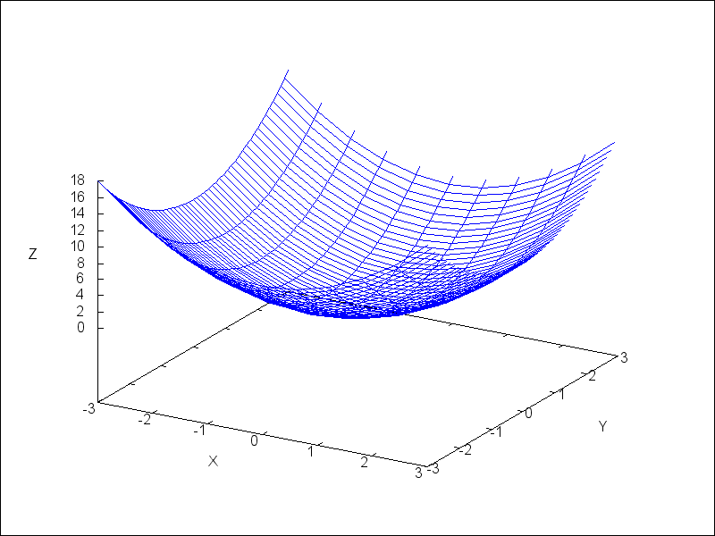


See also `xu_005fgrid`.

See also: `explicit`, `parametric_surface`, `xu_grid`.

### Variable: z_voxel

Default value: 10


`z_voxel` is the number of voxels in the z direction to
be used by the *marching cubes algorithm* implemented
by the 3d `implicit` object.

### Variable: zaxis

Default value: `false`


If `zaxis` is `true`, the *z* axis is drawn in 3D plots.
This option has no effect in 2D scenes.


Since this is a global graphics option, its position in the scene description
does not matter.


Example:


```maxima
(%i1) draw3d(explicit(x^2+y^2,x,-1,1,y,-1,1),
             zaxis       = true,
             zaxis_type  = solid,
             zaxis_color = blue)$
```


See also `zaxis_width`,  `zaxis_type` and `zaxis_005fcolor`.

See also: `zaxis_width`, `zaxis_type`, `zaxis_color`.

### Variable: zaxis_color

Default value: `"black"`


`zaxis_color` specifies the color for the *z* axis. See
`color` to know how colors are defined. 
This option has no effect in 2D scenes.


Since this is a global graphics option, its position in the scene description
does not matter.


Example:


```maxima
(%i1) draw3d(explicit(x^2+y^2,x,-1,1,y,-1,1),
             zaxis       = true,
             zaxis_type  = solid,
             zaxis_color = red)$
```


See also `zaxis`,  `zaxis_width` and `zaxis_005ftype`.

See also: `zaxis`, `zaxis_width`, `zaxis_type`.

### Variable: zaxis_type

Default value: `dots`


`zaxis_type` indicates how the *z* axis is displayed; 
possible values are `solid` and `dots`.
This option has no effect in 2D scenes.


Since this is a global graphics option, its position in the scene description
does not matter.


Example:


```maxima
(%i1) draw3d(explicit(x^2+y^2,x,-1,1,y,-1,1),
             zaxis       = true,
             zaxis_type  = solid)$
```


See also `zaxis`,  `zaxis_width` and `zaxis_005fcolor`.

See also: `zaxis`, `zaxis_width`, `zaxis_color`.

### Variable: zaxis_width

Default value: 1


`zaxis_width` is the width of the *z* axis.
Its value must be a positive number. This option has no effect in 2D scenes.


Since this is a global graphics option, its position in the scene description
does not matter.


Example:


```maxima
(%i1) draw3d(explicit(x^2+y^2,x,-1,1,y,-1,1),
             zaxis       = true,
             zaxis_type  = solid,
             zaxis_width = 3)$
```


See also `zaxis`,  `zaxis_type` and `zaxis_005fcolor`.

See also: `zaxis`, `zaxis_type`, `zaxis_color`.

### Variable: zlabel_rotate

Default value: `"auto"`


This graphics option allows to choose if the z axis label of 3d plots is
drawn horizontal (`false`), vertical (`true`) or if maxima
automatically chooses an orientation based on the length of the label
(`auto`).


Since this is a global graphics option, its position in the scene description
does not matter.


Example:


```maxima
(%i1) draw3d(
          explicit(sin(x)*sin(y),x,0,10,y,0,10),
          zlabel_rotate=false
      )$
```


See also `zlabel_005fdraw`.

See also: `zlabel_draw`.

### Variable: zrange

Default value: `auto`


If `zrange` is `auto`, the range for the *z* coordinate is
computed automatically.


If the user wants a specific interval for *z*, it must be given as a 
Maxima list, as in `zrange=[-2, 3]`.


Since this is a global graphics option, its position in the scene description
does not matter.


Example:


```maxima
(%i1) draw3d(yrange = [-3,3],
             zrange = [-2,5],
             explicit(x^2+y^2,x,-1,1,y,-1,1),
             xrange = [-3,3])$
```


See also `xrange` and `yrange`.

See also: `xrange`, `yrange`.

### Variable: ztics_axis

Default value: `false`


If `ztics_axis` is `true`, tic marks and their labels are plotted just
along the *z* axis, if it is `false` tics are plotted on the border.


Since this is a global graphics option, its position in the scene description
does not matter.

### Variable: ztics_rotate

Default value: `false`


If `ztics_rotate` is `true`, tic marks on the *z* axis are rotated 
90 degrees.


Since this is a global graphics option, its position in the scene description
does not matter.

