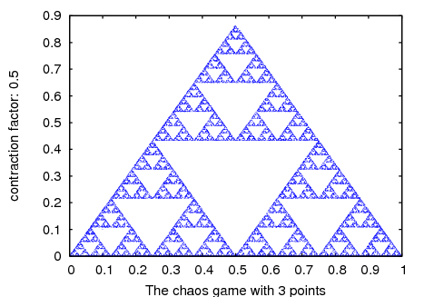
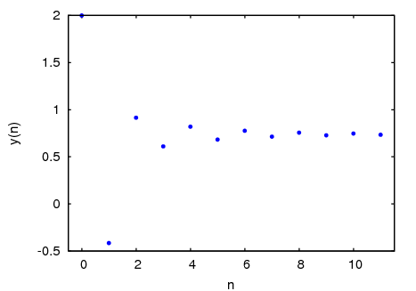
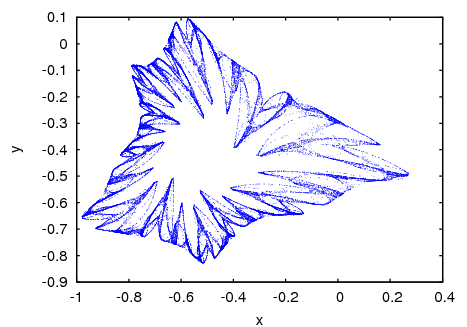
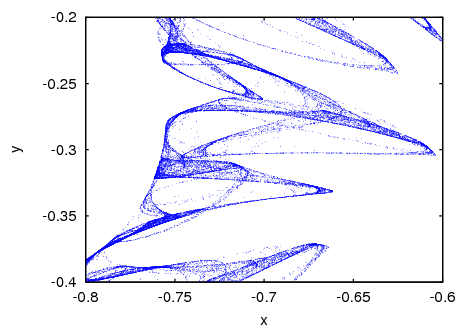
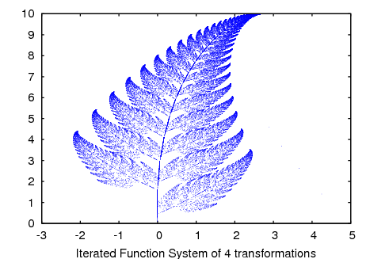
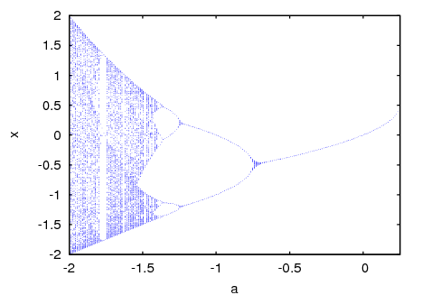
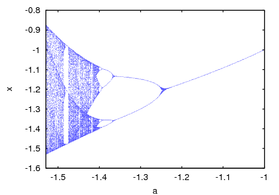
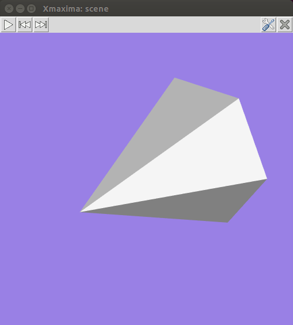
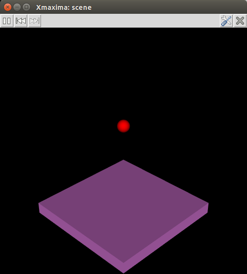
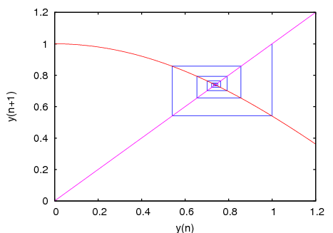

## dynamics

### Variable: animation

*property* should be one of the following 4 object’s properties:
`object_005forigin`, `object_005fscale`,
`object_005fposition` or
`object_005forientation` and *positions* should be a
list of points. When the play button is pressed, the object property
will be changed sequentially through all the values in the list, at
intervals of time given by the option `scene_005ftstep`. The
rewind button can be used to point at the start of the sequence making
the animation restart after the play button is pressed again.


See also `object_005ftrack`.

See also: `object_origin`, `object_scale`, `object_position`, `object_orientation`, `scene_tstep`, `object_track`.

### Variable: background

Default value: `black`


The color of the graphics window’s background. It accepts color names or
hexadecimal red-green-blue strings (see the `color` option of plot2d).

See also: `color`.

### Variable: center

Default value: `[0, 0, 0]`


The coordinates of the object’s geometric center, with respect to its
`object_005fposition`. *point* can be a list with 3
real numbers, or 3 real numbers separated by commas. In a cylinder, cone
or cube it will be at half its height and in a sphere at its center.

See also: `object_position`.

### Function: chaosgame (x1, y1, ..., xm, ym, x0, y0, b, n, options, ..., ;)

Implements the so-called chaos game: the initial point (*x0*,
*y0*) is plotted and then one of the *m* points
[*x1*, *y1*]...*xm*, *ym*]
will be selected at random. The next point plotted will be on the
segment from the previous point plotted to the point chosen randomly, at a
distance from the random point which will be *b* times that segment’s
length. The procedure is repeated *n* times. The options are the
same as for `plot2d`.


**Example**. A plot of Sierpinsky’s triangle:


```maxima
(%i1) chaosgame([[0, 0], [1, 0], [0.5, sqrt(3)/2]], [0.1, 0.1], 1/2,
                 30000, [style, dots]);
```




See also: `plot2d`.

### Variable: cone

Creates a regular pyramid with height equal to 1 and a hexagonal base
with vertices 0.5 units away from the axis. Options
`object_005fheight` and `object_005fradius` can be used
to change those defaults and option `object_005fresolution`
can be used to change the number of edges of the base; higher values
will make it look like a cone. By default, the axis will be along the x
axis, the middle point of the axis will be at the origin and the vertex
on the positive side of the x axis; use options
`object_005forientation` and `object_005fcenter` to
change those defaults.


**Example**. This shows a pyramid that starts rotating around the z
axis when the play button is pressed.

 

```maxima
(%i1) scene([cone, [orientation,0,30,0], [tstep,100],
   [animate,orientation,makelist([0,30,i],i,5,360,5)]], restart)$
```

See also: `object_height`, `object_radius`, `object_resolution`, `object_orientation`, `object_center`.

### Variable: cube

A cube with edges of 1 unit and faces parallel to the xy, xz and yz
planes. The lengths of the three edges can be changed with options
`object_005fxlength`, `object_005fylength` and
`object_005fzlength`, turning it into a rectangular box and
the faces can be rotated with option `object_005forientation`.

See also: `object_xlength`, `object_ylength`, `object_zlength`, `object_orientation`.

### Variable: cylinder

Creates a regular prism with height equal to 1 and a hexagonal base with
vertices 0.5 units away from the axis. Options
`object_005fheight` and `object_005fradius` can be
used to change those defaults and option `object_005fresolution` can be used to change the number of edges of the base;
higher values will make it look like a cylinder. The default height can
be changed with the option `object_005fheight`. By default,
the axis will be along the x axis and the middle point of the axis will
be at the origin; use options `object_005forientation` and
`object_005fcenter` to change those defaults.

See also: `object_height`, `object_radius`, `object_resolution`, `object_orientation`, `object_center`.

### Variable: endphi

Default value: `180`


In a sphere phi is the angle on the vertical plane that passes through
the z axis, measured from the positive part of the z axis. *angle*
must be a number between 0 and 180 that sets the final value of phi at
which the surface will end. A value smaller than 180 will eliminate a
part of the sphere’s surface.


See also `object_005fstartphi` and
`object_005fphiresolution`.

See also: `object_startphi`, `object_phiresolution`.

### Variable: endtheta

Default value: `360`


In a sphere theta is the angle on the horizontal plane (longitude),
measured from the positive part of the x axis. *angle* must be a
number between 0 and 360 that sets the final value of theta at which the
surface will end. A value smaller than 360 will eliminate a part of
the sphere’s surface.


See also `object_005fstarttheta` and
`object_005fthetaresolution`.

See also: `object_starttheta`, `object_thetaresolution`.

### Function: evolution (F, y0, n, ..., options, ..., ;)

Draws *n+1* points in a two-dimensional graph, where the horizontal
coordinates of the points are the integers 0, 1, 2, ..., *n*, and
the vertical coordinates are the corresponding values *y(n)* of the
sequence defined by the recurrence relation


```maxima
y(n+1) = F(y(n))
```


$$y_{n+1} = F(y_n)$$


With initial value *y(0)* equal to *y0*. *F* must be an
expression that depends only on one variable (in the example, it
depend on *y*, but any other variable can be used),
*y0* must be a real number and *n* must be a positive integer.
 This function accepts the same options as `plot2d`.


**Example**.


```maxima
(%i1) evolution(cos(y), 2, 11);
```



See also: `plot2d`.

### Function: evolution2d (F, G, u, v, u0, y0, n, options, ..., ;)

Shows, in a two-dimensional plot, the first *n+1* points in the
sequence of points defined by the two-dimensional discrete dynamical
system with recurrence relations


```maxima
u(n+1) = F(u(n), v(n))    v(n+1) = G(u(n), v(n))
```


$$\cases{u_{n+1} = F(u_n, v_n) &\cr v_{n+1} = G(u_n, v_n)}$$


With initial values *u0* and *v0*. *F* and *G* must be
two expressions that depend only on two variables, *u* and
*v*, which must be named explicitly in a list. The options are the
same as for `plot2d`.


**Example**. Evolution of a two-dimensional discrete dynamical system:


```maxima
(%i1) f: 0.6*x*(1+2*x)+0.8*y*(x-1)-y^2-0.9$
(%i2) g: 0.1*x*(1-6*x+4*y)+0.1*y*(1+9*y)-0.4$
(%i3) evolution2d([f,g], [x,y], [-0.5,0], 50000, [style,dots]);
```





And an enlargement of a small region in that fractal:


```maxima
(%i9) evolution2d([f,g], [x,y], [-0.5,0], 300000, [x,-0.8,-0.6],
                  [y,-0.4,-0.2], [style, dots]);
```




See also: `plot2d`.

### Variable: height

Default value: `500`


The height, in pixels, of the graphics window. *pixels* must be a
positive integer number.

### Function: ifs (r1, ..., rm, A1, ..., Am, x1, y1, ..., xm, ym, x0, y0, n, options, ..., ;)

Implements the Iterated Function System method. This method is similar
to the method described in the function `chaosgame`. but instead of
shrinking the segment from the current point to the randomly chosen
point, the 2 components of that segment will be multiplied by the 2 by 2
matrix *Ai* that corresponds to the point chosen randomly.


The random choice of one of the *m* attractive points can be made
with a non-uniform probability distribution defined by the weights
*r1*,...,*rm*. Those weights are given in cumulative form; for
instance if there are 3 points with probabilities 0.2, 0.5 and 0.3, the
weights *r1*, *r2* and *r3* could be 2, 7 and 10. The
options are the same as for `plot2d`.


**Example**. Barnsley’s fern, obtained with 4 matrices and 4 points:


```maxima
(%i1) a1: matrix([0.85,0.04],[-0.04,0.85])$
(%i2) a2: matrix([0.2,-0.26],[0.23,0.22])$
(%i3) a3: matrix([-0.15,0.28],[0.26,0.24])$
(%i4) a4: matrix([0,0],[0,0.16])$
(%i5) p1: [0,1.6]$
(%i6) p2: [0,1.6]$
(%i7) p3: [0,0.44]$
(%i8) p4: [0,0]$
(%i9) w: [85,92,99,100]$
(%i10) ifs(w, [a1,a2,a3,a4], [p1,p2,p3,p4], [5,0], 50000, [style,dots]);
```




See also: `chaosgame`, `plot2d`.

### Variable: linewidth

Default value: `1`


The width of the lines, when option `object_005fwireframe` is
used. *value* must be a positive number.

See also: `object_wireframe`.

### Variable: opacity

Default value: `1`


*value* must be a number between 0 and 1. The lower the number, the
more transparent the object will become. The default value of 1 means a
completely opaque object.

### Function: orbits (F, y0, n1, n2, x, x0, xf, xstep, options, ..., ;)

Draws the orbits diagram for a family of one-dimensional
discrete dynamical systems, with one parameter *x*; that kind of
diagram is used to study the bifurcations of an one-dimensional discrete
system.


The function *F(y)* defines a sequence with a starting value of
*y0*, as in the case of the function `evolution`, but in this
case that function will also depend on a parameter *x* that will
take values in the interval from *x0* to *xf* with increments of
*xstep*. Each value used for the parameter *x* is shown on the
horizontal axis. The vertical axis will show the *n2* values
of the sequence *y(n1+1)*,..., *y(n1+n2+1)* obtained after letting
the sequence evolve *n1* iterations.  In addition to the options
accepted by `plot2d`, it accepts an option *pixels* that
sets up the maximum number of different points that will be represented
in the vertical direction.


**Example**. Orbits diagram of the quadratic map, with a parameter
*a*:


```maxima
(%i1) orbits(x^2+a, 0, 50, 200, [a, -2, 0.25], [style, dots]);
```





To enlarge the region around the lower bifurcation near x `=` -1.25 use:


```maxima
(%i2) orbits(x^2+a, 0, 100, 400, [a,-1,-1.53], [x,-1.6,-0.8],
             [nticks, 400], [style,dots]);
```




See also: `plot2d`.

### Variable: orientation

Default value: `[0, 0, 0]`


Three angles by which the object will be rotated with respect to the
three axis. *angles* can be a list with 3 real numbers, or 3 real
numbers separated by commas. **Example**: `[0, 0, 90]` rotates
the x axis of the object to the y axis of the reference frame.

### Variable: origin

Default value: `[0, 0, 0]`


The coordinates of the object’s origin, with respect to which its
other dimensions are defined. *point* can be a list with 3
real numbers, or 3 real numbers separated by commas.

### Variable: phiresolution

Default value: ``


The number of sub-intervals into which the phi angle interval from
`object_005fstartphi` to `object_005fendphi`
will be divided. *num* must be a positive integer.


See also `object_005fstartphi` and
`object_005fendphi`.

See also: `object_startphi`, `object_endphi`.

### Variable: pointsize

Default value: `1`


The size of the points, when option `object_005fpoints` is
used. *value* must be a positive number.

See also: `object_points`.

### Variable: position

Default value: `[0, 0, 0]`


The coordinates of the object’s position. *point* can be a list with 3
real numbers, or 3 real numbers separated by commas.

### Variable: radius

Default value: `0.5`


The radius or a sphere or the distance from the axis to the base’s
vertices in a cylinder or a cone. *value* must be a positive number.

### Variable: resolution

Default value: `6`


*number* must be an integer greater than 2 that sets the number of
edges in the base of a cone or a cylinder.

### Variable: restart

Default value: `false`


A true value means that animations will restart automatically when the
end of the list is reached. Writing just “restart” is equivalent to
[restart, *true*].

### Variable: scale

Default value: `[1, 1, 1]`


Three numbers by which the object will be scaled with respect to the
three axis. *factors* can be a list with 3 real numbers, or 3 real
numbers separated by commas. **Example**: `[2, 0.5, 1]`
enlarges the object to twice its size in the x direction, reduces the
dimensions in the y direction to half and leaves the z dimensions
unchanged.

### Function: scene (objects, ..., options, ..., ;)

Accepts an empty list or a list of several `scene_005fobjects`
and `scene_005foptions`. The program launches Xmaxima, which
opens an external window representing the given objects in a
3-dimensional space and applying the options given. Each object must
belong to one of the following 4 classes: sphere, cube, cylinder or cone
(see `scene_005fobjects`). Objects are identified by
giving their name or by a list in which the first element is the class
name and the following elements are options for that object.

 

**Example**. A hexagonal pyramid with a blue background:


```maxima
(%i1) scene(cone, [background,"#9980e5"])$
```




By holding down the left button of the mouse while it is moved on the
graphics window, the camera can be rotated showing different views of
the pyramid. The two plot options `scene_005felevation` and
`scene_005fazimuth` can also be used to change the initial
orientation of the viewing camera. The camera can be moved by holding
the middle mouse button while moving it and holding the right-side mouse
button while moving it up or down will zoom in or out.


Each object option should be a list starting with the option name,
followed by its value. The list of allowed options can be found in the
`object_005foptions` section.


**Example**. This will show a sphere falling to the ground and
bouncing off without losing any energy. To start or pause the
animation, press the play/pause button.


```maxima
(%i1) p: makelist ([0,0,2.1- 9.8*t^2/2], t, 0, 0.64, 0.01)$

(%i2) p: append (p, reverse(p))$

(%i3) ball: [sphere, [radius,0.1], [thetaresolution,20],
  [phiresolution,20], [position,0,0,2.1], [color,red],
  [animate,position,p]]$

(%i4) ground: [cube, [xlength,2], [ylength,2], [zlength,0.2],
  [position,0,0,-0.1],[color,violet]]$

(%i5) scene (ball, ground, restart)$
```




The *restart* option was used to make the animation restart
automatically every time the last point in the position list is reached.
The accepted values for the colors are the same as for the `color`
option of plot2d.

See also: `scene_objects`, `scene_options`, `scene_elevation`, `scene_azimuth`, `object_options`, `color`.

### Variable: sphere

A sphere with default radius of 0.5 units and center at the origin.

### Function: staircase (F, y0, n, options, ..., ;)

Draws a staircase diagram for the sequence defined by the recurrence
relation


```maxima
y(n+1) = F(y(n))
```


$$y_{n+1} = F(y_n)$$


The interpretation and allowed values of the input parameters is the
same as for the function `evolution`. A staircase diagram consists
of a plot of the function *F(y)*, together with the line *G(y)*
`=` *y*. A vertical segment is drawn from the point (*y0*,
*y0*) on that line until the point where it intersects the function
*F*. From that point a horizontal segment is drawn until it reaches
the point (*y1*, *y1*) on the line, and the procedure is
repeated *n* times until the point (*yn*, *yn*) is
reached. The options are the same as for `plot2d`.


**Example**.


```maxima
(%i1) staircase(cos(y), 1, 11, [y, 0, 1.2]);
```



See also: `evolution`, `plot2d`.

### Variable: startphi

Default value: `0`


In a sphere phi is the angle on the vertical plane that passes through
the z axis, measured from the positive part of the z axis. *angle*
must be a number between 0 and 180 that sets the initial value of phi at
which the surface will start. A value bigger than 0 will eliminate a
part of the sphere’s surface.


See also `object_005fendphi` and
`object_005fphiresolution`.

See also: `object_endphi`, `object_phiresolution`.

### Variable: starttheta

Default value: `0`


In a sphere theta is the angle on the horizontal plane (longitude),
measured from the positive part of the x axis. *angle* must be a
number between 0 and 360 that sets the initial value of theta at which
the surface will start. A value bigger than 0 will eliminate a part of
the sphere’s surface.


See also `object_005fendtheta` and
`object_005fthetaresolution`.

See also: `object_endtheta`, `object_thetaresolution`.

### Variable: surface

The surfaces of the object will be rendered and the lines and points of
the triangulation used to build the surface will not be shown. This is
the default behavior, which can be changed using either the option
`object_005fpoints` or `object_005fwireframe`.

See also: `object_points`, `object_wireframe`.

### Variable: thetaresolution

Default value: ``


The number of sub-intervals into which the theta angle interval from
`object_005fstarttheta` to `object_005fendtheta`
will be divided. *num* must be a positive integer.


See also `object_005fstarttheta` and
`object_005fendtheta`.

See also: `object_starttheta`, `object_endtheta`.

### Variable: track

*positions* should be a list of points. When the play button is
pressed, the object position will be changed sequentially through all
the points in the list, at intervals of time given by the option
`scene_005ftstep`, leaving behind a track of the object’s
trajectory. The rewind button can be used to point at the start of the
sequence making the animation restart after the play button is pressed
again.


**Example**. This will show the trajectory of a ball thrown with
speed of 5 m/s, at an angle of 45 degrees, when the air resistance can
be neglected:


```maxima
(%i1) p: makelist ([0,4*t,4*t- 9.8*t^2/2], t, 0, 0.82, 0.01)$

(%i2) ball: [sphere, [radius,0.1], [color,red], [track,p]]$

(%i3) ground: [cube, [xlength,2], [ylength,4], [zlength,0.2],
      [position,0,1.5,-0.2],[color,green]]$

(%i4) scene (ball, ground)$
```


See also `object_005fanimation`.

See also: `scene_tstep`, `object_animation`.

### Variable: tstep

Default value: `10`


The amount of time, in mili-seconds, between iterations among
consecutive animation frames. *time* must be a real number.

### Variable: width

Default value: `500`


The width, in pixels, of the graphics window. *pixels* must be a
positive integer number.

### Variable: windowname

Default value: `.scene`


*name* must be a string that can be used as the name of the Tk
window created by Xmaxima for the `scene` graphics. The default
value `.scene` implies that a new top level window will be created.

### Variable: windowtitle

Default value: `Xmaxima: scene`


*name* must be a string that will be written in the title of the
window created by `scene`.

### Variable: wireframe

Only the edges of the triangulation used to render the surface will be
shown. **Example**: `[cube, [wireframe]]`


See also `object_005fsurface` and
`object_005fpoints`.

See also: `object_surface`, `object_points`.

### Variable: xlength

Default value: `1`


The height of a cube in the x direction. *length* must be a positive
number. See also `object_005fylength` and
`object_005fzlength`.

See also: `object_ylength`, `object_zlength`.

### Variable: ylength

Default value: `1`


The height of a cube in the y direction. *length* must be a positive
number. See also `object_005fxlength` and
`object_005fzlength`.

See also: `object_xlength`, `object_zlength`.

### Variable: zlength

Default value: `1`


The height of a cube in z the direction. *length* must be a positive
 number.  See also `object_005fxlength` and
 `object_005fylength`.

See also: `object_xlength`, `object_ylength`.

