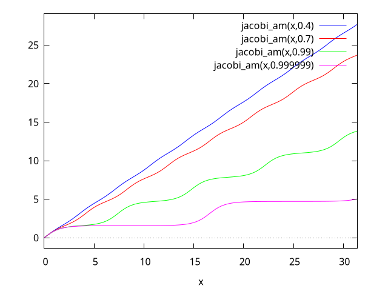

## Elliptic Functions

<!-- category: SpecialFunctions -->
<!-- keywords: inverse_jacobi_cd -->
<!-- signatures: inverse_jacobi_cd(u, m) -->
### Function: inverse_jacobi_cd (u, m)

The inverse of the Jacobian elliptic function 
${\rm cd}(u,m).$
For 
$-1\le u \le 1,$
it can also be written ([https://dlmf.nist.gov/22.15.E15DLMF 22.15.E15]()):

$${\rm inverse\_jacobi\_cd}(u, m) = \int_u^1 {dt\over \sqrt{(1-t^2)(1-mt^2)}}$$


$${\rm inverse\_jacobi\_cd}(u, m) = \int_u^1 {dt\over \sqrt{(1-t^2)(1-mt^2)}}$$

<!-- category: SpecialFunctions -->
<!-- keywords: inverse_jacobi_cs -->
<!-- signatures: inverse_jacobi_cs(u, m) -->
### Function: inverse_jacobi_cs (u, m)

The inverse of the Jacobian elliptic function 
${\rm cs}(u,m).$
For all $u$ it can also be written ([https://dlmf.nist.gov/22.15.E23DLMF 22.15.E23]()):

$${\rm inverse\_jacobi\_cs}(u, m) = \int_u^{\infty} {dt\over \sqrt{(1+t^2)(t^2+(1-m))}}$$


$${\rm inverse\_jacobi\_cs}(u, m) = \int_u^{\infty} {dt\over \sqrt{(1+t^2)(t^2+(1-m))}}$$

<!-- category: SpecialFunctions -->
<!-- keywords: inverse_jacobi_dc -->
<!-- signatures: inverse_jacobi_dc(u, m) -->
### Function: inverse_jacobi_dc (u, m)

The inverse of the Jacobian elliptic function 
${\rm dc}(u,m).$
For 
$1 \le u,$
it can also be written ([https://dlmf.nist.gov/22.15.E18DLMF 22.15.E18]()):

$${\rm inverse\_jacobi\_dc}(u, m) = \int_1^u {dt\over \sqrt{(t^2-1)(t^2-m)}}$$


$${\rm inverse\_jacobi\_dc}(u, m) = \int_1^u {dt\over \sqrt{(t^2-1)(t^2-m)}}$$

<!-- category: SpecialFunctions -->
<!-- keywords: inverse_jacobi_dn -->
<!-- signatures: inverse_jacobi_dn(u, m) -->
### Function: inverse_jacobi_dn (u, m)

The inverse of the Jacobian elliptic function 
${\rm dn}(u,m).$
For 
$\sqrt{1-m}\le u \le 1,$
it can also be written ([https://dlmf.nist.gov/22.15.E14DLMF 22.15.E14]()):

$${\rm inverse\_jacobi\_dn}(u, m) = \int_u^1 {dt\over \sqrt{(1-t^2)(t^2-(1-m))}}$$


$${\rm inverse\_jacobi\_dn}(u, m) = \int_u^1 {dt\over \sqrt{(1-t^2)(t^2-(1-m))}}$$

<!-- category: SpecialFunctions -->
<!-- keywords: inverse_jacobi_ds -->
<!-- signatures: inverse_jacobi_ds(u, m) -->
### Function: inverse_jacobi_ds (u, m)

The inverse of the Jacobian elliptic function 
${\rm ds}(u,m).$
For 
$\sqrt{1-m}\le u,$
it can also be written ([https://dlmf.nist.gov/22.15.E22DLMF 22.15.E22]()):

$${\rm inverse\_jacobi\_ds}(u, m) = \int_u^{\infty} {dt\over \sqrt{(t^2+m)(t^2-(1-m))}}$$


$${\rm inverse\_jacobi\_ds}(u, m) = \int_u^{\infty} {dt\over \sqrt{(t^2+m)(t^2-(1-m))}}$$

<!-- category: SpecialFunctions -->
<!-- keywords: inverse_jacobi_nc -->
<!-- signatures: inverse_jacobi_nc(u, m) -->
### Function: inverse_jacobi_nc (u, m)

The inverse of the Jacobian elliptic function 
${\rm nc}(u,m).$
For 
$1\le u,$
it can also be written ([https://dlmf.nist.gov/22.15.E19DLMF 22.15.E19]()):

$${\rm inverse\_jacobi\_nc}(u, m) = \int_1^u {dt\over \sqrt{(t^2-1)(m+(1-m)t^2)}}$$


$${\rm inverse\_jacobi\_nc}(u, m) = \int_1^u {dt\over \sqrt{(t^2-1)(m+(1-m)t^2)}}$$

<!-- category: SpecialFunctions -->
<!-- keywords: inverse_jacobi_nd -->
<!-- signatures: inverse_jacobi_nd(u, m) -->
### Function: inverse_jacobi_nd (u, m)

The inverse of the Jacobian elliptic function 
${\rm nd}(u,m).$
For 
$1\le u \le 1/\sqrt{1-m},$
it can also be written ([https://dlmf.nist.gov/22.15.E17DLMF 22.15.E17]()):

$${\rm inverse\_jacobi\_nd}(u, m) = \int_1^u {dt\over \sqrt{(t^2-1)(1-(1-m)t^2)}}$$


$${\rm inverse\_jacobi\_nd}(u, m) = \int_1^u {dt\over \sqrt{(t^2-1)(1-(1-m)t^2)}}$$

<!-- category: SpecialFunctions -->
<!-- keywords: inverse_jacobi_ns -->
<!-- signatures: inverse_jacobi_ns(u, m) -->
### Function: inverse_jacobi_ns (u, m)

The inverse of the Jacobian elliptic function 
${\rm ns}(u,m).$
For 
$1 \le u,$
it can also be written ([https://dlmf.nist.gov/22.15.E121DLMF 22.15.E121]()):

$${\rm inverse\_jacobi\_ns}(u, m) = \int_u^{\infty} {dt\over \sqrt{(1-t^2)(t^2-m)}}$$


$${\rm inverse\_jacobi\_ns}(u, m) = \int_u^{\infty} {dt\over \sqrt{(1-t^2)(t^2-m)}}$$

<!-- category: SpecialFunctions -->
<!-- keywords: inverse_jacobi_sc -->
<!-- signatures: inverse_jacobi_sc(u, m) -->
### Function: inverse_jacobi_sc (u, m)

The inverse of the Jacobian elliptic function 
${\rm sc}(u,m).$
For all $u$ it can also be written ([https://dlmf.nist.gov/22.15.E20DLMF 22.15.E20]()):

$${\rm inverse\_jacobi\_sc}(u, m) = \int_0^u {dt\over \sqrt{(1+t^2)(1+(1-m)t^2)}}$$


$${\rm inverse\_jacobi\_sc}(u, m) = \int_0^u {dt\over \sqrt{(1+t^2)(1+(1-m)t^2)}}$$

<!-- category: SpecialFunctions -->
<!-- keywords: inverse_jacobi_sd -->
<!-- signatures: inverse_jacobi_sd(u, m) -->
### Function: inverse_jacobi_sd (u, m)

The inverse of the Jacobian elliptic function 
${\rm sd}(u,m).$
For 
$-1/\sqrt{1-m}\le u \le 1/\sqrt{1-m},$
it can also be written ([https://dlmf.nist.gov/22.15.E16DLMF 22.15.E16]()):

$${\rm inverse\_jacobi\_sd}(u, m) = \int_0^u {dt\over \sqrt{(1-(1-m)t^2)(1+mt^2)}}$$


$${\rm inverse\_jacobi\_sd}(u, m) = \int_0^u {dt\over \sqrt{(1-(1-m)t^2)(1+mt^2)}}$$

<!-- category: SpecialFunctions -->
<!-- keywords: jacobi_am -->
<!-- signatures: jacobi_am(u, m) -->
### Function: jacobi_am (u, m)

The Jacobi amplitude function, `jacobi_am`, is defined implicitly by (see
[http://functions.wolfram.com/09.24.02.0001.01]())
$z = {\rm am}(w, m)$
where $w = F(z,m)$ where $F(z,m)$ is the incomplete elliptic
integral of the first kind (`elliptic_005ff`).  It is defined for
all real and complex values of $z$ and $m$.  In particular
for real $z$ and $m$ with $|m|<1$,
${\rm am}(z,m)$
maps the entire real line to the entire real line.  For other values
of $z$ and $m$, the following relationship is used:
${\rm am}(z,m) = \sin^{-1}({\rm jacobi\_sn}(z, m)).$


Some examples:


```maxima
maxima

(%i1) jacobi_am(z,0);
(%o1)                           z


(%i2) jacobi_am(z,1);
                                 z    %pi
(%o2)                   2 atan(%e ) - ---
                                       2


(%i3) jacobi_am(0,m);
(%o3)                           0


(%i4) jacobi_am(100, .5);
(%o4)                   84.70311272411382


(%i5) jacobi_am(0.5, 1.5);
(%o5)                  0.4707197897046991


(%i6) jacobi_am(1.5b0, 1.5b0+%i);
(%o6)    9.340542168700782b-1 - 3.723960452146071b-1 %i
```


```maxima
maxima

(%i1) plot2d([jacobi_am(x,.4),jacobi_am(x,.7),jacobi_am(x,.99),jacobi_am(x,.999999)],[x,0,10*%pi]);
(%o1)                         false
```


Compare this plot with the plot from [https://dlmf.nist.gov/22.16.ivDLMF 22.16.iv]():




See also: `jacobi_am`, `elliptic_f`.

<!-- category: SpecialFunctions -->
<!-- keywords: jacobi_cd -->
<!-- signatures: jacobi_cd(u, m) -->
### Function: jacobi_cd (u, m)

The Jacobian elliptic function 
${\rm cd}(u,m) = {\rm cn}(u,m)/{\rm dn}(u,m).$

<!-- category: SpecialFunctions -->
<!-- keywords: jacobi_cn -->
<!-- signatures: jacobi_cn(u, m) -->
### Function: jacobi_cn (u, m)

The Jacobian elliptic function 
${\rm cn}(u,m).$

<!-- category: SpecialFunctions -->
<!-- keywords: jacobi_cs -->
<!-- signatures: jacobi_cs(u, m) -->
### Function: jacobi_cs (u, m)

The Jacobian elliptic function 
${\rm cs}(u,m) = {\rm cn}(u,m)/{\rm sn}(u,m).$

<!-- category: SpecialFunctions -->
<!-- keywords: jacobi_dc -->
<!-- signatures: jacobi_dc(u, m) -->
### Function: jacobi_dc (u, m)

The Jacobian elliptic function 
${\rm dc}(u,m) = {\rm dn}(u,m)/{\rm cn}(u,m).$

<!-- category: SpecialFunctions -->
<!-- keywords: jacobi_dn -->
<!-- signatures: jacobi_dn(u, m) -->
### Function: jacobi_dn (u, m)

The Jacobian elliptic function 
${\rm dn}(u,m).$

<!-- category: SpecialFunctions -->
<!-- keywords: jacobi_ds -->
<!-- signatures: jacobi_ds(u, m) -->
### Function: jacobi_ds (u, m)

The Jacobian elliptic function 
${\rm ds}(u,m) = {\rm dn}(u,m)/{\rm sn}(u,m).$

<!-- category: SpecialFunctions -->
<!-- keywords: jacobi_nc -->
<!-- signatures: jacobi_nc(u, m) -->
### Function: jacobi_nc (u, m)

The Jacobian elliptic function 
${\rm nc}(u,m) = 1/{\rm cn}(u,m).$

<!-- category: SpecialFunctions -->
<!-- keywords: jacobi_nd -->
<!-- signatures: jacobi_nd(u, m) -->
### Function: jacobi_nd (u, m)

The Jacobian elliptic function 
${\rm nd}(u,m) = 1/{\rm dn}(u,m).$

<!-- category: SpecialFunctions -->
<!-- keywords: jacobi_ns -->
<!-- signatures: jacobi_ns(u, m) -->
### Function: jacobi_ns (u, m)

The Jacobian elliptic function 
${\rm ns}(u,m) = 1/{\rm sn}(u,m).$

<!-- category: SpecialFunctions -->
<!-- keywords: jacobi_sc -->
<!-- signatures: jacobi_sc(u, m) -->
### Function: jacobi_sc (u, m)

The Jacobian elliptic function 
${\rm sc}(u,m) = {\rm sn}(u,m)/{\rm cn}(u,m).$

<!-- category: SpecialFunctions -->
<!-- keywords: jacobi_sd -->
<!-- signatures: jacobi_sd(u, m) -->
### Function: jacobi_sd (u, m)

The Jacobian elliptic function 
${\rm sd}(u,m) = {\rm sn}(u,m)/{\rm dn}(u,m).$

<!-- category: SpecialFunctions -->
<!-- keywords: jacobi_sn -->
<!-- signatures: jacobi_sn(u, m) -->
### Function: jacobi_sn (u, m)

The Jacobian elliptic function 
${\rm sn}(u,m).$

